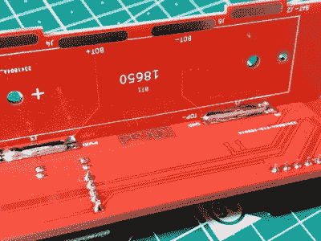

# 略微弯曲的 ESP8266 传感器平台

> 原文：<https://hackaday.com/2020/01/14/a-slightly-bent-esp8266-sensor-platform/>

以极低的价格获得专业制造的印刷电路板(至少是小型电路板)的能力，对我们在这些地方看到的这类项目产生了巨大影响。现在，试验 PCB 外壳不仅是让你的下一个项目脱颖而出的一种方式，也是一种经济的选择。

这就是这个来自[Josef Adamík]的 [ESP8266 传感器小工具如何获得其独特的“折叠”外观](https://josef-adamcik.cz/electronics/esp8266-based-room-conditions-monitor-part-2.html)。顶部面板是微控制器和各种传感器接头的所在地，底部面板是 TP4056 USB 充电模块的所在地，中间面板提供机械支撑并容纳单个 18650 电池。他没有用第四块面板把整个东西封闭起来，而是决定让它敞开着，这样就可以很容易地把电池取出来。另外，当然，这样看起来更酷。

 【约瑟夫】会不会把他所有的电子设备都装在一个 100 x 100 的 PCB 上，然后把整个东西放进一个 3D 打印的外壳里？好吧，当然。但在这一点上，他已经做得很累了，此外，他还在寻找一个借口，让自己在 PCB 设计中变得更舒服。我们认为这也使得最终产品比简单的“正常”方式更具视觉吸引力。

目前[Josef]有一个 SHT21 湿度/温度传感器和一个 BH1750 光传感器安装在设备顶部的接头上，但如果你想做一些更令人兴奋的事情，它们可以很容易地与其他东西交换。我们注意到[自制空气质量监测器](https://hackaday.com/2019/12/27/breathe-easy-with-this-online-dust-sensor-box/)越来越受欢迎。

用多氯联苯建造定制的外壳是一个奇妙的技巧，坦率地说，我们希望看到更多。[这本身是一种艺术形式](https://hackaday.com/2015/06/03/how-to-build-beautiful-enclosures-from-fr4-aka-pcbs/)，但是如果你愿意付出努力去做好它[，结果会非常惊人](https://hackaday.com/2019/09/16/the-benefits-and-pitfalls-of-using-pcbs-as-an-enclosure/)。