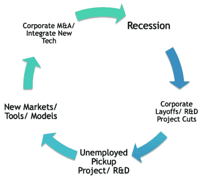

# 珍·科斯蒂洛解释了为什么黑客在经济衰退中茁壮成长

> 原文：<https://hackaday.com/2020/01/17/jen-costillo-explains-why-hackers-thrive-in-a-recession/>

如果你还没注意到，这绝对是成为一名黑客的绝佳时机。组件很便宜，软件通常是免费的，而且网上有这么多关于如何将它们整合在一起的信息，即使是初学者也可以在第一次出门时制作出令人难以置信的项目。毫不夸张地说，我们今天看到的项目在十年前对个人来说几乎是不可能完成的。

但我们是如何走到这一步的，或许更重要的是，我们接下来要去哪里？虽然我们可能处于 DIY 的黄金时代，但有创造力的人们把自己的硬件和软件组装在一起肯定不是什么新鲜事。至于展望未来，黑客和创客运动没有显示出放缓的迹象。如果有的话，我们只是刚刚开始。随着我们拥有越来越多的强大工具，未来完全取决于我们的决定。

在她在 2019 年 Hackaday 超级大会上的演讲中， [" *未来是我们:为什么开源和业余爱好者社区推动消费产品* "](https://www.youtube.com/watch?v=iIb-tEzhl_k) ，Jen Costillo 不仅向我们展示了迄今为止黑客历史的概况，还对 DIY 运动将如何影响未来的主流做出了一些预测。随着时间的推移，很难看到细微的变化，而事实上我们大多数人大多数时间都在埋头苦干，这使得事情变得更加困难。对于我们这些黑客社区的人来说，她的演讲是一个很好的方式，让我们后退一大步，看看将如此不可思议的力量交到如此多人手中的范式转变。

 [https://www.youtube.com/embed/iIb-tEzhl_k?version=3&rel=1&showsearch=0&showinfo=1&iv_load_policy=1&fs=1&hl=en-US&autohide=2&wmode=transparent](https://www.youtube.com/embed/iIb-tEzhl_k?version=3&rel=1&showsearch=0&showinfo=1&iv_load_policy=1&fs=1&hl=en-US&autohide=2&wmode=transparent)

## 黑客历史

为了了解全貌，Jen 从 20 世纪 70 年代的家酿计算机俱乐部开始讲起。在那些令人兴奋的日子里，家庭计算的一些最大的发展实际上是在黑客的车库里发生的。到 20 世纪 80 年代，GCC 项目如火如荼地展开，给爱好者提供了他们自己的工具链来开发和调试软件，而不必购买昂贵的许可证。短短几年后， [Linus Torvalds 在 comp.os.minix 新闻组](https://hackaday.com/2019/11/05/will-the-real-unix-please-stand-up/)上发表了他现在标志性的帖子，寻求对他一直从事的免费“爱好”操作系统的反馈。

进入 21 世纪，我们看到了创客文化的兴起。像 SparkFun 和 Adafruit 这样的公司涌现出来，为 DIY 者提供高科技组件，Makerbot 使普通消费者在家里 3D 打印零件成为可能，Kickstarter 为任何有好主意的人提供大量现金，Maker Faire 证明有大量的人对自己建造东西感到好奇。硬件和软件创造方式的另一场革命已经准备就绪，这一次的规模在几十年前是不可想象的。

所有这些里程碑对我们的社区都至关重要，当以这样的时间线呈现时，朝着更大更好的事情的自然进展是清楚的。但是 Jen 通过把它们都画出来真正想要说明的不是发生了什么，而是*什么时候*发生了。

## (科技)生活圈

正如 Jen 在介绍完黑客历史课程后继续解释的那样，许多使我们今天处于这种境地的形成性事件都发生在经济衰退期间。似乎在经济不景气的时候，黑客和创客们就兴旺起来了。

 大事件的道理很容易理解；当你有很多真正聪明的人失业或未充分就业时，他们更有可能投身于他们可能没有时间去做的爱好项目。对于 DIY 人群来说，理由甚至更直白。当资金紧张时，人们更愿意改变用途而不是购买新的东西。

但是历史也告诉我们，这个时期通常不会持续很长时间。很快，大公司玩家就会从车库和黑客空间中得到所有不可思议的东西，并开始购买创意和雇佣人才。一旦成为企业机器的一部分，创新总是会减速，东西开始变得昂贵，一旦资金枯竭，周期就会重新开始。

如果我们仔细观察，一些裂缝已经开始形成。Maker Media 正在努力重塑自己的品牌，无限期搁置旗舰品牌 Maker Faires。像脸书、微软和三星这样的公司正在积极地[搜索社区，寻找他们可以用于各自虚拟和增强现实项目的想法和人才](https://hackaday.com/2017/01/09/david-krum-the-revolution-in-virtual-reality/)，人们可能会认为这减缓了黑客友好的 AR 和 VR 头戴设备的发展。

## 为下一步做准备

在 2000 年给我们带来这些不可思议的制造商进步的“大衰退”现在已经结束，我们目前正在享受一个非凡的经济增长时期。公司正在扩张和收购创意，对于那些认识到这种趋势的人来说，这是一个赚钱的机会。

Jen 说，现在的公司都在密切关注 GitHub 和 Hackaday.io 等网站，寻找下一个好主意，通常会在你同意面试之前就了解你的能力。与上一次大繁荣时期相比，他们可能会更加谨慎地开出大额支票，但熟练的操作者和好的想法仍然会得到认可。

当然，上升的必然下降。许多经济学家认为，我们距离下一次下降趋势只有一两年的时间，这使得更多裁员和谨慎支出的可能性即将出现。一些人甚至认为它将在 2020 年底前到来。所以，如果你在接下来的几个月里得到了一份梦寐以求的工作，如果它不会持续很长时间，不要完全惊讶。

所有这一切的有利一面是，如果我们在不久的将来看到另一场衰退，那么我们也可能在不久的将来看到黑客和制造商领域的一些新发展。如果上一次衰退推出了让我们在过去几年里在这个黑客乌托邦中运营的技术和公司，我们将承认对下一次衰退会带来什么非常感兴趣。