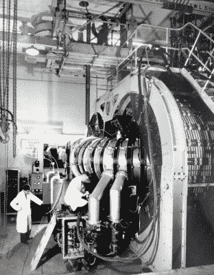
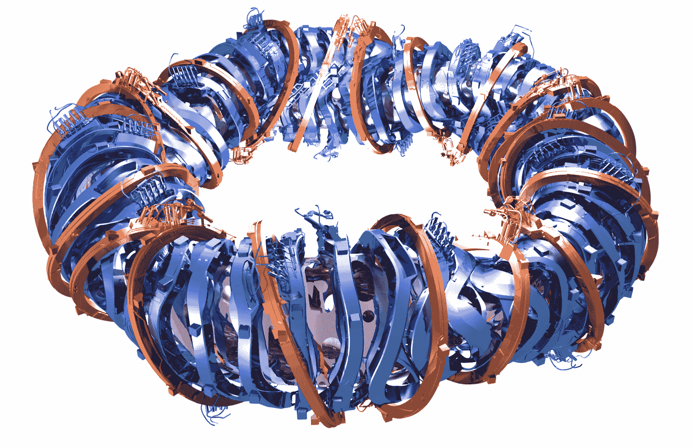
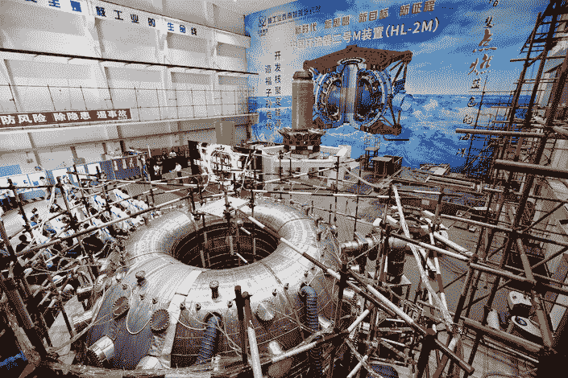
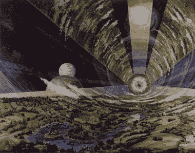

# 核聚变 100 年:能源优势的隐藏竞赛

> 原文：<https://hackaday.com/2020/01/23/nuclear-fusion-at-100-the-hidden-race-for-energy-supremacy/>

谈到核聚变在媒体上的形象，它已经度过了一段艰难的时期，这几乎不是什么秘密:这是一个永远“只需十年”的奇迹电源。即使没有一个自尊的物理学家会做出这样的声明，对许多人来说，商业核聚变能源的到来也不会来得太快。这是一种几乎无穷无尽、无浪费的清洁能源，听起来确实像是科幻小说中的故事。

与此同时，在非虚构的世界里，一代又一代的科学家致力于更好地了解反应堆中的等离子体是如何表现的，如何遏制它，以及什么类型的燃料最适合聚变反应堆，特别是必须连续运行、净正能量输出的反应堆。在这方面，2020 年是令人兴奋的一年，德国 Wendelstein 7-X stellarator 达到了最终配置，中国 HL-2M 托卡马克即将点火。

休息之后，请加入我，让我看看一个世纪以来聚变研究的进展给我们带来了什么，以及它将把我们带向何方。

## 《追求核聚变》前情提要

1920 年，英国物理学家[弗朗西斯·威廉·阿斯顿](https://en.wikipedia.org/wiki/Francis_William_Aston)发现四个氢原子的总质量当量大于一个氦( ⁴ He)原子的总质量当量。这一观察得出结论，当人们将氢核融合在一起时，例如在常见的氘( ² D)氚( ³ T)反应中，可以释放净能量:

氘( ² H，或 D)是一种常见的氢的稳定同位素，在自然界中大量存在，占地球海洋中氢的 0.02%。[氚](https://en.wikipedia.org/wiki/Tritium) ( ³ H，或 T)是氢的一种不稳定的放射性(β发射体)同位素，半衰期为 12.32 年。氚是通过与宇宙射线的相互作用自然形成的，但可以很容易地从锂金属中增殖出来，要么在聚变反应堆的增殖包层中，要么在使用重水(氘)的裂变反应堆中，如加拿大的 CANDU 反应堆。

The UK ZETA Z-pinch fusion reactor in 1958.

剑桥大学的欧内斯特·路德·福兹的工作人员于 1933 年发现了核聚变产生的第一批中子。这包括能量高达 600 千电子伏的质子向目标加速。20 世纪 30 年代对该主题的研究为聚变反应堆的第一个概念的发展奠定了基础，最初涉及使用洛伦兹力来控制等离子体的 [Z 箍缩](https://en.wikipedia.org/wiki/Z-pinch)概念。

世界各地的团队在绝对保密的情况下工作，所有与核聚变相关的研究都是保密的。英国人创造了稳定的箍缩聚变反应堆，希望这将被证明是商业聚变反应堆的可行蓝图。不幸的是，ZETA 证明了 Z 箍缩的设计总是不稳定，到 1961 年，Z 箍缩的概念被放弃了。

与此同时，俄罗斯人在 20 世纪 50 年代开发了托卡马克反应堆概念，部分基于 Z 箍缩设计。托卡马克的设计被证明能够抑制困扰 Z 箍缩反应堆的不稳定性，以及早期的 stellerator 设计。如今，大多数运行中的聚变反应堆都是托卡马克设计的，尽管最近星状装置又死灰复燃，特别是以[温德尔斯坦 7-X](https://en.wikipedia.org/wiki/Wendelstein_7-X) 项目的形式出现。

## 我们可以期待在 2020 年看到什么

A schematic view of Wendelstein 7-X’s magnets.

正如文章介绍中提到的，Wendelstein 7-X 已经达到了一个重要的里程碑。自从我们在 2015 年第一次写这个项目以来，这个项目已经完成了所有的目标，除了最后一个:冷却的[偏滤器](https://en.wikipedia.org/wiki/Divertor)运行。该反应堆目前正在用这些偏滤器进行升级，理论上应该允许稳态运行，允许在运行期间从等离子体中去除杂质。

安装新的偏滤器和低温泵将持续到 2020 年的大部分时间，包括运行一条 55 米长的输送管线到低温设备，以及安装新的氦气和液氮储存罐。幸运的话，我们将在今年看到新系统的首次测试，但最有可能的是，WX 7 号的首次连续运行将在 2021 年进行。

China’s HL-2M tokamak at Southwestern Institute of Physics (SWIP).

在中国，HL-2M 托卡马克已经完成最后的润色，这是自 20 世纪 60 年代以来一系列托卡马克设计中最新的。 [HL-2M 是 HL-2A 托卡马克](https://iopscience.iop.org/article/10.1088/1741-4326/ab4c65/pdf)的新配置，是中国目前使用的三个托卡马克之一(EAST 和 J-TEXT 是另外两个)。HL-2M 装置的线圈结构发生了很大的变化，允许产生多种类型的等离子体，同时还测试了各种类型的偏滤器结构。今年 HL-2M 将看到它的第一个等离子。

根据 HL-2M 的表现，它将允许 [CFETR](https://en.wikipedia.org/wiki/China_Fusion_Engineering_Test_Reactor) (中国聚变工程试验堆)项目在 2020 年代开始其建设阶段。在第一阶段，CFETR 托卡马克将展示稳态运行和氚增殖。在第二阶段，CFETR 将被更新，以允许 1 吉瓦的功率输出(相比 ITER 的 500 兆瓦)和高于 12 的[聚变增益](https://en.wikipedia.org/wiki/Fusion_gain) (Q)。

## 融合很难

与核裂变相比，核聚变需要这么长时间的主要原因是前者需要理想的条件才能发生，更不用说持续了。这意味着高温、高压、高电流或其组合。即使这样，等离子体密封也是出了名的复杂，因为等离子体不是一种很好的，平静的气态，只是漂浮在那里。相反，它是高压和数百万摄氏度下沸腾的等离子体集合，只要有机会就会突破磁约束。尽管在这方面已经取得了重大进展，但未来几年将会告诉我们，托卡马克和星状器的设计是否会避免类似 Z 箍缩的死胡同。

运行核聚变反应堆的许多方面仍然是一个谜，就像第一个裂变反应堆一样，早期第二代设计中使用的材料发生了无数次变化，同时对整体设计进行了根本性的改变，以提高性能和安全性。尽管聚变反应堆在这方面的挑战性较小，但它们确实必须应对堆芯材料的中子轰击，这种轰击会削弱它们。这也导致了聚变反应堆产生的唯一废物:反应堆堆芯本身。

通过暴露在中子下的活化(T0)和氚污染(T2)的结合将使堆芯材料具有放射性(T3)，这需要在反应堆寿命结束时处理产生的低到中等放射性废物，如钢铁和其他建筑材料。幸运的是，研究表明，长达 100 年的中间储存足以使这些材料变得安全。

无论如何，在未来的反应堆设计中，中子暴露是一个可能通过材料选择或中子俘获机制以更直接的方式处理的方面。随着中国的项目从 HL-2M 发展到 CFETR，从 ITER 发展到 DEMO，我们希望能够在聚变达到黄金时间之前发现任何问题并做出改进。

## 低能核反应

与聚变有点关系的是，LENR 曾被称为“冷聚变”。尽管受到了几十年的嘲笑，许多科学家仍然坚持研究这种现象，这种现象照亮了世界，并承诺在室温下产生聚变能。抛开最初的氢原子融合理论，目前的理论是质子和电子可以合并形成中子。如需详细的概述，请参见麻省理工学院副教授彼得·海格斯坦教授的[视频演示。](https://www.youtube.com/watch?v=CiNDqaFPO4A)

根据 Widom-Larsen 理论，1989 年的原始实验如此难以重现的原因是因为它依赖于氢原子沉积在钯(或等效物)层的活性位点上。这意味着人们需要在纳米水平上创造一个合适的表面，这在 20 世纪 80 年代是不现实的。

即使 LENR 只不过变成了一件珍品，但它确实让我们以另一种方式窥见了原子的行为。最好的情况是，通过降低压力和温度要求，它可能为我们提供改进聚变反应堆的方法，这是我们今天无法理解的。

## 能源优势是游戏

除了反物质反应堆之类的发展之外，商业聚变反应堆将是能源生产的巅峰。作为一种能源，它的燃料实际上是无限的，氘-氚型燃料足以在地球上使用数百万年，氘工艺版本仅使用地球上可用的氘就可以提供数十亿年的能源生产。第一个掌握这种能力的国家将会获益良多。

Colony in space, with a clear view of nearby planets.

聚变反应堆本质上是安全的，因为维持聚变过程发生的适当条件是复杂的。在运行过程中，没有废物产生，而是产生了非常有用的氦( ⁴ He ),它有无数的应用，从工业到运行核磁共振扫描仪，到填充派对气球。虽然核聚变很可能与核裂变(可能[使用 FNRs](https://hackaday.com/2019/10/08/the-long-history-of-fast-reactors-and-the-promise-of-a-closed-fuel-cycle/) )以互补的方式共存，但前者非常适合为地球上所有人口中心处理电力和热量生成。

我们何时能看到第一个商业上可行的聚变反应堆，目前还很难说。由于 ITER 预计在 2035 年之前不会看到第一个等离子体，我们可能会看到中国及其 CFETR 和后续反应堆在 21 世纪 30 年代或 40 年代达到商业可行性。然而，正如英国从泽塔那里学到的，在等离子体物理学中，没有什么是确定的。

【主图:[Wendelstein 7-X](https://commons.wikimedia.org/wiki/File:Wendelstein_7-X_experimental_field_line_visualization.jpg)中一个磁性表面上的磁力线实验可视化。 *CC-BY 4.0，温德尔斯坦 7-X 团队*