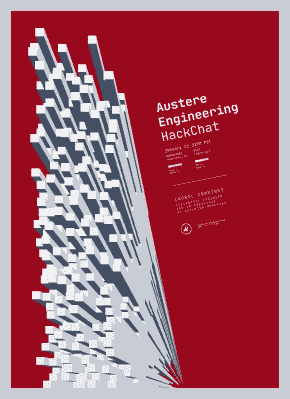

# 简单的工程聊天

> 原文：<https://hackaday.com/2020/01/20/austere-engineering-hack-chat/>

加入我们太平洋时间 1 月 22 日星期三中午与 Laurel Cummings 的[严峻工程黑客聊天](https://hackaday.io/event/169095-austere-engineering-hack-chat)！

对我们大多数人来说，建造任何需要建造的东西都是相对舒适和富足的事情。当然，有冷车间和库存不足的零件箱要处理，但总的来说，我们都在或多或少受控的环境中工作，在那里我们可以很容易地获得完成工作所需的工具和材料。

 但并不是所有的工程都是在这样的受控条件下完成的。野外行动经常发生在远离文明的地方，如果你需要的东西不在卡车的后备箱里，那还不如不存在。在这种时候，压力就在适应、随机应变和克服，以完成工作，特别是如果人们的生命和福祉受到威胁。

所有这些对电气工程师劳雷尔·卡明斯来说都是熟悉的领域，他是总部设在弗吉尼亚州的技术开发和培训公司 [Building Momentum](https://www.buildingmomentum.us/) 的合伙人。她的工作是走出去，与公司的主要军事和企业客户合作，帮助他们应对严峻环境的挑战，包括灾难应对工作。

从被佛罗伦萨飓风蹂躏的北卡罗来纳州海滩到科威特的沙漠，劳雷尔不得不想办法摆脱一些棘手的情况。加入我们，讨论如何在不太理想的情况下开发和部署现场权宜解决方案，学习如何知道什么时候足够好就是足够好，甚至可能还会听到一些战争故事。

 我们的黑客聊天是 [Hackaday.io 黑客聊天群发消息](https://hackaday.io/messages/room/2369)中的社区直播活动。本周，我们将于太平洋时间 1 月 22 日星期三中午 12:00 坐下来讨论。如果时区让你烦恼，我们有[一个方便的时区转换器](https://www.timeanddate.com/countdown/generic?iso=20200122T12&p0=224&msg=Austere+Engineering+Hack+Chat&font=cursive)。

点击右边的那个发言气泡，你会被直接带到 Hackaday.io 上的黑客聊天群，不用等到周三；随时加入，你可以看到社区在谈论什么。