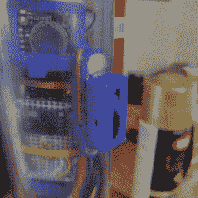

# 像海洋一样开放的海洋学

> 原文：<https://hackaday.com/2020/01/17/oceanography-as-open-as-the-seas/>

随着地球在气候变化的阵痛中挣扎，还没有合适的行星 B 出现，海洋学现在比以往任何时候都重要。然而，几十年来测试海洋条件所依赖的仪器一直稳定在昂贵到令人望而却步的范围内。像任何其他科学领域一样，降低准入门槛几乎没有坏处——更多的参与者意味着更多的数据，这意味着对海水深处内部运作的更多洞察。

 【每个人的海洋学】旨在通过向世界展示建立一个海洋学测试套件是多么容易来改变这一切，该套件使用常见的组件来测量电导率(即盐度)、温度和深度。 [OpenCTD](https://github.com/OceanographyforEveryone/OpenCTD) 主要设计用于大陆架，已经成功测试到 100 米的深度。

一位名叫 M0 的 Adalogger 和 RTC Featherwing 在他们位于 PVC 管中心的防水展台上进行表演。有一个用于深度的 14 巴压力传感器，一个用于温度平均的三个 DS18B20s，以及一个收集盐度数据的商用电导率探针。这些传感器通过 3D 打印的基板进行馈送，最终封装在不锈钢环氧树脂中。管子的另一端用机械塞密封，机械塞通过蝶形螺母的旋转来固定和松开。

我们特别喜欢刮擦式磁性滑动开关，它无需打开气缸即可打开和关闭 OpenCTD。如果你想为自己建造一个，请深入阅读[每个人的海洋学]的综合指南——它非常详细地涵盖了组件、构造和校准。开关从第 50 页开始解释。你可以在[他们的站点](http://oceanographyforeveryone.com/)找到更多关于每个人正在做的海洋学工作。

至于便宜的防水外壳，PVC 是一个很好的选择。[水下摄影也很好用](https://hackaday.com/2018/02/27/pipecam-shallow-water-exploration-with-raspberry-pi/)。