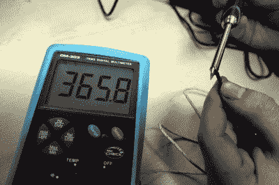
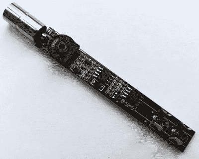

# 点评:三而一高 SH72 烙铁

> 原文：<https://hackaday.com/2020/01/27/review-saneryigo-sh72-soldering-iron/>

近三年前，当迷你产品 TS100 首次在中国出现时，它重新定义了我们对价格合理的烙铁的期望。轻便的 DC 供电温控熨斗在一个小巧的包装中提供了可用的功率和先进的功能，这种组合在以前只有在更昂贵的焊接站才能找到。所有这些加上它的可攻击性和可访问的硬件，使它在我们的社区中立即受到欢迎，我们中的许多人已经将它作为我们的首选。

令人惊讶的是，它没有吸引到类似类型的严重竞争对手，唯一与 TS100 相提并论的熨斗是 Miniware 自己的 USB-C 供电的 TS80。不过，也许这种情况即将改变，因为在圣诞节前，我注意到一种外形与 TS100 非常相似的新型中国熨斗。热门产品最终产生了山寨产品吗？我买了一个来了解一下。

## 预算伪装者

SanErYiGo SH72 是一款温控熨斗，外形与 TS100 非常相似。它有一个轻质的手柄，包含温度控制电子设备，一端是 DC 桶插孔插座，另一端是一个插座，以适应任何一系列不同尖端的元件。相似之处也就到此为止了，因为与 TS100 的有机发光二极管显示屏、按钮和 USB 端口相比，它只有一个控制旋钮。也许最重要的是，虽然 TS100 的价格接近 40 英镑(50 美元)，但我的 SH72 只花了我 8.5 英镑(11 美元)。这是一个廉价的熨斗，但它是一个柠檬还是一颗未经雕琢的钻石？

熨斗运到时包装得很好，放在一个细长的纸箱里，熨斗和把手是分开的。它有一个体面的印刷手册传单中文和写得很好的英文。物理上，手柄是一个重量轻的纹理塑料管，直径约 12 毫米(0.5 英寸)，靠近业务端有一个模制的抓握区。它长约 100 毫米(4 英寸)，比 TS100 长约 5 毫米(0.2 英寸)。控制旋钮的直径约为 10 毫米(0.4 英寸)，位于距离 DC 千斤顶末端约 20 毫米(0.8 英寸)处。它上面印着一个温度范围，但是字体非常小。

Setting the SH72’s temperature with a thermocouple.

该元件与 TS100 装置不同，但采用了类似的一体式尖端和元件形式，触点连接到陶瓷端件上的金属带上。它用一个旋入式金属环固定在适当的位置，我想如果需要的话，你可以在金属环上连接一根接地线。有七种不同的尖端样式，我怀疑这将是最初为另一种熨斗设计的元素，我选择了最好的一点，因为我将使用熨斗进行 SMD 工作。整体明显比 TS100 轻一点，但额外的 5 毫米长度真的不是问题。

它与更贵的竞争对手使用相同的电源，所以你可能已经有了一个插孔和极性正确的笔记本电脑电源。它将采用 12 V 至 24 V 电源供电，24 V 时的声称功率为 65 W。我的 19 V 电源应能提供 40 W 的可观功率。插上电源后，我的第一个动作是取出热电偶并测量其温度。我能设置的最低温度约为 200 摄氏度，最高温度约为 410 摄氏度。很容易调整到我想要的 360 摄氏度，用放大镜检查控制旋钮时，校准没有太大误差。

为了测试它的速度，它被应用于废板上的 SMD 返工，原型板项目的一些焊接，以及 hackerspace CNC 控制器项目的一些布线。除了重量轻、易于操作到位、加热快、功率大之外，你还想从这种类型的熨斗得到什么呢？在这些方面，它的表现令人钦佩，体验类似于使用 TS100，只是有点不灵活的电源线有点烦人。这是一个有用的小铁，很容易应付所有的通用焊接我们不得不手。

## 老式的模拟温度控制，但它的工作

The PCB packs what appears to be a simple analogue temperature controller onto one of its sides.

仅仅描述一个熨斗的外观并测试它的性能并不是一个完整的评论，这是一个黑客日。SH72 里面是什么，是什么让*勾选*？我打开来看了看。进去很简单，但也许它不是为反复打开而设计的。控制旋钮放松，通过一些非常小心的杠杆作用和定位工作，可以将表壳的两半分开。内部有一个长 PCB，一侧覆盖着表面贴装元件，一端是元件的弹簧夹，另一端是 DC 插孔，带有一个大的通孔预设电位计，控制旋钮位于其中。两个主要的半导体器件是 TPC8107 MOSFET 和 LM2904 双通道运算放大器，均采用 SOIC-8 封装。据猜测，一个运算放大器是一个直流放大器，使用元件电阻作为温度传感器，而另一个是一个比较器，用于接通和断开 MOSFET 以给元件供电。这是一种简单但有效的温度控制器，不久前还可以在更昂贵的温控焊接站中找到。

总之，SH72 看起来像是 TS100 的廉价替代品，本质上就是这样。这是一个温控熨斗，大小、功率和重量相似，但仅此而已。它缺乏更昂贵的熨斗的额外功能，如待机温度和自动断电，这些功能都是由微处理器控制的，公平地说，它的塑料手柄不太耐用。它仍然是一个非常有用的铁，在回答之前提出的问题，我会说这是一个明确的未经雕琢的钻石。在这种低预算价格下，你不太可能找到更好的，你肯定能找到更差的。买一个，不会花你很多钱，我想你不会后悔的。