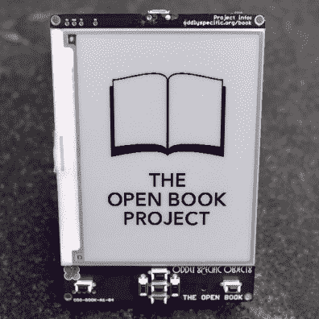
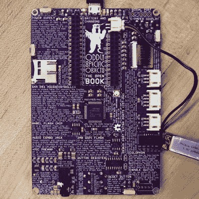
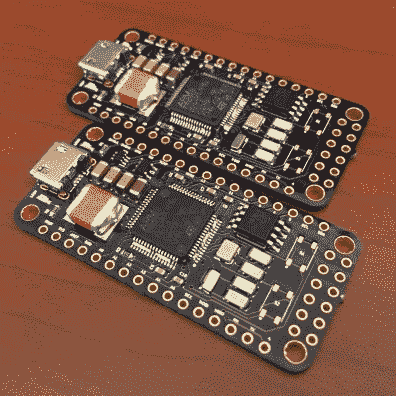
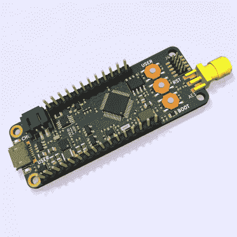
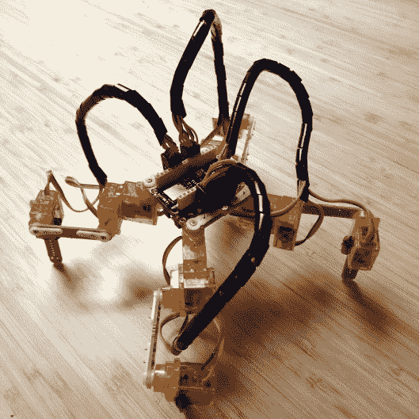
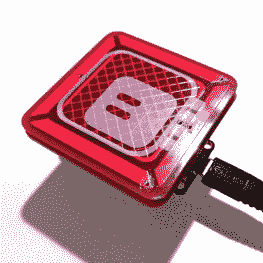
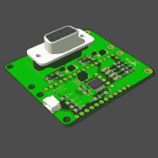

# 羽毛飞行比赛的获胜者

> 原文：<https://hackaday.com/2020/01/22/winners-of-the-take-flight-with-feather-contest/>

纸张上印刷文字的保真度和耐用性是无与伦比的。但电子纸显示器变得非常接近，如果你将它与伟大的设计和可靠的功能结合起来，你可能会更喜欢电子阅读器而不是满满一书架的平装书。如果通过开放硬件来增加交易的甜头呢？“开卷计划”迎接了这个挑战，并刚刚被命名为[带着羽毛飞翔比赛](https://hackaday.io/contest/168107-take-flight-with-feather)的获胜者。

这种电子阅读器现在将进入野外，由赞助这场比赛的 Digi-Key 进行小规模生产。让我们仔细看看打开的书，以及其他五个顶级条目。

    

你可能记得[在十月](https://hackaday.com/2019/10/31/building-an-open-hardware-ebook-reader/)看到开卷，当时汤姆·纳尔迪查看了电路板的早期测试。它是用阿达果羽毛制作的原型，这当然是比赛的主要要求。控制器现已内置于电路板中，可实现独立功能，羽化接头为扩展提供了机会。

屏幕为 4.2 寸，分辨率为 300×400。它从 microSD 卡中读取文件，并使用电路板前面的七个按钮供用户输入。专用闪存芯片存储您选择的字符集的语言文件。小的 LiPo 电池可以通过 USB 端口充电，当然，电子纸在降低阅读器的功耗方面有很大的帮助。

你会在背面找到一些额外的东西。有一个耳机插孔用于听有声书，还有这个，内置麦克风和 TensorFlow 训练的模型允许语音控制！有 STEMMA 接头可添加您自己的硬件选项，以及激光切割和 3D 打印外壳的设计。

## 卫星和长途通讯的发展

  Junebug Feather  LoRaWAN Feather

太空中的羽毛？这是 Junebug 项目的目标，该项目为小型卫星设计了一个羽毛兼容的大脑。也许最有趣的是，它被设计成在没有电池的情况下工作，这就是所谓的间歇计算。Junebug 获得了“你会在边缘割伤自己”的称号。

在其他“遥远的地方”的设计是[lora wan 羽毛](https://hackaday.io/project/168527-lorawan-feather)，旨在让你和运行与远程通信协议，这是所有这些天风靡一时。如果恰如其分地作为无线羽毛标题。

## 四条腿，一个手指，和一个串口

  Spider FeatherWing  Gestrue FeatherWing  RS232 to TTL Featherwing

蜘蛛翼肯定会让你毛骨悚然，因为它用十二个微型伺服系统组成的四条腿四处爬行。也许你可以使用同一黑客的另一种设计来控制它，[手势羽状翼](https://hackaday.io/project/165011-gesture-featherwing)使用 MCP3030 作为输入设备，可以识别你手指绘制的图案。这些作品采用了最怪异的羽毛和辅助技术名称。

一点点复古计算的味道就能选出最棒的赢家。羽毛板系列为羽毛家族带来了标志性的 DB9 收割台。无论你需要一个旧电脑的串行连接，还是想要与旧的输入设备或实验室设备接口，很容易明白为什么这一个声称复古羽毛的标题。

这只是我们在带羽毛飞行比赛中看到的翼尖。超过 80 个参赛作品，你肯定需要看看[人们发现的所有创造羽毛设计的方法](https://hackaday.io/submissions/take-flight-with-feather/list)。

