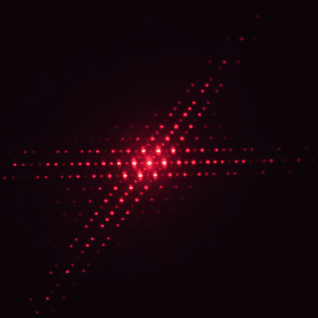
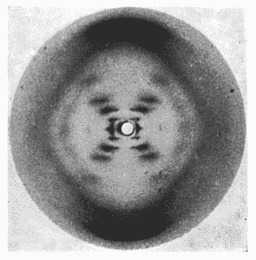

# X 射线晶体学入门指南

> 原文：<https://hackaday.com/2020/01/21/a-beginners-guide-to-x-ray-crystallography/>

在研究生院，我有一门研讨课，其中一节是关于 X 射线晶体学的。我很兴奋，因为仅仅通过 X 射线照射就能辨别大分子的三维结构对我来说就像魔术一样。多亏了一位平庸的教授，在这部分之后，它仍然是一个谜。

要是当时我有史蒂夫·莫尔德当老师就好了。他的最新视频在解释 X 射线晶体学方面做得非常出色，通过使用更长波长的光和宏观目标，极大地放大了这个问题。他首先回顾了衍射图案，当光照射在两个间隔很近的狭缝上时，会产生相长和相消干涉的明暗交替带——著名的[“双缝实验”](https://hackaday.com/2016/09/07/the-quantum-eraser/)，该实验表明光既表现为粒子又表现为波，并让我们第一次看到了量子力学。[史蒂夫]然后在双狭缝上加倍，在第一个狭缝的路径上放置另一对狭缝。这揭示了斑点的网格而不是交替的带，轴之间的角度取决于狭缝对彼此之间的角度。

    Photograph 51, an X-ray crystallogram of the B-form of DNA, by Gosling and Franklin, 1952\. Source: [Wikipedia](https://en.wikipedia.org/wiki/Photo_51)

为了完成演示，[史蒂夫]然后使用衍射成像白炽灯泡的螺旋钨丝。用激光照射螺旋产生了一个图案，该图案与可能是有史以来最著名的 X 射线晶体图惊人地相似:[【罗莎琳德·富兰克林】的 DNA 画像](https://hackaday.com/2017/10/24/rosalind-franklin-saw-dna-first/)。这一切都很有意义，当从目标大小和用于探测它的光的波长两方面缩小时，很容易看出这个过程是如何工作的。

向[史蒂夫]致敬，他让一些通常很复杂的事情变得如此容易理解，填补了我知识上的一个长期空白。

 [https://www.youtube.com/embed/dqMYWldfs_k?version=3&rel=1&showsearch=0&showinfo=1&iv_load_policy=1&fs=1&hl=en-US&autohide=2&wmode=transparent](https://www.youtube.com/embed/dqMYWldfs_k?version=3&rel=1&showsearch=0&showinfo=1&iv_load_policy=1&fs=1&hl=en-US&autohide=2&wmode=transparent)

