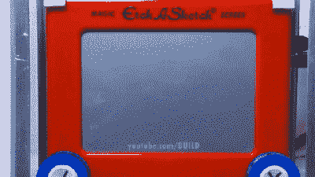

# CNC 蚀刻草图:停止运动是合理的下一步

> 原文：<https://hackaday.com/2020/01/26/cnc-etch-a-sketch-stop-motion-is-logical-next-step/>

每个人都会这样。你第一次接触到蚀刻素描，掌握了它的工作原理，你确信你可以画出除了矩形和楼梯以外的东西。然后你会发现一个可怕的事实:你并不像你认为的那样精确，如果你是[QuintBUILDS]，你试图画的圆圈看起来像柠檬、土豆或微生物。

 好吧，是的，这绝对不是我们看到的第一个电脑化蚀刻草图，[但它可能是最酷的一个](http://www.instructables.com/id/CNC-Etch-a-Sketch-and-Video-Player/)。无论如何，这肯定是最适合孩子的。

最重要的是，你仍然可以拿起它并摇动它来清空屏幕，这是我们提到的许多自动画图器非常缺乏的功能。如果你对这个黑客还不完全满意，一定要看看休息后的定格视频，它将这个宝贝变成了平板电脑的触摸屏视频播放器。

翻过来你会发现一个树莓 Pi 3 和一个 CNC 帽子。旋钮由一对 NEMA-17 大小的步进电机驱动，步进电机通过紧配合的滑轮与旋钮连接。电源来自四个 18650，由电池管理板计量，提供过充和放电保护。在未来的某个时候，[QuintBUILDS]计划转向电池组，因为电池座在电气上不稳定。

我们喜欢焊接框架和丙烯酸外壳，因为它们使东西坚固和便携。此外，我们是透明外壳的吸盘。如果你想做[QuintBUILDS]所做的事情，并把它带到小学科学博览会上，向孩子们展示如果你坚持下去，科学会有多酷，那么他们显然更优秀。

如果你不认为电动蚀刻草图有用，也许你还没看过这个时钟制作。

 [https://www.youtube.com/embed/oMxiMDmlYRk?version=3&rel=1&showsearch=0&showinfo=1&iv_load_policy=1&fs=1&hl=en-US&autohide=2&wmode=transparent](https://www.youtube.com/embed/oMxiMDmlYRk?version=3&rel=1&showsearch=0&showinfo=1&iv_load_policy=1&fs=1&hl=en-US&autohide=2&wmode=transparent)

 [https://www.youtube.com/embed/kxRXd6hDt5s?version=3&rel=1&showsearch=0&showinfo=1&iv_load_policy=1&fs=1&hl=en-US&autohide=2&wmode=transparent](https://www.youtube.com/embed/kxRXd6hDt5s?version=3&rel=1&showsearch=0&showinfo=1&iv_load_policy=1&fs=1&hl=en-US&autohide=2&wmode=transparent)

