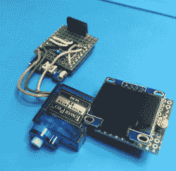

# Lovebox 给无限的糖果比巧克力更甜

> 原文：<https://hackaday.com/2020/01/22/lovebox-gives-infinite-treats-sweeter-than-chocolate/>

想做一份特别的情人节礼物，在节日过后继续送出吗？我们也喜欢，尤其是像[Marcel str]的[love box](https://frightanic.com/iot/the-lovebox-a-gift-from-a-maker/)一样可爱的东西。这是一个相对简单的构建，但它能让你一次又一次地让别人开心。

 发送者在秘密的 GitHub 要点中编写他们的爱情笔记，可以是文本消息或二进制图像，并更新要点。每当盒子里的 Wemos D1 迷你收到一条新信息，一个微型伺服系统就会慢慢地上下摆动心脏来通知收件人。

一旦他们打开盖子阅读它，光敏电阻会感应到它表面的大量光线，并告诉伺服系统它可以停止摆动。我们认为心脏在移动的时候向上轻推一点盒盖是很棒的，因为这增加了可爱系数。

每个人都喜欢整天听到那个特别的人的消息。远程发送亲密信息的想法是非常浪漫的，而且身体上的通知有一些令人激动和紧急的东西。向 break 按钮展示一点爱，你会看到一个块菌大小的演示，既有传入的图像又有文本信息。

[马塞尔]乐于发挥他的木工技能，而不是使用激光切割机。如果你两样都没有，去一两家工艺品商店，你会发现很多未完成的木箱和预先切好的心形。或者，你可以用铜来表示。

 [https://www.youtube.com/embed/FA3ph2sqOSo?version=3&rel=1&showsearch=0&showinfo=1&iv_load_policy=1&fs=1&hl=en-US&autohide=2&wmode=transparent](https://www.youtube.com/embed/FA3ph2sqOSo?version=3&rel=1&showsearch=0&showinfo=1&iv_load_policy=1&fs=1&hl=en-US&autohide=2&wmode=transparent)

