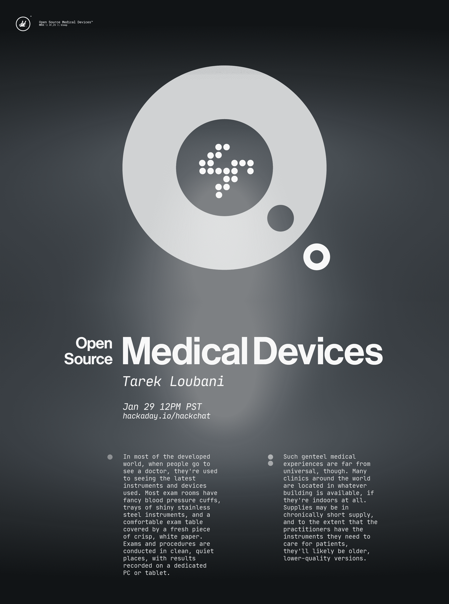

# 开源医疗设备黑客聊天

> 原文：<https://hackaday.com/2020/01/28/open-source-medical-devices-hack-chat/>

加入我们太平洋时间 1 月 29 日星期三中午[与](https://hackaday.io/event/168701-open-source-medical-devices-hack-chat) [Tarek Loubani](https://hackaday.io/hacker/11608-tarek-loubani) 的开源医疗设备黑客聊天！

在大多数发达国家，当人们去看医生时，他们习惯于看到最新的仪器和设备。大多数检查室都有别致的血压袖带，闪亮的不锈钢仪器托盘，舒适的检查台，上面覆盖着一张干净的白纸。考试和程序在干净安静的地方进行，结果记录在专用的个人电脑或平板电脑上。

然而，这种高雅的医疗体验远非普遍。世界上许多诊所都位于任何可用的建筑内，如果它们在室内的话。供应可能会长期短缺，从某种程度上说，从业者拥有他们护理病人所需的仪器，但它们很可能是较旧、质量较低的版本。

Tarek Loubani 精通在这种情况下以及更糟糕的情况下的医疗实践。作为加拿大的一名急诊医生和研究人员，他习惯了设备完善的设施和充足的供应。但他也参与人道主义救援，把他的医疗技能和有限的物资带到像加沙这样的地方。他亲眼目睹了缺乏正确的工具会给患者带来多么糟糕的结果，并选择通过设计一系列可以 3D 打印的医疗设备和仪器进行反击。他的神经胶质项目有免费的计划，包括花几美元就能制造出高质量的听诊器、耳镜和脉搏血氧仪，以及一系列手术工具，以使在严峻的条件下行医变得稍微容易一些。

请加入我们，与 Loubani 博士一起探讨他的开源医疗努力。我们将谈论他如何对构建设备感兴趣，他如何决定什么值得构建，以及 Glia 项目的未来会发生什么，以及一般的开源医学。

 我们的黑客聊天是 [Hackaday.io 黑客聊天群发消息](https://hackaday.io/messages/room/2369)中的社区直播活动。本周，我们将于太平洋时间 1 月 29 日星期三中午 12:00 坐下来讨论。如果时区让你烦恼，我们有[一个方便的时区转换器](https://www.timeanddate.com/countdown/generic?iso=20200129T12&p0=224&msg=Open-Source+Medical+Devices+Hack+Chat&font=cursive)。

点击右边的那个发言气泡，你会被直接带到 Hackaday.io 上的黑客聊天群，不用等到周三；随时加入，你可以看到社区在谈论什么。

