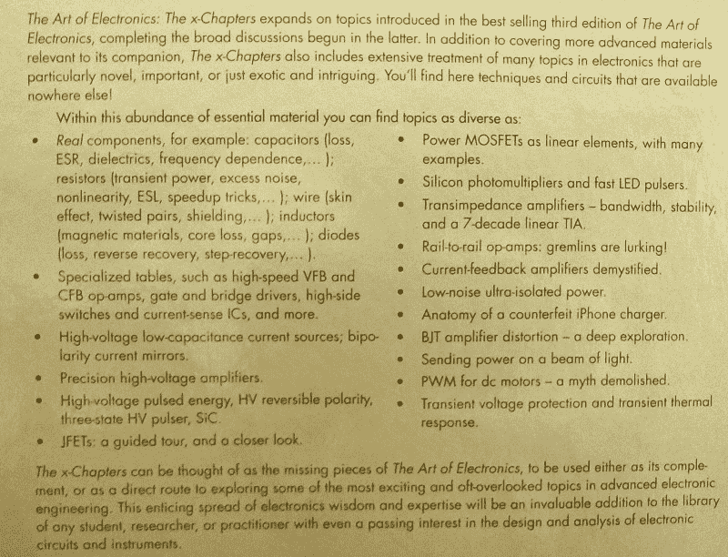
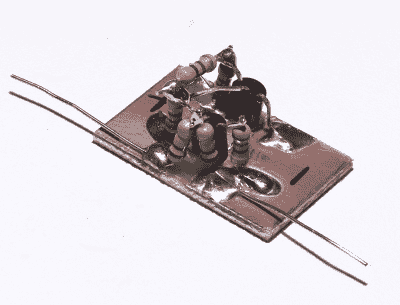
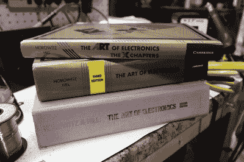

# 真相就在那里:电子艺术，X 章

> 原文：<https://hackaday.com/2020/01/23/the-truth-is-in-there-the-art-of-electronics-the-x-chapters/>

如果你对电子产品感兴趣已经有一段时间了，那么你几乎肯定会遇到这个领域的实用圣经*电子艺术*，通常缩写为 AoE。这本书的任何粉丝肯定会考虑获得最新版本的 [*《电子艺术:x 章*](https://x.artofelectronics.net/) 》，这是继 2015 年第三版 AoE 之后的版本。这本新书的特点是扩大了以前版本的主题覆盖范围，加上一些有趣但很少涉及的电气工程领域的讨论。

对于那些不熟悉它的人来说，1980 年首次出版的 AoE 是教科书和工程师参考的异常有用的混合体，融合了足够的理论和大量的实践经验。凭借其生动的语气和非正式的风格，这本书使来自许多背景的人能够设计和实现电子电路。

在第一本书之后，第二版(AoE2)于 1989 年出版，第三版(AoE3)于 2015 年出版，每一版都更新和扩大了覆盖范围，以跟上该领域的快速发展。我从第二版开始，当我购买第三版的副本时，它已经非常破旧了，这是一个升级版，我会推荐给任何仍在观望的人。虽然第二和第三本书看起来很像第一本书，但这本新书有点不同。同时，它也是对 AoE3 中涵盖的许多主题的扩展讨论，以及关于电气工程中各种主题的独立参考手册。

我在得知这本书即将出版的当天就预订了它，它终于在本周到货。所以，在连续几天把这本书拿在手里之后，我想我已经对它的内容有了一个大致的了解。请留下来听听我对这一非常有趣的系列丛书的最新看法。

## 概观

在这本书序言的第一段，作者给出了基本的描述:“x”代表额外的内容，这意味着这本书的内容最初被定为 AoE3 的一部分，但根本不适合——这本书实际上有 1250 页。这本新书大约有 500 页，分为五章:1x、2x、3x、4x 和 9x。这种不寻常的编号方案使内容与第三版 AoE 的章节保持一致，强调了这样一个事实，即许多这种材料将放在那里。事实上，新书的每一章都是从 AoE3 的相应部分开始重复章节末的回顾。

The back cover of *The Art of Electronics: The x-Chapters*

虽然我将讨论每章的一些重点——但不是详尽的列表——请记住，这本书读起来与 AoE3 略有不同:它更多的是工程参考手册，而不是教科书。前言对此说得很清楚；以前的 AoE 书籍的线性结构已经被特定主题的非常模块化的部分所取代。如果你是一个有点经验的设计师，正在寻找某个特定主题的经验，这是很好的，但对初学者来说可能没那么有用——稍后会详细介绍。

## 第 1x 章:现实世界中的无源元件

从最底层的电线开始，本章考察了现实世界中组件的行为。对导体、电缆和连接器进行检查，以确定它们可能表现出的非理想效应。同样，也讨论了各种类型的真实电阻，包括数字电位计。电容和电感得到了广泛的处理，因为有无数的缺陷困扰着它们。第 1x.6 节特别有趣，涵盖了机械开关和继电器，这些我们有时会忘记具有非理想特性的组件。如果您将这些组件用于任何重要的事情，这当然值得一读。最后，本章最后讨论了不同类型的二极管，包括一些深奥的类型，以及它们的实际故障。

Testing a tunnel diode

但是这本书不仅仅是实用的。例如，这本书用了几页的篇幅专门讨论隧道二极管，这是一个深奥的话题，作者对此很感兴趣。他们不满足于简单地给出理论，而是深入到跟踪隧道二极管曲线的实际方面。在这几页中记录了我在这方面的尝试后，我真的很欣赏 x-Chapters 中对这个主题的处理的细心和细节。这是黑客类型的东西；如果他们的工作还没有被写进书里，那么它就可以作为一篇日常文章放在这里。正如我们将看到的，在随后的章节中会有更多相同的内容。

这不是作者们唯一的乐趣。这篇文章的标题来自他们自己的脚注，暗指 X 档案。

## 第 2x 章:高级 BJT 主题

NDR Circuit

如前所述，你不会在这里找到一本介绍双极结型晶体管的教科书；相反，你会找到一些关于特定副主题的小笔记。例如，作者列出并讨论了一组 BJT 和 fet 的漏电流进行比较，并包括一个关于 BJT 带宽和转换频率的部分。他们通过一个详细的例子在 SPICE 中模拟几个 BJT 放大器来测量失真。他们讨论了改进的电流镜和一些非常有趣的双极镜。

还有更深入更少人涉足的领域，比如对 BJT 两端负阻的讨论，[另一个我很感兴趣的模糊话题](https://hackaday.com/2019/05/08/fun-with-negative-resistance-jellybean-transistors/)。

## 第 3x 章:高级 FET 主题

在第三章 x 中，您将找到一些关于为您的应用选择 FET 的有用信息、关于 FET 跨导的讨论、FET 电路的带宽(以及与 BJT 的比较)、关于功率 MOSFET 的发展和当前状态的精彩讨论，以及关于集成 MOSFET 栅极驱动器的部分。还有用于测量 MOSFET 栅极电荷和 FET 跨导的应用电路，并提供各种类型的列表结果。

同样，也有一些以 fet 为特征的应用示例，包括驱动压电传感器、为 led 产生快速脉冲、快速猝灭高能磁场线圈以及产生快速 1.5 kV 电压斜坡。

## 第 4x 章:运算放大器的高级主题

第四章适当地以一个古董真空管运算放大器的简短讨论开始，本章的其余部分主要致力于讨论现代器件设计的优点。对反馈稳定性进行了深入讨论，详细讨论了跨阻放大器，如光电二极管、单位增益缓冲器及其用途，还有两章讨论高速运算放大器:一章讨论电压反馈型，另一章讨论电流反馈型。它们还涵盖一些不常见的容性反馈运算放大器电路、对数放大器和驱动容性负载等简短主题。

在 exotica 类别中，有一个关于硅光电倍增管的部分，以及一个在示波器上产生洛伦兹系统的混沌吸引子的图形的示例电路。

## 第 9x 章:电源控制的高级主题

在这里，您将看到对简单的基于二极管和 MOSFET 的反向电池保护电路、锂离子电池电路安全、实现折返电流限制、利用 PWM 控制 DC 电机、高端电流检测以及电力电子设计中各种其他主题的讨论。书中有正品和假冒 iPhone 充电器的拆解和台架比较，还有一个很好的部分是关于电源电路的温度测量——从常见的手指探针到热感相机。

至于不寻常的话题，有一页是关于用于能量收集的低压升压转换器的——它们提供了一个简单的电路，从 20 mV 的电源电压启动，一直运行到 10 mV。他们还包括一个总线转换器的部分:双向 DC 转换器，可以从一种电压转换到另一种电压，比如从 12V 到 5V，但也可以透明地反向工作。这是有趣的东西。

## 讨论

显然，在这篇简短的评论中，我无法涵盖书中的所有内容。我有没有漏掉什么会成为你最喜欢的部分？很有可能。不过，希望你已经对这本书有了足够的了解，知道它是否值得进一步研究。

和原版 AoE 书籍一样，除了对设计问题的讨论，新书还包含了各种电子零件的选型表。需要高速运算放大器吗？MOSFET 栅极驱动器怎么样？检查相应的表格。将这些表格与制造商或经销商网站上的参数搜索相混淆是错误的。虽然搜索工具当然有用，但它们很难取代由实际使用过这些零件的设计师精心设计的表格。

这本书的一个更有趣的特点是后面的部分索引。例如，如果你想知道所有作者对 2N3904 晶体管的看法，索引会给你指出书中提到它的 22 个地方。对于这样一本书来说，这是一个了不起的想法，它包含了你在数据表中可能找不到的各种信息。

## 该不该买？

首先，我应该说我不认为任何 AoE 书籍适合作为绝对初学者的第*本*书。当然，如果你已经学习了另一个工程领域，你可能会拿起一本开始运行，但是对于没有任何工程经验的真正初学者，你可能会想从其他地方开始，并参考 AoE 进行更高级的讨论——如果你有初学者书籍的建议，请在评论中发表意见。

然而，如果你已经成功地使用了《电子艺术》三个版本中的任何一个，我会毫不犹豫地推荐 x 章。现在已经花了一点时间，我很想说如果没有这些额外的材料，AoE 的第三版是不完整的。这并不是说在这本新书之前我觉得 AoE3 有所欠缺，但包括这本书在内，AOE 3 肯定更加完整。没有 AoE3 买这本书有意义吗？当然，就其所涵盖的内容而言，这是一本很棒的书，但是如果没有 AoE3，x-Chapters 本身是绝对不完整的。就我个人而言，现在我的书架上不会没有这两样东西。