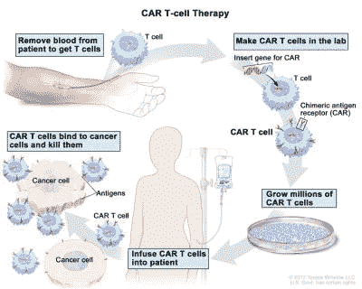
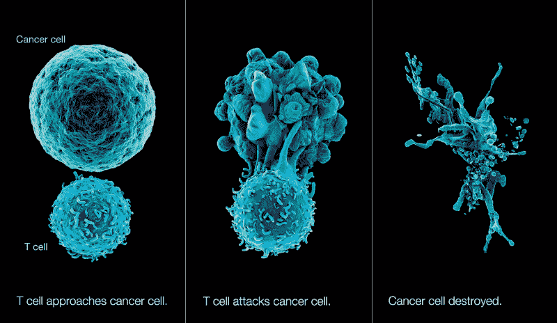

# CRISPR 可以用新发现的 T 细胞油炸所有癌症

> 原文：<https://hackaday.com/2020/01/27/crispr-could-fry-all-cancer-using-newly-found-t-cell/>

人体最大的特点之一是其天然的抗病毒保护。如果你的免疫系统工作正常，它会产生大量的 T 细胞，四处寻找癌细胞等异常情况，以便联合起来消灭它们。它们通过抓住称为抗原的小蛋白质片段来做到这一点，这些小蛋白质片段生活在坏细胞的表面，并向免疫系统报告它们的行踪。一旦 T 细胞控制了这些抗原，它们就可以释放毒素，摧毁坏细胞，同时将对健康细胞的附带损害降至最低。

CAR T-cell therapy process via [National Cancer Institute](https://www.cancer.gimg/cdr/live/CDR774647-750.jpg)

然而，这种相当巧妙的人类把戏并不总是奏效。癌细胞有时将自己伪装成健康细胞，或者通过在其表面生长如此多的抗原以至于 T 细胞无处可抓来阻止 T 细胞的攻击。

医学科学已经提出了一种相当新的方法来击败这些狡猾的癌细胞，称为 CAR T 细胞疗法。基本上，他们从病人身上抽血，提取 T 细胞，然后更换血液。T 细胞被送到 CRISPR 实验室，在那里它们被注射了一种经过修改的无活性病毒，这种病毒引入了一种新的基因，使 T 细胞在其表面长出一个小钩子。

这个钩子，他们称之为嵌合抗原受体(CAR)，允许 T 细胞通过化学方法看穿癌细胞的各种伪装并攻击它们。实验室繁殖这些超级士兵，并将他们送回治疗设施，在那里他们被注射到病人的前线。

## 蛋白质是释放汽车潜力的关键

目前，T 细胞疗法似乎只对白血病等以血液为基础的癌症有效，对对抗产生实体瘤的癌症无效。但是卡迪夫大学的一个团队发现了一种新的 T 细胞，这种细胞可能会改变游戏规则。这种 T 细胞与一种叫做 MR1 的蛋白质相互作用，这种蛋白质出现在身体每个细胞的表面。当它分析癌细胞的 MR1 蛋白质时，它可以告诉细胞内正在进行的代谢被扭曲，并将这个邪恶的细胞报告给免疫系统。

Immunotherapy illustrated. Via [North Shore University Health System](https://www.northshore.org/kellogg-cancer-center/our-services/immunotherapy/)

这一发现仍处于初级阶段，但潜力巨大。编辑 T 细胞与 MR1 蛋白特异性相互作用，有朝一日可能会杀死人类患者体内的多种癌细胞。目前，试验仅限于实验室，但前景是好的:研究人员已经成功摧毁了 10 多种癌症，包括许多实体瘤类型。

## 汽车仍然有点摇摇晃晃

CAR T 细胞疗法仍然是一种非常昂贵的前沿癌症武器，但它对身体的破坏远不如化疗，尽管有时需要低剂量来为基因编辑细胞腾出空间。还有一些问题需要解决——患者可能会有严重的副作用，其中一些会导致神经方面的困难，如思维混乱，说话和理解语言的困难。

另一个问题是 CAR T 细胞治疗过程的时间表——从最初的抽血到给患者注射个性化剂量需要 2-3 周。2019 年 6 月，试验开始于由健康细胞捐赠者制成并储存的现成版本的 CAR T 细胞。这种现成解决方案的缺点是供体细胞可能与受体细胞反应不佳，但并非总是如此。总而言之，这在我们看来是一种进步。

Unsplash 上由 [@nci 拍摄的主图像照片](https://unsplash.com/photos/W2OVh2w2Kpo)