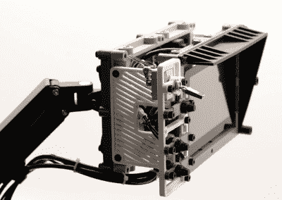

# 总是触手可及的覆盆子 Pi 终端

> 原文：<https://hackaday.com/2020/01/24/a-raspberry-pi-terminal-thats-always-within-reach/>

受电影《黑客帝国》等电影的启发，黑客被铰接臂上的显示器和键盘包围，[【杰伊·多舍尔】创造了这个赛博朋克“浮动”终端](https://back7.co/home/arm-terminal)，这样你最喜欢的 Linux 单板电脑就总是近在咫尺。你真的*需要在工作台旁边的墙上安装*这样的东西吗？大概不会。但是，这什么时候阻止过黑客读者呢？

[Jay]提出了一种“自动柜员机终端”的模块化设计，允许用户轻松地添加额外的硬件。终端的 3D 打印框架有挂载点，可以安装新模块[，由于有螺纹金属插件](https://hackaday.com/2019/02/28/threading-3d-printed-parts-how-to-use-heat-set-inserts/)，在多种配置下都不会有问题。

 这个初始版本的特点是左侧有一个面板，上面有各种按钮和开关，连接到 Pi 的 GPIO 引脚。只需一点代码，就可以很容易地获得这些控件的状态，并使用它们来启动您想象中的任何任务。在底部[Jay]安装了一个独立的 VFD 音频频谱显示器，连接到 Pi 的 3.5 毫米插孔。这完全没有必要，花费和树莓派一样多，但它确实很漂亮。

如果这种设计有缺点的话，那就是目前唯一支持的显示器是官方的 Raspberry Pi 触摸屏，只有 800×480，与更现代的面板相比有点昂贵。另一方面，官方屏幕背面的标准化螺栓图案也值得一提；因此，如果你想使用更高分辨率的显示器，请准备好设计自己的安装支架。如果你和班上其他人分享你的改变，会加分。

对于那些喜欢自动取款机终端的外观，但又不太喜欢被拴在墙上的人来说，你很幸运。[【Jay】之前创造了 Raspberry Pi 恢复套件](https://hackaday.com/2019/11/11/a-mobile-terminal-for-the-end-of-the-world/)，它分享了许多相同的设计原则，但将它们放入了一个坚固耐用的外壳中，为现场使用做好了准备。