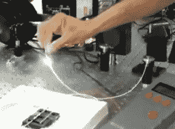

# 以安全的名义用大激光器烧东西

> 原文：<https://hackaday.com/2020/01/29/burning-things-with-big-lasers-in-the-name-of-security/>

量子研究的几个领域已经从研究实验室过渡到商业产品，伴随着一些夸大其词的声明。他们有他们说的那么好吗？我们需要像 Sarah Kaiser 博士这样的人来独立测试这些说法，寻找实施中的缺陷。在 2019 年 Hackaday 超级大会上，她分享了她关于[攻击商用量子密钥分发(QKD)硬件](https://www.youtube.com/watch?v=j3QV5_Me-v4)的研究。

看到题目中的“量子”一词，不要被吓跑。她的演讲很容易理解，几乎不需要量子研究术语的先验知识。事实上，这才是重点。凯泽博士的个人抱负是[让量子计算成为每个人都可以参与的诱人话题](https://www.sckaiser.com/blog/2019/12/17/qsharp-advent2.html)，而不仅仅是象牙塔里的精英研究人员。你应该在下面的视频中听她说完，并跟着[演示幻灯片](https://www.sckaiser.com/public/download/kaiser-hackaday-2019.pptx)。PPTX)。

## 量子密钥分配

那么，为什么 QKD 如此诱人呢？与现有的方法不同，理论基础是安全的，可以抵御任何受光速和物理定律限制的攻击者。

> *一般来说，如果你的攻击者没有被那些东西束缚，我们就有一个大得多的问题*。

但是正如我们所知，密码学的理论基础和实际实现之间总是有差异的。这种差异正是旁道攻击等攻击盛行的地方，因此她开始研究激光 QKD 系统的组件。

作为一个自称“疯狂激光女士”的人，这项调查的一部分检查了组件如何承受大激光器在正常工作范围之外输送功率**。这产生了类似光纤保险丝的激动人心的效果(视频中的 17:30)，这实际上是通过光纤传播的等离子体火焰。看起来很酷，但是破坏性很强，对隐蔽攻击没用。当激光被用来仔细降解选定的组件以使系统变得脆弱时，更有成效的结果出现了。**

 **如果你想从 Kaiser 博士那里了解更多关于量子密钥分发的知识，[她有一本书的章节是关于这个主题的](https://livebook.manning.com/book/learn-quantum-computing-with-python-and-q-sharp/chapter-3)。(可免费在线访问，但有限制。)这不是[第一次尝试](https://hackaday.com/2008/10/06/quantum-cryptography-in-band-attack)破解量子密钥分发，我们怀疑这将是最后一次。每一代产品都会提高对攻击的容忍度，我们需要像疯狂激光女士这样的研究人员来发现广告宣称背后的现实。

 [https://www.youtube.com/embed/j3QV5_Me-v4?version=3&rel=1&showsearch=0&showinfo=1&iv_load_policy=1&fs=1&hl=en-US&autohide=2&wmode=transparent](https://www.youtube.com/embed/j3QV5_Me-v4?version=3&rel=1&showsearch=0&showinfo=1&iv_load_policy=1&fs=1&hl=en-US&autohide=2&wmode=transparent)

**