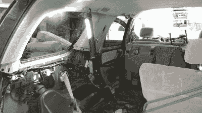
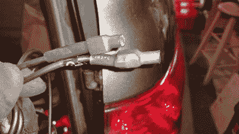
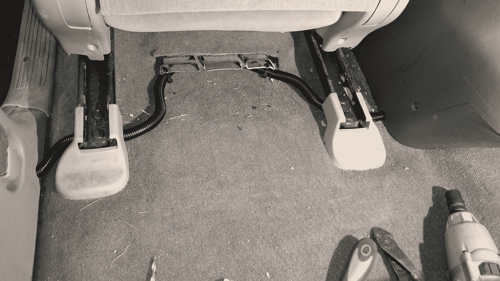
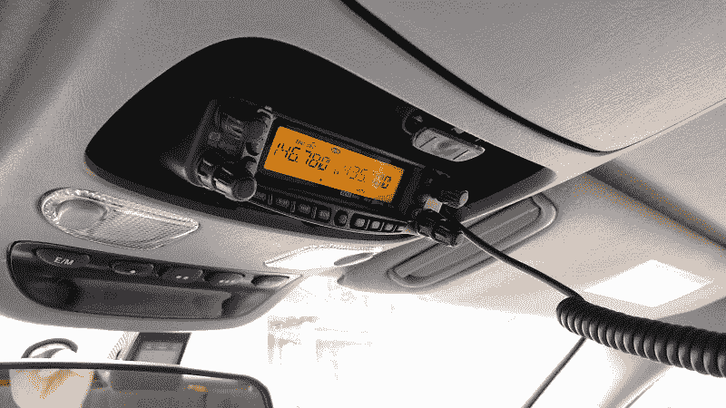

# 50 美元的火腿:走向移动

> 原文：<https://hackaday.com/2020/02/05/the-50-ham-going-mobile/>

到目前为止，在这个系列中，我们所涵盖的一切都围绕着最便宜和最简单的可能的广播方式:[获得你的技术员执照](https://hackaday.com/2019/03/08/the-50-ham-getting-your-ticket-punched/)，购买你的第一个低端便携式收发器，以及[在本地中继器网络上登记](https://hackaday.com/2019/04/11/the-50-ham-checking-out-the-local-repeater-scene/)。这些都是好东西，而且有可能你真的能完成这三个步骤，而且你的 50 美元钞票还有剩余。就像我说的，业余无线电不一定要很贵才有趣。

但在某种程度上，每个新的锤子都会渴望第一个“真正的”装备，在功率方面更有活力，也许还有更多的功能。对于许多技术人员来说，显而易见的选择是移动钻机，可以用来在上班的路上与同事聊天，或者在长途旅行中打发时间。无论你的动机是什么，一旦你买了一台收音机，你就必须安装它，其中存在着大量的挑战，既有电气的也有机械的。

我最近尝试了一个移动设备，虽然无线电和天线比 50 美元贵一个数量级，但安装过程相当便宜。但在这个系列中，重要的不是东西的价格；相反，这是为了表明业余无线电就是要自己动手，即使这意味着要把你的车从里到外拆开，然后围绕着一台收音机重新组装。

## 选择钻机

无论你最终买什么样的收音机，都将完全取决于你打算如何使用它。技术人员可能想要一个双波段无线电，覆盖 2 米(VHF)和 70 厘米(UHF)波段，这将使您能够访问本地中继器。功能和质量因品牌而异，但如果你坚持使用“三巨头”之一——八重洲、建伍和 ICOM——你会物有所值。Alinco 可能也属于那里，你可以找到像样的移动设备，这些设备是备受嘲笑的“廉价中国手持对讲机”的高功率版本，售价不超过 50 美元。

我选择的是一台[八重洲 FT-8900R](https://www.yaesu.com/indexVS.cfm?cmd=DisplayProducts&ProdCatID=106&encProdID=0C4855ADE6394D514EAABAE148B93F5C&DivisionID=65&isArchived=0) ，一台现已停产的四波段收音机。除了通常的 UHF 和 VHF 波段，8900 还具有 6 米和 10 米波段，前者被称为“神奇波段”,因为它可以以多种不同的方式工作，后者为单工、无中继器通信提供了一些有趣的选择。技术人员可以使用所有的 6 米波段，但只有 10 米的一小部分，而且只能使用单边带语音。FT-8900R 是一款仅支持 FM 的收发器，但由于我有通用执照，所以我可以在 10 米波段上使用它。无线电也可以设置为跨波段中继器，这对我来说有一些有趣的可能性。

如今，几乎所有的 FM 移动火腿钻机都是数字的，其中许多都支持一种或另一种数字调制方案，如系统融合和 DMR。许多都支持内置的自动数据包报告系统(APRS ),可以让您自动报告信息，如您的 GPS 位置。制造商对市场的反应是提供尽可能多或尽可能少的华而不实的东西，所以不管你想要什么，很有可能有人会做出来。奇怪的是，移动设备是业余无线电领域中没有太多自制的领域，尽管有一个活跃的社区将旧的超高频和甚高频商业波段无线电重新用于业余无线电。但大多数人只是买了一个设计精良的 COTS 收音机，并使用该装置来表达他们的自制创意。

## 规划安装

Nearing peak disassembly. The radio will go just below the drop light.

让我告诉你，现代汽车和卡车需要大量的创造力和独创性来实现一个干净，专业的安装。很多年前，我开始做移动安装，当时汽车里有更多的金属，而电子元件和线束却少得多。那时，很容易找到一个可靠的接地，你永远不必在安全气囊计算机、安全带预紧器和信息娱乐组件周围工作。现代汽车的安装更具挑战性，但也更有趣，因为你会惊叹于工程师的技能，他们设计的零件可以用最少的工具快速组装，然后在你试图拆卸没有可见紧固件的东西时诅咒他们的名字。

Protip: many control-head cables have RJ-style connectors. Protect the locking tab while running the cable with a little heat-shrink tubing.

规划您的安装可能是最关键的一步。许多移动设备都带有可分离的面板，因此收音机本身可以安装在行李箱上或安装在座位下，而带有显示器和麦克风的控制头可以放在容易使用的地方。当安装在现代汽车上时，这是一个巨大的好处，因为放置大型一体式收音机的选择有限；小控制头更容易楔在某个地方，仍然是可用的。就我而言，我决定把我的 2004 年丰田红杉车的一个置物箱拿掉，把车头放在它的位置上，而收音机本身会放在“回来的路”上的一个侧袋里。

在计划好零件的走向后，你需要弄清楚如何以及在哪里走线。火腿钻机需要大量的电流——7 到 10 安培的传输是常见的——它们需要用粗电线直接连接到车辆电池。不要在这方面精打细算，试着在仪表板下挖掘一些东西，就像我们过去安装售后市场音响一样。在防火墙中找到一个插头或索环，并正确操作。保险丝是必须的。你不希望一根 12 号线穿过汽车，当有东西短路时像保险丝一样。问我怎么知道的。

从物理上保护电源线——就此而言，所有的电线——也非常重要。花几块钱买一台波纹塑料对开织布机，把电线包起来，尤其是在人们可能会踩到或踢到它们的地方。

## 整洁很重要

现代汽车的好处是有很多隐蔽的地方可以布线。糟糕的是接触到他们。几乎汽车中的每一个塑料装饰件都是用某种塑料紧固件固定的，这种紧固件很可能会断裂，也很可能会脱落。购买一套修剪去除工具；这将给你一个更好的机会来释放这些紧固件，而不会破坏它们或损坏其他零件的表面。尽管如此，在这个阶段仍然有 50%的失败率。

Nice and neat and safe from feet – make sure you loom your wires to protect them from damage.

我设法相当容易地运行我的电线。控制头的电线穿过车顶内衬到达“C”柱(从前面数第三个车顶柱)上的装饰件；而电源和遥控扬声器电线从后排乘客门槛下和驾驶员座椅下穿过，到达中控台。我很幸运，因为我之前在控制台中安装了一个逆变器，所以已经有了非常大规格的电线。不过，我还是小心翼翼地将收音机的线束正确地编织起来，并使用合适的压接工具安装好压接连接器。我还确保保险丝易于更换。

Finished install. The front face could use a little more illumination for easier nighttime use, though.

## 下次

可能在任何移动火腿装置中最关键的任务是处理天线。你不仅要为这项工作挑选一个合适的天线，还要安装它。这可以简单到推倒一个磁性底座，然后把天线拧上，或者简单到用一把孔锯在你的屋顶上钻孔。即使在此之后，还有其他工作，如调整天线，测试安装，并减轻汽车本身引起的任何噪音。这些都是具有挑战性的工作，我们将在下一期讨论它们。