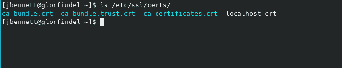

# 符号链接故障排除 Git 记录手册的推理小说

> 原文：<https://hackaday.com/2020/02/06/troubleshooting-a-symlink-a-whodunnit-for-the-git-record-books/>

虽然我通常会戴着一顶冷酷的系统管理员的旧软呢帽，但周日早上我会把新黑色的配饰换成科技黑色的:一副专业耳机。这是这两个角色冲突的故事。亲爱的读者，这是一场教育闹剧。你看，我每周的工作是运行一个脸书直播流，脸书最近开始执行一项新政策:所有的视频流都必须使用加密。我们在媒体机器上安装了 Fedora，并使用开放广播软件(OBS)进行流式传输。更新流设置应该很容易。我做了必要的修改，并进行了测试——运气不好。错误消息没有什么帮助:“无法连接到服务器”。我叹了一口气，摘下耳机，戴上 sysadmin 的帽子，走进了数字的黑暗中。该回去工作了。

## 什么是 RTMPS？

一些术语，在我们开始之前。RTMP 是实时消息协议，最初由 Macromedia 开发。感谢 Adobe，RTMP 的一个版本现在是一个开放的规范，许多视频流服务现在使用它在互联网上传输实时音频和视频。RTMPS 只是加密版本，其中 RTMP 被包装在 TLS/SSL 连接中。TLS(传输层安全性)是支持 HTTPS 的相同协议。TLS 确实依赖于您的机器有一个好的证书包副本，这是一个被认为是可信的公钥集合。

如何着手解决这类问题呢？好的第一步是获得更有用的错误消息。从命令行运行 OBS 可以让我们看到所有通常不可见的额外输出消息。下面我删掉了所有多余的消息，以突出失败的连接尝试。

```

info: [rtmp stream: 'simple_stream'] Connecting to RTMP URL rtmps://rtmp-api.facebook.com:443/rtmp/...
info: RTMP_Connect1, TLS_Connect failed: -0x7680
info: [rtmp stream: 'simple_stream'] Connection to rtmps://rtmp-api.facebook.com:443/rtmp/ failed: -2
info: ==== Streaming Stop ================================================

```

现在我们有进展了。故障具体出现在 TLS 连接中，这一点我们已经猜到了。我们还会得到一个错误代码。尝试搜索该错误的快速提示:Google 会将前导破折号解释为您想要的结果不包括该搜索词。用引号将它括起来，`"-0x7680"`是获得有用结果的方法。

## 如何缩小错误原因的范围

搜索该错误号将会找到两个有趣的结果。一个是在 OBS 论坛的帖子，我们这些面临这个问题的人一直在讨论这个问题。另一个打击是[mbed TLS 文档](https://tls.mbed.org/api/ssl_8h.html#a31bcc2bfd103177e3e76e04219e0497f)，其中定义了该代码的一个错误。这可能是一个误报，但由于我们正在对 TLS 问题进行故障诊断，它可能是相关的。那个错误是`MBEDTLS_ERR_SSL_CA_CHAIN_REQUIRED`，描述为“没有设置 CA 链，但是需要操作。”

那么下一步是什么？我们已经了解了一些，但仍然没有任何答案，所以让我们深入代码。我的备用快速调试技术是添加`printf()`调用来帮助跟踪代码执行，但是从哪里开始呢？我们在程序输出中有一个面包屑，“RTMP _ 连接 1”。在 Github 上搜索 OBS 代码库，我们会在[找到一个名为](https://github.com/obsproject/obs-studio/blob/fbc2d9c87e2be8f70216a7bebf936e187bbb711a/plugins/obs-outputs/librtmp/rtmp.c#L1042)的功能。在这个函数的中途，我们可以看到[打印日志消息的命令，这个命令把我们带到了](https://github.com/obsproject/obs-studio/blob/fbc2d9c87e2be8f70216a7bebf936e187bbb711a/plugins/obs-outputs/librtmp/rtmp.c#L1100)。

该错误消息表明没有加载 CA 链。这听起来像是初始化问题。也许在 OBS 源中使用了术语“链”。搜索我们的可疑文件返回 18 个匹配项，其中 17 个在一个名为`RTMP_TLS_LoadCerts()`的函数中。我花了一些时间跟踪 RTMP 连接的执行流，甚至画出了每个函数被调用的草图。代码引导我回到了`RTMP_TLS_LoadCerts()`。这个函数包含了相当多的代码，但是我们可以安全地忽略特定于 Windows 或 MacOS 的部分。有一个明显的行应该加载系统证书。

```
if (mbedtls_x509_crt_parse_path(chain, "/etc/ssl/certs/") &< 0) {
        goto error;
    }
```

因此 OBS 对 mbedtls 库进行函数调用，请求加载`/etc/ssl/certs/`中的证书。让我们确保一个正确的证书文件确实在 OBS 期望的地方:



Ca-bundle.crt 是我们正在寻找的文件。注意到蓝绿色了吗？这三个文件实际上是指向另一个位置的符号链接。Linux 文件系统上的文件一直都是符号化链接的，所以这可能不是问题。我花了一些时间检查文件权限之类的东西，并尝试禁用 selinux，但一无所获。这似乎不是一个过分热心的安全设置。我只知道我有一个 mbedtls 函数，它应该加载证书包，但是当程序实际尝试验证 tls 证书时，它抱怨说链`ca-bundle.crt`丢失了。如果 mbedtls 函数失败了，难道不应该出现错误吗？下一个合乎逻辑的步骤是查看函数的文档。

现在我们找到了第一个关于可能会发生什么的真正线索。可以部分失败，但仍然给我们一个不会触发错误的返回代码。所以，是时候使用`printf()`来查看我机器上的返回代码了。我添加代码，编译，运行输出二进制文件……但没有得到这样的日志输出。

我花了很长时间才弄明白为什么我的代码更改在运行程序时似乎没有什么不同。这是一个需要小心的潜在陷阱。OBS 使用模块化结构，由 OBS 二进制以及各种可加载模块组成。我所做的代码更改是`obs-outputs.so`的一部分，即使在运行编译好的二进制代码时，这些模块也是从它们的默认位置加载的。为了测试我的更改，我必须明确地告诉 OBS 使用新编译的模块。

## 讨厌符号链接的系统调用

很明显`mbedtls_x509_crt_parse_path()`出了点问题。我在文档中看不到任何明显的东西，但是我确实看到了一个类似的函数，`mbedtls_x509_crt_parse_file()`。如果我们强迫 mbedtls 只尝试加载我们关心的一个 crt 文件，会发生什么？我做了更改，编译，让我惊讶的是 OBS 终于连接到脸书现场。我有一个真正的修复，但我仍然不明白它为什么坏了。是时候看看 mbedtls 源代码了。

在 mbedtls 源代码树中很容易找到 [`parse_path()`函数](https://github.com/ARMmbed/mbedtls/blob/development/library/x509_crt.c#L1518)。确保观看`#if defined()`块——我们对 Windows 的代码不感兴趣。一旦我们发现[在给定路径中为每个文件](https://github.com/ARMmbed/mbedtls/blob/development/library/x509_crt.c#L1600)运行的循环，问题代码可能会跳出来。

```

        else if( stat( entry_name, &sb ) == -1 )
        {
            ret = MBEDTLS_ERR_X509_FILE_IO_ERROR;
            goto cleanup;
        }

        if( !S_ISREG( sb.st_mode ) )
            continue;

```

`Stat()`是获取文件系统路径状态的系统调用，然后 S_ISREG 是检查该路径是否指向常规文件的宏。值得注意的是，parse_file 函数并不做这种检查，而是很乐意加载一个符号链接。

## 报告 Bug，但是向谁报告呢？

这当然是核心问题。Fedora 使用一个符号链接`ca-bundle.crt`，当它是一个符号链接时 mbedtls 拒绝加载`ca-bundle.crt`。我们理解这个问题，但适当的解决办法是什么？哪个项目实际上有问题？OBS 根据其文档正确使用了 mbedtls 函数，mbedtls 可能有很好的安全理由拒绝加载实际上是符号链接的包。是在 RPMFusion 上，和包维护者修复不兼容的吗？就我个人而言，我认为这实际上是一个 mbedtls 问题，尤其是因为在我遇到的任何文档中都没有提到这个怪癖。最终，哪个项目需要拥有这个问题不是我说了算。

那么，我们的最后一个任务是报告我们发现的 bug。在这一点上停下来，问问自己，这个 bug 是一个潜在的安全问题吗？最好尝试私下报告安全问题，大多数项目都有披露此类问题的联系说明。根据你在哪里发现的问题，你甚至有资格获得发现问题的 bug 赏金。

假设没有要考虑的安全角度，您会想要做一个错误报告。这个项目有公开的 bug 追踪器吗？那可能是它应该去的地方。如果没有，可能会有一个报告错误的邮件列表。包含足够的信息来重现 bug，以及您认为正在发生的事情的细节，但是不要在 bug 或邮件列表中包含一堆日志输出。如果相关，使用 pastebin 或其他文本托管网站，以避免在错误报告中包含大量文本。如果你知道如何解决这个问题，就提出来。在邮件列表中，补丁通常是可以接受的。如果项目使用 Github 或 Gitlab，您可以报告 bug，然后提交一个 pull 请求来修复它。

特别是对于琐碎的变更，我倾向于询问项目更喜欢什么，我是否应该发送一个拉请求，或者这是否足够琐碎到不需要一个就可以解决。如果你想在这个项目上做未来的工作，做公关是让你的名字进入 git 记录的一种便捷方式。如果有你已经修复错误的记录，项目更有可能对你未来的工作有好感。

## 另一个故事的结尾

这个结果很好。OBS 正在添加一些解决方法代码，以确保 ca-bundle 在它是 symlink 的系统上正确加载。mbedtls 项目将这种行为视为一个 bug，我已经提交了一个补丁来修复它。我注意到在证书加载代码中有一个相关的逻辑错误，它也已经被承认了。我已经修补了 OBS 的副本，所以直播又可以工作了。这对于系统管理员来说是家常便饭。然而，疲倦的人没有休息。我有一对 10Gb 的以太网卡，每当它们传输 VLAN 标记的流量时就会死机。只是另一个案子。

### 正误表

我知道更有经验的程序员会在评论里指出，`stat()`从来不会把 st_mode 设置成 S_IFLNK。`Stat()`跟随符号链接报告目标，而`lstat()`告诉你符号链接本身。我的解决方法奏效了，但是问题与我想象的略有不同。`Mbedtls_x509_crt_parse_path()`如果指定目录下只有部分文件加载成功，会返回一个正值。OBS 将该正值视为失败，并立即转储已加载的证书。在查找和修复 bug 时，追踪这样的错误线索是完全正常的。最终，错误被修复，这才是真正重要的。失陪了，我得找点东西把嘴里的乌鸦味洗掉。