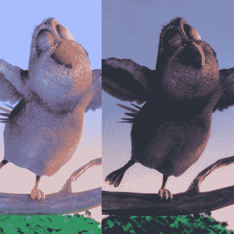

# 欺骗大脑看到立体图像中增强的对比度

> 原文：<https://hackaday.com/2020/02/01/tricking-the-brain-into-seeing-boosted-contrast-in-stereo-imagery/>

去年，一组研究人员发表了一篇论文，详细介绍了一种提高立体显示器视觉对比度和图像质量的方法。这种方法被称为[dich optic Contrast Enhancement(DiCE ),其工作原理是向每只眼睛展示图像的一个略有不同的版本，诱使大脑将两个视图融合在一起，以提高感知的图像质量](https://www.cl.cam.ac.uk/research/rainbow/projects/dice/)。这只适用于像 VR 头戴式设备这样的立体显示器，但是计算简单，容易实现。这种技巧可以用来抵消耳机中使用的显示器的一些限制，例如，使它们看起来能够比实际提供的对比度更高。这很好，因为高对比度通常被认为更真实、更立体；VR 头戴设备和其他立体显示器中的重要因素。

立体视觉的工作原理是让大脑将双眼看到的东西融合在一起，这个过程被称为双目融合。每只眼睛看到的微小差异大多向我们传达了深度感，但 DiCE 使用双目融合的一些奇怪现象来欺骗大脑感知视觉中增强的对比度。这种感知到的更高的对比度反过来导致更强的深度感和整体图像质量。

Example of DiCE-processed images, showing each eye a different dynamic contrast range. The result is greater perceived contrast and image quality when the brain fuses the two together.

为了实现这一点，DiCE 向两只眼睛显示了不同的对比度，旨在鼓励大脑以积极的方式将它们融合在一起。简而言之，对每只眼睛使用单独且不同的动态对比度范围会在融合图像中产生总体上更大的感知对比度范围。这在理论上很简单，但实际上有许多问题需要解决。其中最主要的是这样一个事实，如果两只眼睛看到的东西差别太大，结果是由于双眼竞争造成的不适。DiCE 背后的艰苦科学工作来自实验性地确定最佳位置，以及独立于观众和内容的预计算过滤器，以便可以实时应用它来获得一致的结果。

类似这样的事情提醒我们，我们只能通过感官的过滤器来体验世界，我们对现实的感知有一些怪癖，这可以通过这个项目和其他“感官融合”的边缘案例来证明，如热格栅幻觉，我们看到它被用作沙丘中疼痛盒子的复制品[。](https://hackaday.com/2015/02/21/making-the-dune-pain-box-a-reality/)

下面嵌入了该方法的简短视频概述，并且可以下载出版物的 PDF 以供进一步阅读。想要更实际的方法吗？该团队甚至制作了一个[骰子插件(免费)，可以从 Unity 资产商店](https://assetstore.unity.com/packages/tools/particles-effects/dice-dichoptic-contrast-enhancement-for-vr-and-stereo-displays-155141)获得。

 [https://www.youtube.com/embed/2GgvY8dn9Kg?version=3&rel=1&showsearch=0&showinfo=1&iv_load_policy=1&fs=1&hl=en-US&autohide=2&wmode=transparent](https://www.youtube.com/embed/2GgvY8dn9Kg?version=3&rel=1&showsearch=0&showinfo=1&iv_load_policy=1&fs=1&hl=en-US&autohide=2&wmode=transparent)

[通过[路到 VR](https://www.roadtovr.com/dice-dichoptic-contrast-enhancement-research-vr/)