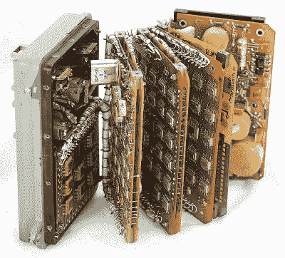

# 苏联联盟号时钟拆卸

> 原文：<https://hackaday.com/2020/01/29/soviet-soyuz-clock-teardown/>

我们喜欢宇宙飞船，当然也喜欢拆卸，尤其是对于老式设备。[Ken Shirriff]写道[从苏联联盟号系列宇宙飞船](http://www.righto.com/2020/01/inside-digital-clock-from-soyuz.html)上拆卸数字时钟模块，该设备有许多有趣的部分。毕竟已经进入太空了。

联盟号系列宇宙飞船于 1966 年进行了处女航，至今仍在飞行。问题中的时钟来自中间的某个地方，大约在 1996 年。从外面看，它看起来就像任何一个宇宙飞船的小发明，这个数字钟可以记录当地时间，还有秒表和闹钟功能。更有趣的是，不下 10 块多氯联苯夹在这个小盒子里。

该系统由双层板组成，混合了 SMD 和通孔元件，通过一系列电线相互连接，这些电线捆扎在一起形成线束。这些图片展示了一种非常聪明的设置堆叠的方法，该系统可以像书一样打开。这样就可以使用外观独特的元件，包括 14 引脚扁平封装芯片、大型陶瓷多线圈电感、绿色电阻和橙色矩形二极管。

有隔离的 PSU 板，控制板，时钟电路，一些胶水逻辑把东西放在一起，和 LED 显示器与驱动电路。[Ken Shirriff]深入探讨时钟电路和各种相关器件，并与美国技术进行比较。在这些板上有很多有趣的细节，它可能是一些人的灵感来源。

如果你正在寻找更多的太空技术，看看收藏在国际空间站的[。](https://hackaday.com/2018/12/10/the-space-station-has-a-supercomputer-stowaway/)

谢谢你的提示[托尔斯滕·埃格特]

 [https://www.youtube.com/embed/JBIhzEZkWEA?version=3&rel=1&showsearch=0&showinfo=1&iv_load_policy=1&fs=1&hl=en-US&autohide=2&wmode=transparent](https://www.youtube.com/embed/JBIhzEZkWEA?version=3&rel=1&showsearch=0&showinfo=1&iv_load_policy=1&fs=1&hl=en-US&autohide=2&wmode=transparent)

