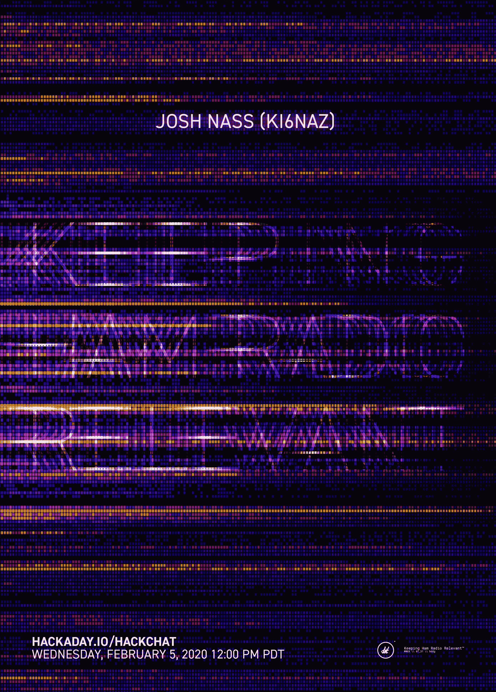

# 保持业余无线电相关的黑客聊天

> 原文：<https://hackaday.com/2020/02/03/keeping-ham-radio-relevant-hack-chat/>

加入我们太平洋时间 2 月 5 日星期三中午的[保持业余无线电相关黑客聊天](https://hackaday.io/event/169574-making-ham-radio-relevant-hack-chat)与乔希·纳斯！

可能看起来不像，但是业余无线电正在为它的继续存在打一场两方面的战争。在频谱方面，随着新通信技术的发展，业余无线电爱好者面临着持续的威胁，即仍然分配给他们使用的宝贵频谱碎片将被回收并出售给出价最高的人。在人口统计方面，业余无线电正在老化，越来越少的年轻人有兴趣从事获得许可所需的工作，更少的人仍然有办法进行广播。

业余无线电有着悠久而丰富的历史，但业余爱好者声称他们的爱好是神圣不可侵犯的日子已经一去不复返了，因为它可以在紧急情况下提供通信。停留在这个特殊的桂冠上不会为这个爱好赢得新的追随者，也不会帮助它保持其频谱分配，所以乔希·纳斯(KI6NAZ)正在帮助改变这种对话。乔希是来自南加州的工程师和无线电爱好者，他经营着一个业余无线电速成班，这是一个 YouTube 频道，致力于让人们了解业余无线电。Josh 的每周直播和他对火腿广播产品和项目的视频评论展示了这个世界上最大爱好的另一面，更活跃的一面(通过像“[空中峰会](https://www.youtube.com/watch?v=_mccku0OgNg)”这样的活动)，专注于新火腿可能更有趣和更容易获得的数字模式。

加入我们的 Hack Chat，讨论如何让业余无线电在当今技术普及的世界中发挥作用。我们将谈论业余无线电面临的挑战，即使乐队像现在这样死去，广播中仍有乐趣(剧透:他们不是真的)，以及我们可以做些什么来保持业余无线电的相关性。

 我们的黑客聊天是 [Hackaday.io 黑客聊天群发消息](https://hackaday.io/messages/room/2369)中的社区直播活动。本周，我们将于太平洋时间 2 月 5 日星期三中午 12:00 坐下来讨论。如果时区让你烦恼，我们有[一个方便的时区转换器](https://www.timeanddate.com/countdown/generic?iso=20200205T12&p0=224&msg=Making+Ham+Radio+Relevant+Hack+Chat&font=cursive)。

点击右边的那个发言气泡，你会被直接带到 Hackaday.io 上的黑客聊天群，不用等到周三；随时加入，你可以看到社区在谈论什么。

