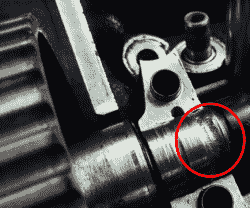
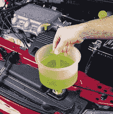
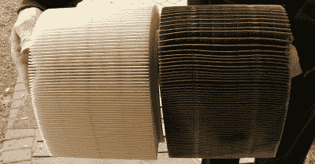
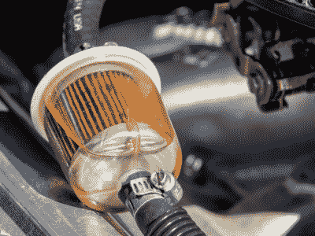

# 如何进入汽车:基本保养

> 原文：<https://hackaday.com/2020/02/12/how-to-get-into-cars-basic-maintenance/>

所以，你已经决定你想进入汽车行业。经过一番研究和深思熟虑，你已经为自己买了一辆可爱的项目车，并且迫不及待地开始工作。首先，是时候学习基本维护了！

## 享受美好时光

按时做必要的保养是享受你的项目车的关键。太多的齿轮头知道一只被忽视的野兽的痛苦，它花在千斤顶上的时间比在路上的时间还多。购买合适的汽车，并密切关注需要做什么，将大大改善您的体验和与您的乘坐关系。

如果你刚买了一辆车，不管东西看起来有多好，仔细检查一下以确保一切都符合标准是个好主意。这可以避免昂贵的损失，而且如果你是汽车新手，这是一个很好的方法。作为新手，你可以做一些简单的工作，让你的车保持最佳状态。

### 液体

为了平稳可靠地行驶，您的汽车依赖于各种高度工程化的液体。使用正确的液体并定期更换对于确保您的汽车性能良好非常重要。虽然卖家可能已经向你保证一切都已按计划完成，但当你把项目带回家时，你应该做的第一件事就是更换液体。

A lack of oil pressure caused the cam to seize in the head in my 1992 Daihatsu Feroza. This totalled the car, and I miss it dearly!

机油可能是最重要的。随着时间的推移，污染物在油中积累，油开始失去作为润滑剂的效力。离开太久，你的油泵会堵塞，你会失去油压，在几秒钟内摧毁你的引擎。或者，随着发动机的磨损，金属颗粒会越积越多，你的机油滤清器只能做这么多。你想保持你的油新鲜和适当的等级，大多数制造商建议一个固定的时间段或里程数来改变油。对绝大多数汽车来说，这是一项容易的工作，尽管你可能会发现很难够到你的机油滤清器(看看你，Miata)。这是一个让你在车上工作时感到舒适的好方法——只要确保你在启动引擎前加好新油，否则你几乎肯定会毁了你的车。[你甚至可以将油样送去分析，这有助于诊断长期问题。](https://jalopnik.com/how-a-28-laboratory-test-may-have-just-saved-my-engine-1795355769)哦，每次一定要给我们换一个新的过滤器——并注意有无泄漏！

A spill-free funnel makes changing your coolant and burping the system easy.

冷却液也是需要定期检查和更换的重要液体。如果它看起来生锈和棕色，你的发动机部件正在腐蚀，这对你的长期健康没有好处。值得庆幸的是，这很容易改变:大多数汽车都有一个水龙头，可以在你加满冷却液之前帮助倾倒冷却液。如果东西特别脏，在更换液体之前，您可能需要在系统中运行冷却液冲洗溶液。只是要确保你在上路前正确地排出系统中的空气，以免你的发动机过热。

您汽车中的其他液体通常在需要维修前有相当长的间隔。自动变速器通常很少建议更换机油；10 万公里以上是常见的。类似的时间间隔对于手动变速箱和差速器油是典型的。如果你刚买了一辆车，而且它的换挡和驾驶都很好，你可能会安全地离开这些。通常情况下，它们有点难以处理，所以一旦你对扳手有了更多的了解，就可以考虑去处理它们了。

### 过滤

过滤器起着重要的作用，确保你的车每次在危险的加油站加油时不会堵塞燃料喷射器，或者确保沙子不会破坏气缸孔。然而，随着时间的推移，它们会堵塞，导致性能下降和其他琐碎的问题。令人欣慰的是，它们通常很便宜，容易更换，并且很容易由 shadetree 技工处理。

If your filter looks like the one on the right, it’s time for a change. Image credit: Napa Auto Parts

空气滤清器是发动机防止灰尘和微粒的主要保护装置。它们通常由纸或泡沫制成，通常位于发动机旁边或顶部的可触及位置，简单的目视检查通常足以判断它们是否需要更换。如果它们脏了或散架了，就把它们换掉。如果它被油覆盖，你也会想要一个新的，尽管这表明你有其他问题。一般来说，高质量的 OEM 过滤器是最好的替代品。除非你真的知道自己在做什么，并且正在采购高质量的零件，否则换成豆荚过滤器或廉价的易贝进气装置不会有什么好处。

Carbureted cars often use these nifty transparent filters, making inspection easy. Fuel injected cars run at higher fuel pressures, necessitating metal-cased filters instead.

燃油滤清器负责确保您的化油器或喷油器的微小通道不会被燃油中的碎屑堵塞。如果你遇到了磕磕绊绊或加速不足的奇怪问题，你可能会发现你的燃油滤清器正接近其寿命的尽头。当它们堵塞时，燃油压力下降，这可能会导致性能问题。化油器汽车通常有一个或多个直列式过滤器，只需一把螺丝刀就可以更换。燃油喷射汽车可能会稍微复杂一点，通常有多个过滤器，但如果你知道去哪里找，它们仍然很容易改变。他们的罐内泵上也有一个特殊的过滤袜，但这些通常和泵一样长，你不必太担心它们。

### 车轮和轮胎

在赛道上询问如何开始让你的车更快，你会得到的第一件事就是“轮胎，轮胎，轮胎”。你的轮胎是你的汽车和道路之间的接口，无论你对汽车的其他部分做什么，如果你有坏轮胎，一切都将是徒劳的。然而，这不仅仅是赛道上的速度——无论你是在街上还是在越野中驾驶，一套好的轮胎对于保持你的车指向正确的方向，避免倒在沟里是很重要的。

My project car originally came on a set of ugly 17″ rims with mismatched tires, which I promptly swapped for something a little more fitting. I’m also very poor at caring for the paint.

通常情况下，项目车可能带有不匹配的车轮和轮胎，或者完全裸露的橡胶。最糟糕的情况是，你从谷仓或田地里拖出一样东西，它已经在橡胶上放了 10 多年了。仅仅因为他们有胎面和保持空气，并不意味着他们可以安全驾驶。橡胶不容易老化，除非你的新座驾有一套新鲜的肉，有足够的胎面和当前的日期代码，否则你会想把它们换掉。

注意车轮和轮胎的尺寸也很重要。给你的车装上巨大的轮圈对某些人来说可能看起来很酷，但这通常会破坏你的操控性。当然，没有必要拘泥于制造商的标准车轮——毕竟，这些车轮可能会很丑，很无聊。得到合适的车轮和轮胎的最好方法是和其他车迷交流，他们的车况和你的差不多。他们会告诉你什么适合你的车，你的悬挂设置，以及你的预期目标。

例如，最初的 NA Miata 配备了 14 英寸 x 5 英寸的车轮。这种鞋很适合在城市里行走，但在赛道上使用时，它们太瘦了，不能产生很大的抓地力。如今也很难找到适合 14 英寸车轮的优质橡胶；有多种选择，但它们既昂贵又晦涩难懂。通过询问论坛，并与赛道上的老手聊天，我能够了解到一套 7-8 英寸宽的 15 英寸车轮将是一个很好的赌注，理想情况下偏移在+20 到+35 之间，以确保它们很好地填充防护装置。有了这些知识，我就能够购买一套看起来很棒而且合适的车轮，而不需要任何车轮垫片或其他难看的工具。包裹在一些粘性的半胶片中，我的圈速一夜之间下降了 4 秒！通过做我的研究，我得到了一个很好的结果，没有浪费任何时间和金钱。

### 修复故障

很可能，当你买了一个项目，你的车有一些问题。也许它的排气管有噪音，或者它使用了过多的燃料。虽然这些可能不会妨碍你的车从 A 地到 B 地，但它们会大大降低你的乐趣，并增加拥有项目车的财务负担。然而，解决这些问题是开始了解您的汽车如何工作的一个好方法！

对于初学者来说，诊断可能是困难的，尤其是当面对棘手的问题、最少的工具和有限的经验时。许多人会猜测问题的原因，并开始更换部件，结果却发现问题反复出现。理想情况下，找到问题的根本原因会更有成效。这是通过从逻辑上查看症状，并测试零件和子系统以查看它们是否确实正常运行来实现的。这包括学习如何使用万用表、压力表和各种其他设备。这可能很贵，但将来会有回报。通常，重要的是权衡购买更多的工具还是简单地把车带到已经有装备的商店。

A scantool makes fault finding easier on modern EFI cars. Bluetooth versions like the one above interface with your smartphone to display codes.

一个工具，任何扳手应该有工作的 OBD-II 装备的汽车是扫描工具。这插入到 1996 年以后的车辆的诊断端口中，并允许 ECU 将故障代码传达给驾驶员。这在很多情况下都很有用。例如，如果您的燃油经济性很差，并且您的 scantool 报告了一个糟糕的氧传感器信号，那么更换该部件并使其再次运行是很简单的。其他问题，如熄火，可能更难诊断，但扫描工具仍有助于为您指出正确的方向。

令人欣慰的是，汽车社区的许多部分都渴望与那些渴望学习的人分享他们的知识和激情。脸书团体、论坛和类似的聚会是寻求帮助的好地方。通常，你的问题会被很多人遇到过，简单地把症状输入谷歌就会得到你需要的答案。否则，伸出手，和那些可能有帮助的人开始对话。找一个好的当地机械师也会有所帮助。虽然许多商店的存在只是为了让汽车进进出出，但其他商店通常专注于某些品牌和型号，并愿意与需要帮助的车迷合作。我自己也很幸运地认识了几个伟大的机械师，他们能够介入并解决一些棘手的问题，这些问题超出了我自己的能力范围。在取车后，我从快速聊天中学到了很多关于他们必须做些什么来解决问题！

## 这是马拉松，不是短跑

对于刚开始对汽车感兴趣的人来说，有时会觉得太多了。如果你刚刚开始在你的新座驾引擎盖下四处摸索，发现一堆乱七八糟的电线、脏兮兮的软管和一大堆拉链，你可能会有点不知所措。然而，通过定期维护、咨询知情人士和一点点毅力，你可以学到很多东西，并为自己打造一个甜蜜的旅程。黑客快乐！