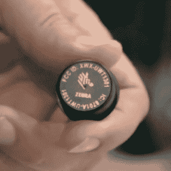
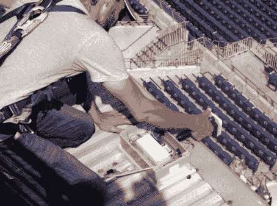
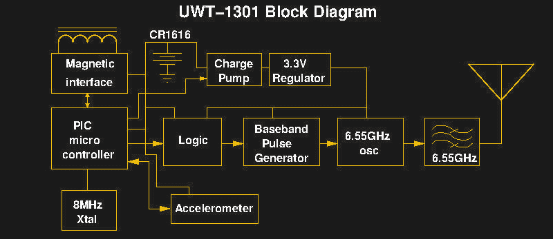
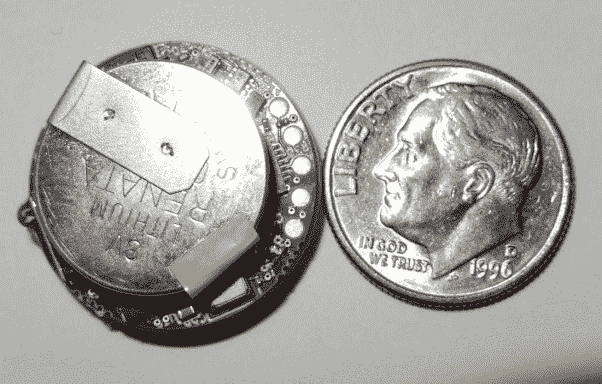
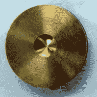
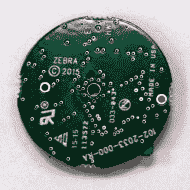
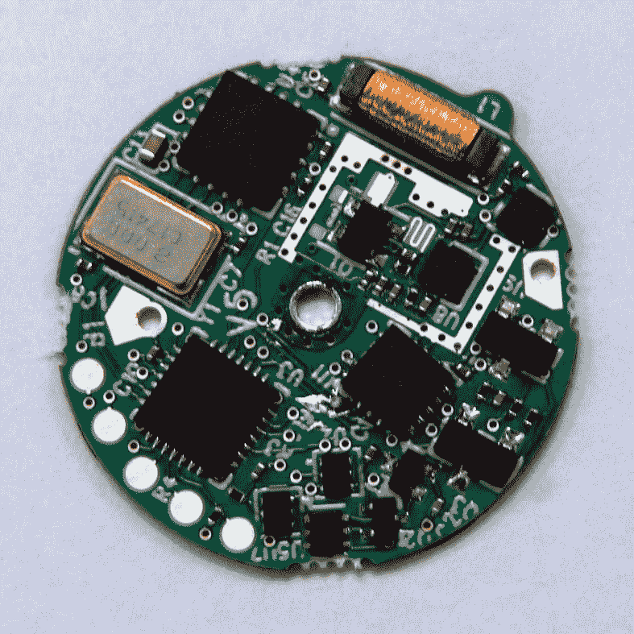

# 足球的互联网

> 原文：<https://hackaday.com/2020/01/31/the-internet-of-football/>

虽然足球在美国的意义与在世界其他地方完全不同，但世界各地的球迷都非常重视它。本周日是美国橄榄球狂潮的巅峰，超级碗，而且是令人惊讶的高科技。NFL 投资了很多技术，由于一些非常现代的设备，今天的足球统计数据与上个世纪完全不同。

这很有趣，因为从本质上来说，这项运动并不需要很多高科技。一个猪皮球，一些手帕，一块用石灰和一把尺子划出来的地就够了。然而，我们已经在记分牌、相机(比如即时回放)和防护装备的演变中看到了很长的技术弧。但是在过去的几年里，数据收集的兴起。它是由运动员肩垫上的 RFID 标签驱动的。

这些不是你信用卡里的 RFID 芯片。这些都是远程设备，在正确的体育场，计算机不仅可以跟踪球员的位置，还可以跟踪他的速度、加速度和许多其他统计数据。

## 不同颜色的条纹

这项技术背后的公司是 Zebra ，他们为许多不同的行业提供 RFID 解决方案。起初，这可能看起来有点噱头。你真的需要知道前卫以一定的速度奔跑吗？彩色评论员真的需要告诉我们四分卫今天的平均加速度因为某种原因下降了 30%吗？也许不是，但话说回来，棒球迷多年来一直痴迷于统计数据。然而，这些数据还有其他的消费者。教练、球探和训练员都可以使用大量的数据来评估球员，并可能计划改进。

这是一个名为 [NFL NextGen Stats](https://nextgenstats.nfl.com/) 的 NFL 项目的一部分。例如，如果你想知道哪个队跑得最快，你可以在那个网站上找到答案。我们现在可以揭示，跑锋马特·布雷达(Matt Breida)是 2019 赛季最快的带球人，峰值速度为每小时 22.3 英里。谁知道统计数据如此令人兴奋？

当然，所有这些数据都是经过数字处理的，所以该网站可以告诉你一个四分卫与所有四分卫的平均水平相比表现如何，并且有许多有趣的彩色图表。甚至有完全基于这些统计数据的 YouTube 视频。

## 打开硬件

RFID 应答器大约有硬币大小，以 25 Hz 的频率报告位置和加速度计读数。每个兼容的体育场都有 20 个接收器，在 100 毫秒多一点的时间内将传入的数据传输到 Zebra 位于加州圣何塞的控制室。该公司声称，他们在不到 500 毫秒的时间内向广播公司报告数据。供应商网站上的资料表明位置的测量误差在 6 英寸以内。

  RFID tracking tag  RFID stadium antenna installation

可以理解的是，我们在斑马或 NFL 网站上找不到很多技术细节。但是我们很幸运地找到了一些图像。上面的照片是从[一个斑马宣传视频](https://www.youtube.com/watch?v=n8Ao53nqTrc)中截取的截图，显示标签本身足够清晰，你可以阅读 FCC ID！

采纳鲍勃·巴德利关于联邦通信委员会文件的建议，我们设法真正了解了标签的内部。上面你可以看到来自文件的框图，表明 PIC 微控制器和 CR1616 3V 电池供电。电荷泵为其提供 3.3V 的电压，RF 产生频率为 6.55 GHz。

        

该文件甚至包括 PCB 的内部照片。在 6.5 GHz 下，一切都是天线或传输线，因此可以看到 U8 和 Q1 附近有一个非常独特的 PCB 特征，构成电路的一部分。如果 L1 的大线圈在 6 GHz 看起来很可怕，不要惊慌。这必须是框图中“磁性接口”的一部分。那个线圈没有承载那么高的频率。

对于练习阶段，标签还可以通过蓝牙实时发送数据。这加入了教练在练习期间开始使用的其他生物仪器的行列，如心率监测器。不过，NFL 不允许在比赛中这样做。但是教练可能会通过监控像这样收集的数据来发现一个球员脱水了。

## **DIY**

我们开始思考这对你们自家后院的运动员来说有多难。远程 RFID 设备是可用的，尽管它可能很昂贵，并且只有在从大量标签收集数据时才有意义。然而，一个可以记录数据的小型可穿戴设备是可行的。我们想知道一些更好的健身追踪器是否能在紧要关头发挥作用？

你可以黑掉现有的追踪器或者选择开源的 T2。如果你不想把名牌追踪器输给一个特别恶心的袋子，甚至还有一些针对[廉价仿制品](https://hackaday.com/2019/02/20/custom-firmware-for-cheap-fitness-trackers/)的窍门。

## 生活在未来

考虑到我们许多人都记得收音机是大件商品，个人电脑是不可想象的，所以看到收音机和电脑如此普遍和如此小巧是很有趣的。这是一个不断重复的故事。直到最近，把电脑放在玩具里，甚至放在汽车里，都还是稀奇古怪的科幻小说。肩垫传感器有

所以，如果你正在观看一场重要的比赛，听到一些奇怪的数据，你会知道它是从哪里来的。或者，只是挂在 NFL 统计网站上，找出每个球员的体重与加速度之比或类似的东西。