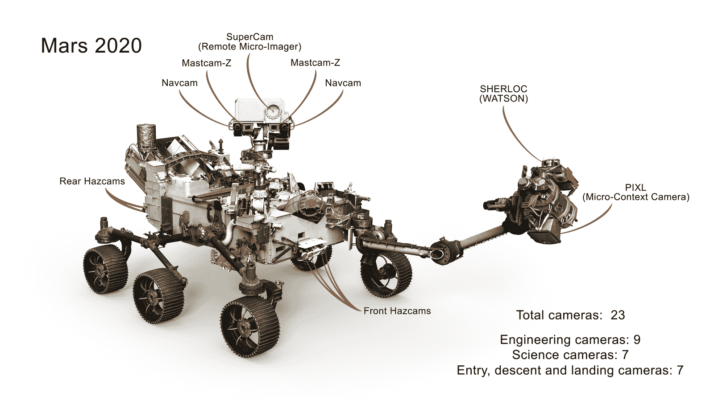
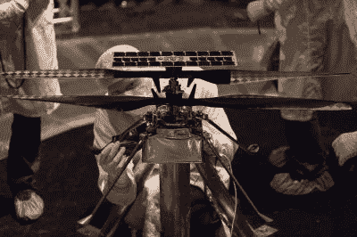

# 火星 2020 漫游者:好奇号的高科技双胞胎为科学而生；包括一架无人驾驶飞机

> 原文：<https://hackaday.com/2020/02/13/mars-2020-rover-curiositys-hi-tech-twin-is-strapped-for-science-includes-a-flying-drone/>

虽然就在火星表面爬行的机动车数量而言，火星可能明显落后于它的向阳邻居，但我们似乎正在尽最大努力缩小这一差距。在过去的 23 年里，人类已经成功地向这颗红色星球的表面发射了四辆火星车，从小型的*旅居者*到大众汽车大小的*好奇号*。这些车辆都在火星尘埃上刻下了六轮轨道，探测了土壤和大气，拍摄了大量照片，所有这些都极大地促进了我们对(有时)最近的行星邻居的了解。

你可能会认为向火星发送更多的漫游者会产生递减的回报，但事实证明仍然有大量的科学工作要做，特别是如果将人类送到那里探索或许生活的梦想要实现的话。因此，在接下来的一年左右的时间里，由火星 2020 计划尚未命名的漫游者领头的两辆新车将加入火星漫游者的行列。让我们来看看下一辆火星车，以及它是如何按照预定的任务建造的。

## 如果它没坏…

火星 2020 任务是更广泛的火星探索计划的一部分。MEP 诞生于 1992 年火星观测任务的失败，这是自 20 世纪 70 年代海盗计划成功以来美国宇航局首次尝试火星任务。静态的海盗号着陆器进行的土壤化学实验表明，火星上可能存在生命，但结果是不明确的。美国宇航局发射了 MEP，以明确回答火星上的生命问题，并描述该星球的地质和大气特征，为人类的探索做准备。

不幸的是，由于 2012 年预算削减，许多构成 MEP 的任务都失败了，唯一指定用于行星探索的资金可能会被用于能够将样本返回地球的任务。然而，好奇号此时已经抵达火星，并传回激动人心的结果和火星景观的壮丽照片。虽然 T2 好奇号能够采集火星风化层的样本，但它无法采集有朝一日可能返回地球的样本。

然而，好奇号确实证明了具有复杂任务剖面的大型火星车可以成功着陆，并在具有挑战性的条件下运行。不愿意与成功搅在一起，并且在预算限制下运作，美国宇航局决定为火星 2020 漫游车克隆 T2 好奇号 T3。这些漫游者在机械上非常相似，安装了不同的科学包，并增加了包装样本所需的硬件，以便最终检索并返回地球。

## 科学超级充电

从外表上看，很难区分好奇号和火星 2020 漫游者。两者都采用了成熟的六轮铰接式转向架设计，每个车轮都由自己的电动马达驱动。不过，由于从七年来对*好奇号*车轮的虐待中吸取了教训，车轮已经为火星 2020 重新设计。

Mars 2020 rover, bedazzled with 23 cameras. Source: [NASA](https://mars.nasa.gov/mars2020/mission/rover/)

两辆火星车的主船体看起来几乎相同，车辆后部相同的倾斜“躯干”区域支撑着相同的[钚动力多任务放射性同位素热发生器](https://hackaday.com/2019/02/08/the-deep-space-energy-crisis-could-soon-be-over/) (MMRTG)模块，为火星车的内脏提供 110 瓦的电力和 2000 瓦的热量。火星 2020 MMRTG 实际上是*好奇号*的遗留物，许多其他部件和仪器也是如此。

当你开始审视这两个火星车旨在支持的科学时，事情就开始不同了。最明显的区别是火星 2020 的主机械臂，它比好奇号上的机械臂更强，并配备了不同的仪器，如称为 PIXL 的 X 射线荧光光谱仪和一对名字可爱的地质仪器:SHERLOC，用于精细矿物学和有机分子检测的紫外拉曼光谱仪，以及 WATSON，用于提供 SHERLOC 可能感兴趣的目标图像的高分辨率相机。

火星 2020 漫游者臂还支持取芯钻，旨在从岩石上切割圆柱形核心部分，而不是像好奇号的钻头那样仅仅粉碎它们。“钻头转盘”允许机械臂从许多其他工具中进行选择，包括研磨岩石的研磨工具。

## 退回给发件人

如果基于车载实验的结果，某个特定的样本被证明是有希望的，探测器腹部的样本处理系统就会开始工作。钻头旋转架上有接收特殊样品容器的插槽，这些容器存放在探测车下方的架子上。一个小型机械臂，看起来有点像半导体工厂的 SCARA 臂，将样本管放在钻头转盘上，旋转它，以便机械臂可以访问它。核心样本被喷射到样本管中，然后在密封之前被送回样本处理区储存。下面的视频很好地展示了样品处理硬件:

 [https://www.youtube.com/embed/987RDiG63h0?version=3&rel=1&showsearch=0&showinfo=1&iv_load_policy=1&fs=1&hl=en-US&autohide=2&wmode=transparent](https://www.youtube.com/embed/987RDiG63h0?version=3&rel=1&showsearch=0&showinfo=1&iv_load_policy=1&fs=1&hl=en-US&autohide=2&wmode=transparent)

该探测器可以收集和存储多达 43 个样本。任务计划要求团队指定一个“贮藏仓库”，在为期一年的火星主要任务中收集的样本将被丢弃在那里。样本试管以及用于评估意外污染的质控试管将从样本处理器中释放出来，堆积在浮土上。在随后的延长任务中收集的任何样本也将留在缓存中，以等待未来的样本返回任务。

火星 2020 漫游者的着陆地点 Jezero 陨石坑被选中，因为大约在地球上首次出现生命的时候，它曾经是一个 250 米深的湖泊。在地球上，沉积在湖床中的沉积物富含生命，人们希望火星沉积物保留了 35 亿年前形成的任何生命迹象。此外，这个古老的湖床有一个三角洲结构，来自一条曾经流入它的河流，再次有可能从任何在火星上立足的生命中找到“生物特征”。

## 喋喋不休

The Mars Helicopter Scout being prepared for a vacuum chamber test flight. Click for higher resolution, and behold the engineering in the dual swash plates. Source: [NASA/JPL](https://www.nasa.gov/feature/jpl/nasas-mars-helicopter-attached-to-mars-2020-rover)

火星车上最有趣的硬件之一是[火星直升机侦察器](https://en.wikipedia.org/wiki/JPL_Mars_Helicopter_Scout)。主要包括测试技术和探索外星航空的挑战，小型无人机将在火星车主要任务的早期进行几次短途飞行。存放在火星车腹部的共轴旋翼无人机携带了一系列对大多数黑客来说似乎很熟悉的技术:运行 Linux 的骁龙 SoC，用于飞行控制的 MCU，以及返回火星车的 Zig-Bee 链接。它甚至有一个锂离子电池组和摄像头，用于导航和观察。

每一次 MHS 飞行将只持续大约 3 分钟，距离地面不超过 10 米。导航将使用太阳能跟踪器和惯性制导。美国宇航局希望高分辨率相机能够提供样本缓存的详细图像，为样本返回任务硬件的设计提供信息。

在第一架外星飞机、一系列计划中的科学实验(包括从稀薄的火星大气中制造氧气)和实际返回火星风化层碎片的可能性之间，火星 2020 有可能成为一项突破性的任务。随着火星车[被安全捆绑](https://www.jpl.nasa.gov/news/news.php?feature=7596)并准备与运载火箭整合，任务的 7 月发射以及火星车与命运号的约会似乎一切都在正轨上。

[特色图片:美国宇航局/JPL]