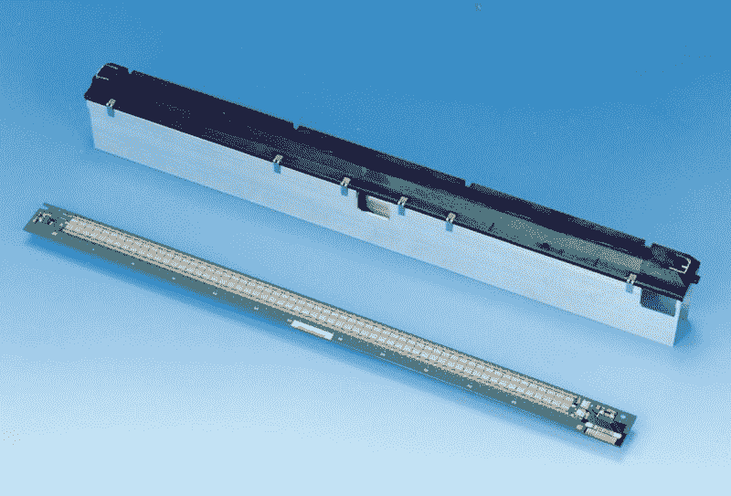

# HackIt:为什么我们不黑 LED 打印机？

> 原文：<https://hackaday.com/2020/02/11/hackit-why-arent-we-hacking-on-the-led-printer/>

led 灯串是我们在 Hackaday 看到的项目类型的主要部分，特别是 WS2812 等可寻址设备，在合理的预算下已经发生了翻天覆地的变化。它们出现在各种项目中，但也许最令人难忘的是用于成像项目，如类似屏幕的阵列或视觉暂留系统。还有一种我们在这里没有看到的可寻址 LED 产品，考虑到它可以在垃圾堆中相对容易地找到，并且已经在市场上存在了几十年，这是一个很大的惊喜。我们讨论的是 LED 打印机，所讨论的可寻址 LED 产品是一个非常高密度的 LED 阵列，宽度相当于一页纸，旨在将页面图像打印在碳粉传输鼓上。

## 喷墨打印机，激光，现在是发光二极管？那是怎么回事？

[OKI LED print heads](https://www.oki.com/en/otr/downloads/otr-161-14.pdf)

LED 打印机与复印机和激光打印机的基本操作相同，因为它们使用静电过程在纸上创建图像。感光鼓在暴露于要打印的页面的明亮图像之前被充静电。在强光照射到滚筒的地方，静电电荷被驱散，但是在没有光的地方，静电电荷仍然存在。当鼓通过粉末碳粉时，它会在充电的地方拾取粉末，从而在其表面上产生碳粉页面的副本。

然后，碳粉被转移到一张纸上，并加热，使其进入纸张，产生永久打印。在复印机上，镜头和强光投射文件，而在激光打印机上，通过用旋转的镜子一行一行地画激光点来给滚筒充电。同时，LED 打印机通过照射来自非常长的一排 LED 的光来一次曝光一行，并且与传统上打印质量略低的激光打印机相比，具有成本和复杂性更低的优势。出于最后一个原因，是激光而不是它更便宜的表亲抓住了公众的想象力，尽管 LED 打印机自 20 世纪 80 年代首次出现以来一直存在，但它们仍然是一种可怜的关系，他们的营销经常根本不提 LED。

根据制造商的不同，发光二极管可以有多种波长，最常见的是近红外或可见光。LED 阵列通常包含所有的驱动芯片，并被串行驱动，这使得它们有可能适用于其他用途。

## 把你的手放在那些可爱的发光二极管上

通过拆卸废弃的打印机，很容易找到 LED 打印机阵列，但令人惊讶的是，它们似乎不可能作为独立的组件找到。这几乎是肯定的，因为它们是作为特定打印机机构的零件制造的，而不是作为其自身权利的零件，所以除非你碰巧是该机构的制造商，否则对它们的需求很小。打捞上来一个，幸运地发现它有可见波长，你会如何使用它呢？一个明显的应用是非常高分辨率的 POV 显示器。它们每英寸提供数百甚至数千个点，这是一系列新像素无法比拟的分辨率。或者把它们用于光线绘画怎么样，在这种情况下，如果相机的灵敏度在这个范围内，红外阵列甚至可以投入使用。

所以，来吧，新像素正在变得陈旧，我们已经看到了几乎所有可以想象的应用。向我们展示一个我们从未见过的 LED 项目，一个具有惊人分辨率的项目！[我们的举报热线一如既往地开通](https://hackaday.com/submit-a-tip/)。为了让你开始，我们在休息时间下面放了一段视频，介绍 LED 打印机，然后是 [OKI 对该技术的介绍](https://www.oki.com/us/printing/about-us/our-brand/our-innovation/index.html)，接着是[他们关于 LED 阵列的白皮书](https://www.oki.com/en/otr/2006/n208/pdf/otr-208-R05.pdf)，最后再看一下[这个 EEVblog 线程](https://www.eevblog.com/forum/projects/led-_laser_-printer-illumination-bar-hacking/)，获得更多指导。

 [https://www.youtube.com/embed/_saDCwsB9Ww?version=3&rel=1&showsearch=0&showinfo=1&iv_load_policy=1&fs=1&hl=en-US&autohide=2&wmode=transparent](https://www.youtube.com/embed/_saDCwsB9Ww?version=3&rel=1&showsearch=0&showinfo=1&iv_load_policy=1&fs=1&hl=en-US&autohide=2&wmode=transparent)

标题图像:OkiUkraine [ [CC BY-SA 3.0](https://commons.wikimedia.org/wiki/File:B401d_PR.jpg)