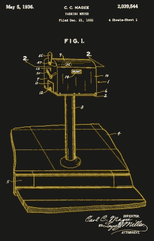
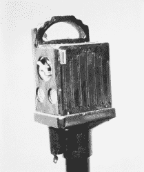
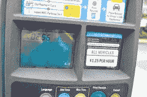
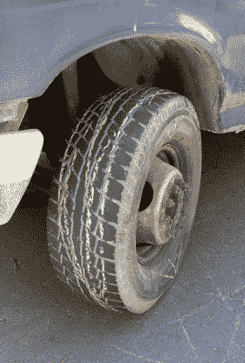

# 对他们自己的利益来说有点太聪明的停车计时器

> 原文：<https://hackaday.com/2020/02/26/parking-meters-throughout-the-years-and-year-related-bugs/>

在像纽约这样汽车拥挤的城市里，常见的景象是停车点旁边路边的停车计时器。这是该市对停在高流量商业区附近人行道上的汽车所占空间进行收费的一种自主方式，鼓励人们结束自己的业务，将车辆移出昂贵或时间有限的停车位。

停车计时器是一个如此平凡的设备，大多数人不会看它们两次，但在内部，看到它们是如何设计的，这些年来是如何变化的，以及一个软件错误如何在 2020 年初阻碍了数千个数字计时器，这很有趣。

## 停车计时器的由来

One of Carl C. Magee’s earliest parking meter designs, [filed for patent in 1932](https://patents.google.com/patent/US2039544A/).

停车计时器最初是在 20 世纪 30 年代由俄克拉荷马市政府委托的，因为汽车数量迅速增加，因此对停车位的需求增加。在此之前，该市使用巡逻警察来管理停车位，但他们跟不上交通增长的速度，可用停车位的缺乏导致市中心商店周围的生意下降。

第一个被广泛采用的停车计时器被称为“黑玛利亚”，这种机器于 1935 年由卡尔·c·麦咭和杰拉尔德·黑尔申请了专利，并于同年 7 月首次在该市安装。这是一个完全自动化的机械装置，用来解决调节司机在指定地点停车时间的问题。它需要一枚五分镍币作为支付，通过旋转一个手柄插入机械装置，这个手柄也可以用来给时钟发条上发条。这个时钟会记录下用户可以在那里停留的剩余时间，根据位置的不同，时间可以从 15 分钟到一个小时不等。

An early Black Maria design, circa 1933.

几天之内，店主们就注意到了利润的积极影响，这要归功于规范停车带来的顾客增加。更重要的是，从咪表中收集的硬币也为城市创造了收入，因此，停车咪表开始在整个城市蔓延。几十年过去了，机制得到了改进。增加了一个窗口，巡逻人员可以很容易地查看是否放入了正确数量的钱。还增加了单独的面板，便于收集硬币，而不会损坏内部发条装置的其余部分。

停车计时器的发展最终通过了可以管理两侧停车位的计时器，将每条人行道所需的电线杆数量减半。电子模型在 20 世纪 90 年代开始出现，最终增加了连通性。由于咪表都连接到同一个网络，停车咪表和你的停车位之间的共生关系被切断了。你的车停在哪里不再重要；你只需把打印好的罚单放在仪表盘上，就可以合法停车了。进一步的发展带来了可以从城市中任何一个电话亭支付的数字点，或者通过智能手机应用程序支付。但是这些数字进步并不总是转化为可靠性…

## 2020 年 1 月 1 日挖宿舍

随着电子停车计时器的引入，公认的支付方式也发生了变化。你不再需要随身携带一个钱包来停车；这些新机器也可以接受信用卡。但是在今年年初，这给纽约市带来了巨大的麻烦。1 月 1 日上午，大约 14000 个设置为接受信用卡支付的电子停车计时器无法完成任何此类交易，迫使司机在汽车座椅下寻找零钱或通过智能手机处理数字支付。

The error message that drivers were met with at January 1st, 2020.

根据交通部的说法，这是由于处理交易的软件出现了错误，该软件被设置为工作到年初，然后就没有更新。负责该软件的 Flowbird 公司[声称这是该软件反欺诈安全设置的一部分，错误地触发了](https://www.qchron.com/editions/queenswide/meter-snafu-stops-credit-debit-payers/article_f54740a1-8e61-56ff-b514-271e35143096.html)，但除此之外没有详细说明细节。

虽然令人困惑的是，一些媒体报道称这是一个“小故障”，而相关公司则将其解释为软件更新失败，但其他人一直在猜测 Flowbird 支付系统在如此特定的日期崩溃的真正原因。事实证明，2000 年的错误仍然存在，工程师们在 20 年后仍然会被它绊倒。如果有人在追赶，2000 年错误(或称 Y2K)是软件系统的一个错误，主要与银行有关，它记录的年份日期只有从 1900 年开始的两位数。一旦 2000 年过去，系统就无法区分这一年和一个世纪以前的年份。

至于这个 bug 是如何设法被压制了这么长时间，这是由于在 Y2K 恐慌的高潮中实施的权宜之计，它在系统中使用了一个“支点年”。在这种情况下，例如，如果给系统一个“20”的支点，那么它可以知道“00”到“19”这几年是指“2000”到“2019”，而不是“1900”，但是在 2020 年将再次失败，因为问题没有减轻，只是推迟了。没有消息来源导致 Flowbird 声称这是他们的系统发生的事情，但这是一个合理的答案，为什么它在雷达下飞行，足以应对他们服务中如此大的突然中断。

为了解决这一问题，交通部培训并派遣官员对 14000 米中的每一米进行更新，这项任务显然必须通过物理接触机器来手动完成。具有讽刺意味的是，这样一个人类工作队与过去的“咪咪女”并没有太大的不同，在电子支付成为规范之前，她们必须从一个咪咪到另一个咪咪收集硬币。这让我们进入下一部分…

## 现在还不要戴那些玫瑰色的眼镜

一月份停车计时器故障的规模之所以成为可能，是因为每一个计时器的软件都存在一个缺陷。但是机械的、模拟的停车执法也不是完全没有缺点和漏洞。入侵和破坏停车计时器的想法并不新鲜，尽管也许机械模型并没有太多地参与自我破坏。装满冰冷的现金，你仍然可以简单地砍掉停车机械计时器的头；机器不可能做任何事来阻止你。

Chalking tires is decidedly low-tech but highly effect in determining if a vehicle has been moved.

这方面的一个例子是 20 世纪 90 年代末袭击 DC 华盛顿州的一系列停车计时器斩首事件。在 1996 年至 1998 年间，一群破坏者砍下了全市数千个停车计时器的头，要么是为了收集里面的硬币(每个计时器最多可容纳 40 美元)，要么只是为了阻止对停车位进行计量。助长这种破坏行为的一个可能的动机是，人们将咪表和停车罚单更多地视为城市赚更多钱的一种方式，而不是专注于执法。市政府官员估计，收入损失和更换成本合计约为 50 万美元(约合今天的 78.5 万美元)。

其他实施停车限制的方法也不能避免被劫持。最简单的一种方法是，警察用粉笔在你的轮胎上标记 15 分钟的停车限制，这种方法可以很容易地绕过，要么向前或向后滚动你的车一点，要么在警察回来之前用湿布擦掉粉笔。车轮卡箍，也称为“停车靴”，用于防止汽车因罚款或非法停车而驶离，只需简单地使用角磨机或断线钳，即可轻松将其拆除。

最近，我们看到了被称为“藤壶”的装置，它们被附着在汽车的挡风玻璃上，以防止汽车像停车行李箱一样被开走。然而，与更多的物理约束不同，它只是防止车内的能见度，实际上并不妨碍汽车的移动，使它们[很容易通过一些巧妙的技巧](https://hackaday.com/2020/01/24/students-use-low-tech-hacks-on-high-tech-parking-enforcer/)从你的汽车上弄下来。由于它们的电子性质，一些人甚至将它们用于电池和内部支持数据的 SIM 卡。

即使在不远的将来，无人驾驶汽车也不会让停车位变得过时。随着城市的扩张和密度不断增加，停车位占用和停车执法之间的猫鼠游戏将继续下去。我们迫不及待地想看到停车计时器变得多聪明。