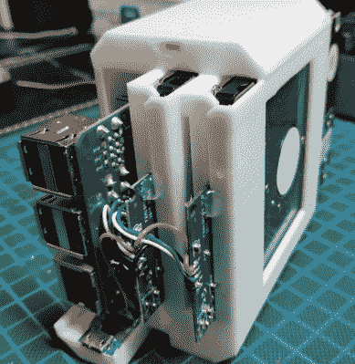

# 一个非常保守的 Raspberry Pi 媒体服务器

> 原文：<https://hackaday.com/2020/02/07/a-very-buttoned-up-raspberry-pi-media-server/>

将 Raspberry Pi 变成低成本网络附加存储(NAS)解决方案的项目非常常见；你所需要的只是正确的软件、Pi 本身和一些 USB 存储设备。但是，除非你特别喜欢“美杜莎”的外观，松散的电缆到处都是，你可能会想把硬件放在一个合适的外壳中。不幸的是，这就是 Pi 有点不寻常的布局会使事情变得棘手的地方。

这就是为什么[AraymBox]为 Raspberry Pi 和两个 USB 连接的硬盘驱动器设计了这个[独特的“胶囊”外壳。我们尽了最大努力来保持这种设计的外观整洁和流线型。我们在其他项目中经常看到的不对称线圈不见了，由于一些巧妙的布线，所有东西都被带进了里面。这个外壳看起来像一个专业产品，如果你愿意付出努力，你可以有一个属于你自己的。](https://www.instructables.com/id/PiNAS-the-Raspberry-Pi-NAS/)

 好消息是，3D 打印外壳只有四个部分，虽然相当大，但都不需要支撑材料。因此，即使在相对低端的机器上，这也应该是一个容易的打印。当然，如果不做一点工作，你就不会得到那种未来的金属外观。你需要做大量的[打磨、填充和油漆工作来获得那种表面光洁度](https://hackaday.com/2017/11/15/visual-3d-print-finishing-guide/)。话又说回来，那种粗糙的“刚印出来”的外观也有某种赛博朋克的吸引力。

但是印刷的附件只是成功的一半。在内部，[AraymBox]将 USB 到 SATA 适配器电缆直接焊接到 Raspberry Pi 上，以保持紧凑紧凑。然后使用微型 USB 分线板在设备背面的以太网和 USB 端口处添加电源连接器，解决了一根单独的 USB 电缆从机箱侧面伸出的问题。

在过去，我们已经看到其他尝试[为 Pi 服务器](https://hackaday.com/2018/03/21/3d-printed-raspberry-pi-nas-with-dual-drive-bays/)创建 3D 可打印外壳，并取得了不同程度的成功。虽然有些人会认为更好的解决方案是[将 Pi 和驱动器放在一个足够大的外壳](https://hackaday.com/2019/11/01/raspberry-pi-nas-makes-itself-at-home-in-donor-pc/)中，这样布线看起来并不重要，但我们欣赏一些黑客愿意做出定制的努力。