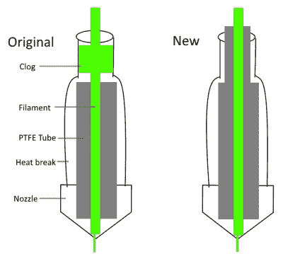

# 让一台 3D 打印机起死回生

> 原文：<https://hackaday.com/2020/02/10/bringing-a-swap-meet-3d-printer-back-from-the-dead/>

在最近一次交易会上，[digitalrice]发现了一台看起来像是全新的蒂奇 X-Plus 3D 打印机。不清楚它有什么问题，但考虑到它的零售价为 900 美元，他认为 150 美元的要价值得一赌。如你所料，打印机最终坏掉了。但是有了经验和备件供应，他能够让这台被遗弃的机器重新运转起来。

第一个也是最明显的问题是打印机的 Z 轴不能正常工作。当打印机试图将轴归位时，其中一个电机发出可怕的噪音，耦合器似乎在向后旋转。从他使用其他打印机的经验来看，[digitalrice]知道耦合器会在轴上滑动，但在这里似乎不是这样。移除步进电机并将其与机器的其他部分隔离开来进行测试，他能够确定它需要更换。

Improving the printer’s filament path.

不幸的是，他的备用踏步机实际上尺寸不合适。他没有等着合适的那一个在邮件中出现，而是拿着角磨机到步进机的轴上，切下 5 毫米来使它合适，然后用锉刀锉几下，磨平任何毛刺。我们不确定在正常情况下是否会推荐这种调整方法，但我们不能对结果提出异议。

被替换的 Z 马达使打印机运转起来，但是[digitalrice]还没有脱离险境。这时，他注意到热水池被严重堵塞了。再次依靠他以前的经验，他能够拆卸挤出机组件并释放出畸形的 PLA 团块，从而得到看起来非常好的测试印刷物。

但是成功是短暂的。换了一根不同的灯丝后，他发现它又堵塞了。在清除第二次堵塞时，他意识到打印机的加热器似乎有设计缺陷。聚四氟乙烯管，用于引导细丝进入热端，没有延伸足够远。就在电子管结束的地方，灯丝变软了，妨碍了工作。用一块备用的聚四氟乙烯管和一些手工整形，他能够制作一个新的衬里，防止细丝在这个关键区域软化；从而产生比打印机原来更可靠的 hotend。

很高兴看到这台打印机被修复到工作状态，特别是因为它看起来像[digitalrice]能够修复一个核心设计缺陷。但是，如果你发现自己处于类似的情况，一台坏掉的 3D 打印机也可以作为许多其他有趣项目的基础。例如，[用数字显微镜](https://hackaday.com/2020/01/24/broken-3d-printer-turned-scanning-microscope/)替换挤出机组件可以产生一些令人印象深刻的结果。