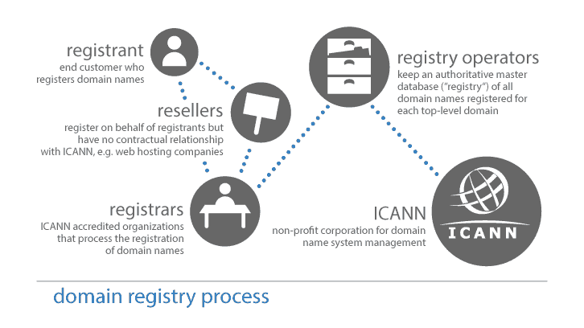

# 天空是网络域名价格的新极限

> 原文：<https://hackaday.com/2020/02/13/sky-is-new-limit-for-dot-com-domain-prices/>

本周早些时候，域名注册商 Namecheap 向所有客户发送了一封电子邮件，告知他们去年年底 ICANN 和 Verisign 之间的秘密交易。随着时间的推移，它有可能大幅改变域名的价格，从而改变我们所知的互联网的构成。

域名并不是真正拥有的，它们是租赁的，可以选择续约，你支付的年费率不仅取决于你的提供商的加价，还取决于那个特定域名的批发价格。这个底价是由非营利组织 ICANN 设定的。

官方说法是，这项协议是对 Verisign 和 ICANN 之间的合同提出的修正案。com”域。提议的修正案将让 Verisign 提高批发租赁价格。在接下来的四年里,“com”域名每年增长 7%。然后会有两年的喘息时间，接下来是另外四年每年 7%的上涨。这个循环看不到尽头。我们认为，认为域名注册商可能会将价格欺诈转嫁给消费者似乎是合理的，但这仍有待观察。

自 2012 年以来，域名年批发价格一直保持在 7.85 美元，截至本文撰写之时，Namecheap 的标准价格为 8.88 美元。com”地址。如果我们的数学是正确的，十年后，a”。com”域名的批发价格约为 13.50 美元，零售价格约为 17.50 美元。这几乎翻倍的价格将影响小网站和拥有许多域名的公司。随着时间的推移，这种增长只会越来越明显。

所以让我们快速看一下域名的业务。

The backs of the racks via [@tvick on unsplash](https://unsplash.com/photos/M5tzZtFCOfs)

## 他们 CANN，他们会的

互联网名称与数字地址分配机构(ICANN)成立于 1998 年，旨在协调、分配和指派域名和 IP 地址、指派协议等。ICANN 还负责组成互联网的 13 个根域名服务器，当你想访问一个网站时，它们是你键入单词而不是数字的原因。他们正式作为一个非盈利的公益公司运作。

Verisign 成立于 1995 年，并开始发行 SSL 证书。2000 年，他们收购了网络解决方案公司，并接管了该公司的注册职能，从而成为互联网超级大国。作为这项新协议的一部分，Verisign 将能够作为域名注册商运营，只是不能出售。尽管他们也有可能通过另一家公司成为经销商。

作为拟议修正案的一部分，Verisign 将在未来五年内向 ICANN 提供 2000 万美元，从 2021 年 1 月开始。虽然还不清楚他们将如何使用这笔钱，但这笔钱应该被指定用于继续支持 ICANN 已经在做的事情，如减轻对 DNS 安全的威胁，管理根域名服务器系统，以及监管可能的域名冲突。但是人们质疑 ICANN 的透明度和问责制——到目前为止，似乎没有一个系统来验证资金没有被挪用。

ICANN has transparency? Image via [ICANN](https://whois.icann.org/en/domain-name-registration-process)

## 一个网址值多少钱？

如果域名过于昂贵，那么只有富人才能在网络空间拥有权利，民主在这方面就会消亡。相反，如果土地太便宜，域名抢注者会抢夺网址和/或用蛇油网站稀释网络。任何正确的答案都需要平衡这些抵消效应。

通货膨胀会推动所有其他商品的价格上涨，为什么域名不会？但费率是否过高？美国的年平均通货膨胀率低于 3%，很久没有达到 7%了。

你觉得呢，黑客世界？这种增加时间表是引起恐慌的原因，还是只是照常营业？

我们认为 ICANN 至少可以更快地通知注册服务商，但这可能给了消费者太多的时间来投诉。在最近的记忆中，这并不是 ICANN 第一次忽视公众意见——去年夏天就有关于取消对“域名”价格上限的讨论。org”域名，许多人评论支持保持其他传统顶级域名的价格上限，ICANN 完全忽略了他们。几个月后。org registry 被一家私募股权公司收购，具体细节还在制定中。ICANN 还在为公益而努力吗？

按照以后请求原谅的传统，并且为了所有的好处， [ICANN 有一个开放的意见征询期，直到 2 月 14 日星期五](https://www.icann.org/public-comments/com-amendment-3-2020-01-03-en)。所以去告诉他们你的感受，即使感觉像是在虚空中尖叫。