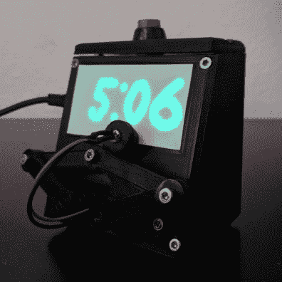
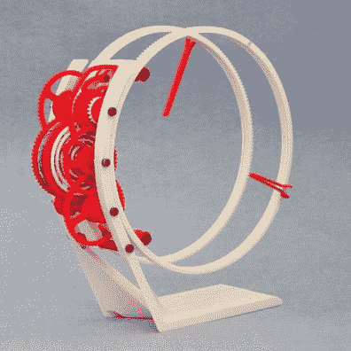
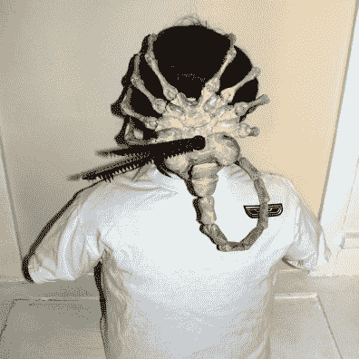
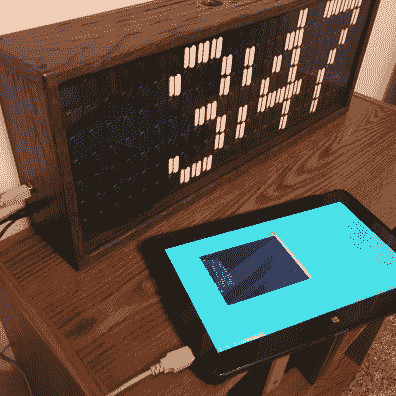

# 告诉时间竞赛的获胜者:时钟让你大吃一惊

> 原文：<https://hackaday.com/2020/02/13/tell-time-contest-winners-clocks-to-knock-your-socks-off/>

结果出来了，[告诉时间竞赛](https://hackaday.io/contest/168639-tell-time-contest)是创造力的壮观展示。根据工艺、功能和创意，选出了五名获胜者和一些亚军。

将要偷走你的心的是 [*Fetch:铁磁流体显示器*](https://hackaday.io/project/167056-fetch-a-ferrofluid-display) 。这个项目利用重力对抗电磁力，设法将一种液体转变成显示器的各个部分，并且用于在数字之间转换的动画非常有趣。这是一个非常复杂的系统，应用拖延的团队在记录构建这个开源奇迹的研究和开发方面做得非常好。有人试图复制它吗？我们希望在评论中听到你的意见！

  UV Glow-In-The-Dark Plot Clock  TORLO

机械运动可以追溯到日晷和沙漏的转变，但这两个现代的“钟表机构”证明仍然有足够的创造力。第一个是绘图仪，它使用两个伺服电机和一个 UV LED 在磷光材料上绘制小时和分钟。

第二个是对传统时钟机制的最小化和惊人的掌握。 [TORLO 使用硬盘上的音圈来移动齿轮](https://hackaday.io/project/25309-torlo)。这是 3D 打印的，在众目睽睽之下完成，太棒了！

  “Alien” Cuckoo Clock  Flip Dot Clock

《异形》系列的粉丝们会立刻认出这个像昆虫一样的“拥抱者”,这是一个发展中的异形的第二阶段。秉承“咕咕钟”的传统，[在整点的时候，一个“爆胸器”会从胸像的胸部弹出来](https://hackaday.io/project/19829-alien-cuckoo-clock)，标志着时间的流逝。令人毛骨悚然但执行得很好。

[flip-dot 显示器使用漂亮的自制电路板](https://hackaday.io/project/169309-flip-dot-clock)来保持外壳内部的整洁。当然，这些显示器的问题总是“你从哪里得到这些翻转点？”。这个面板在作为公共汽车信息标志服役一段时间后有了它的第二次生命。

## 亚军和八个分数的条目

*   [线性日历时钟](https://hackaday.io/project/169122)
*   [宜家 LACK 台灯钟](https://hackaday.io/project/169494)
*   [继电器时钟](https://hackaday.io/project/169050)
*   [叉车时钟](https://hackaday.io/project/169160)
*   [螺旋时钟](https://hackaday.io/project/168890)
*   [陌生人板](https://hackaday.io/project/167567)
*   [TetrisWaterRun](https://hackaday.io/project/167643)
*   [TTL/CMOS 线性 LED 时钟](https://hackaday.io/project/168198)
*   [8×8 RGB LEDMatrix 桌面字时钟](https://hackaday.io/project/169194)
*   [弯曲钟](https://hackaday.io/project/185)
*   [涂鸦时钟#2](https://hackaday.io/project/7930)
*   [CircuitPython 7 段字符钟](https://hackaday.io/project/165822)
*   [时钟 512](https://hackaday.io/project/169197)
*   [报时时钟](https://hackaday.io/project/169286)

祝贺我们所有在讲时间比赛中获得亚军的人。这是一个竞争激烈的领域，总共有 160 个参赛作品，每一个都以一种简单却非常复杂的方式引人入胜地观察着时间的流逝。把这个加入你的周末遗愿清单，因为你肯定会迷失在这些项目的细节中。