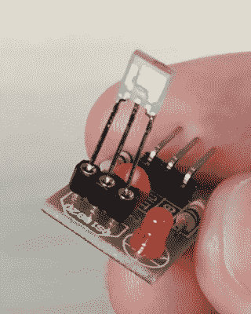

# 黑客日播客 054:异形饼干，热熔胶的 101 种用途，滚动机器人和笔记本电脑

> 原文：<https://hackaday.com/2020/02/14/hackaday-podcast-054-xenomorph-cookies-101-uses-for-hot-glue-rolling-robots-and-a-clippy-computer/>

Hackaday 编辑埃利奥特·威廉姆斯和迈克·什奇斯对过去几天的重大黑客事件进行了反思。应力消除是每个电子极客都会遇到的事情，有一种漂亮的方法可以让你的热熔胶看起来像工厂连接器。空气中有某种东西，它似乎在重现早期的计算机。你知道宇航员在烤他们禁止吃的饼干吗？你听说过从油炸锅里给 3D 打印机供油吗？

如果你想继续，看看下面的链接，一如既往地在评论中告诉我们你对这一集的看法！

[//html5-player.libsyn.com/embed/episode/id/16571378/height/90/theme/custom/thumbnail/yes/direction/backward/render-playlist/no/custom-color/000000/](//html5-player.libsyn.com/embed/episode/id/16571378/height/90/theme/custom/thumbnail/yes/direction/backward/render-playlist/no/custom-color/000000/)

如果你想继续，看看下面的链接，一如既往，在评论中告诉我们你对这一集的看法！

[直接下载](https://traffic.libsyn.com/secure/hackaday/760259386-hackaday-ep054-xenomorph-cookies-101-uses-for-hot-glue-rolling-robots-and-a-clippy-computer.mp3) (60 MB 左右。)

Where to Follow Hackaday Podcast

### 关注 Hackaday 播客的地方:

*   [谷歌播客](https://podcasts.google.com/feed/aHR0cDovL2ZlZWRzLnNvdW5kY2xvdWQuY29tL3VzZXJzL3NvdW5kY2xvdWQ6dXNlcnM6OTM5MTM0NzIvc291bmRzLnJzcw)
*   [iTunes](https://itunes.apple.com/us/podcast/hackaday-podcast/id1447409683)
*   [Spotify](https://open.spotify.com/show/3NRV0mhZa8xeRT0EyLPaIp)
*   [装订机](https://www.stitcher.com/podcast/hackaday-podcast)
*   [RSS](http://hackaday.libsyn.com/rss)

## 第 054 集节目笔记:

#### 本周新消息:

*   贝尔格莱德的黑客日是 5 月 9 日！
*   Voja Antonic 的 origina Galaksija 计算机文章(1984 年 1 月，使用顶部箭头导航)
*   [问 Hackaday:你的冠状病毒供应链暴露情况如何？](https://hackaday.com/2020/02/10/ask-hackaday-whats-your-coronavirus-supply-chain-exposure/)

#### 本周有趣的黑客:

*   [现代版的“回形针电脑”](https://hackaday.com/2020/02/08/a-modern-take-on-the-paperclip-computer/)
*   [当您的电子套件大获成功时，可使用自动元件胶带切割器](https://hackaday.com/2020/02/07/automatic-component-tape-cutter-for-when-your-electronics-kit-hits-the-big-time/)
    *   [胶带切割机器人消除了沉闷](https://hackaday.com/2017/10/06/tape-cutting-bot-trims-the-tedium/)
*   [Xbox 控制器介绍 SWD 黑客](https://hackaday.com/2020/02/11/xbox-controller-provides-intro-to-swd-hacking/)
*   [激光转速表知道你刚才旋转的速度](https://hackaday.com/?p=398469)
*   [通过在 3D 打印中浇铸热胶来减轻应力](https://hackaday.com/2020/02/11/cheap-strain-relief-by-casting-hot-glue-in-a-3d-print/)
    *   [关于铆接和封装的简短介绍](https://hackaday.com/2016/10/27/a-short-introduction-to-staking-and-potting/)
*   [Rollbot 将十只手臂塞进一个轮子](https://hackaday.com/2020/02/06/rollbot-crams-ten-arms-onto-one-wheel/)

#### 快速破解:

*   埃利奥特的选择:
    *   [用一点 FFT 魔法命名未知的 RF 信号](https://hackaday.com/2020/02/11/name-that-unknown-rf-signal-with-a-little-fft-magic)
    *   [由碎玻璃制成的巨大七段显示屏](https://hackaday.com/2020/02/10/huge-seven-segment-display-made-from-broken-glass/)
    *   欢迎来到麦当劳；你想要 3D 打印树脂吗？
*   迈克的选择:
    *   [用算法机对彩虹进行排序](https://hackaday.com/2020/02/09/sort-the-rainbow-with-an-algorithm-machine/)
    *   [一个法国记者可以带你出去露营](https://hackaday.com/2020/02/10/a-french-press-you-can-take-out-camping/)
    *   [线路径的 3D 打印产生一个减去 PCB 的 Arduboy】](https://hackaday.com/2020/02/08/3d-printing-for-wire-paths-yields-an-arduboy-minus-the-pcb/)

#### 不能错过的文章:

*   [新的一天:Wi-Fi 踏步机让想法更快工作](https://hackaday.com/2020/02/10/new-part-day-the-wi-fi-stepper-gets-ideas-working-faster/)
*   [第一次太空饼干:宇宙烹饪半生不熟](https://hackaday.com/2020/02/11/first-space-cookies-cosmic-cooking-is-half-baked/)