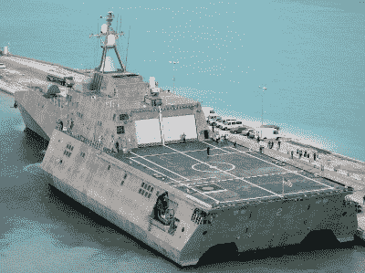
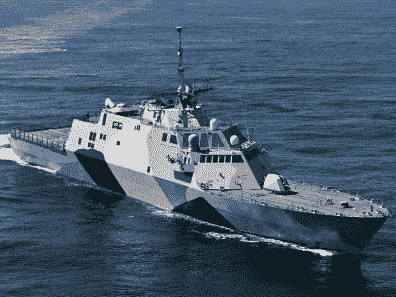
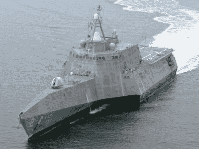
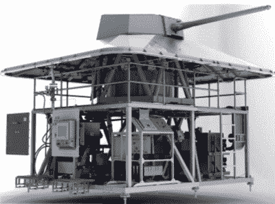

# 美国海军希望退役未来原型船

> 原文：<https://hackaday.com/2020/03/05/us-navy-looking-to-retire-futuristic-prototype-ships/>

从航海时代到第二次世界大战，海战主要是在近距离用大炮进行的。在这几个世纪中，技术自然有了很大的进步，但想法或多或少是一样的:拥有最多火炮和装甲的船只通常是胜利者。随着时间的推移，战舰变得越来越大，越来越重，这一趋势在 20 世纪 40 年代随着大型俾斯麦级、衣阿华级和大和级战舰的出现而达到顶峰。

但是到二战结束时，海战的性质已经开始改变。与第一次世界大战时相比有了很大改进的飞机和潜艇带来了来自上方和下方的威胁。几年后，实用远程制导导弹的出现意味着敌人不再需要在可视范围内发动攻击。进入冷战后，很明显，为了保持相关性，未来的战舰需要更小、更快、更智能。

The aft flight deck of a modular LCS

正是这种思路导致美国海军在 21 世纪初开始了濒海战斗舰(LCS)计划。这些船只将比老式战舰更加灵活，能够快速穿过敌人无法跟随的沿海浅水区。他们的主要武器将包括制导导弹，快速发射的小口径火炮将被归入防御任务。但最重要的是，LCS 计划的核心目标是生产模块化战舰。

由于所谓的“任务模块”可以根据需要快速更换，LCS 将能够执行多种任务，而不是为单一任务而建造。不需要返回母港进行漫长的改装，LCS 可以在几个小时内在靠近战区的商业港口进行各种任务的改装。

一支可以根据需求在战斗角色之间转换的舰队有望打造一支更具活力的海军。如果不断变化的地缘政治气候意味着他们需要更多的电子侦察船和更少的扫雷舰，海军就不必等待十年的大部分时间来重组他们的资产；这种转变可能会在几周内发生。

不幸的是，濒海战斗舰一直受到技术问题的困扰。以维持其运行所需的昂贵改装为由，[海军现在正考虑让舰队中的前四艘](https://www.defensenews.com/naval/2020/02/12/upgrading-the-first-four-littoral-combat-ships-not-worth-the-money-us-navy-says/)退役，其中最新的一艘只有六年历史。

## 买二送一

改装如此昂贵的一个原因是海军从未真正决定他们想要保留哪艘 LCS 号。当洛克希德·马丁公司开始对该项目进行招标时，他们提交了一份传统的钢制单体船设计，澳大利亚造船公司 Austal 则提供了一份基于该公司已经建造的高速渡轮的铝制三体船。这两种工艺各有独特的优势，很难宣布谁是明显的赢家。由于两艘船最终都比海军最初预期的便宜，2010 年决定从两家公司各购买 10 艘船，而不是选择一种设计。

  Lockheed Martin’s Freedom-class  Austal’s Independence-class

虽然十年前的前期成本可能已经足够低，足以让这个决定有意义，但海军现在正在处理支持两艘船的令人不快的现实。根据海员将被分配到哪艘船，他们需要接受不同的培训，并且需要维护两条独立的备件供应线。就连建筑中使用的不同材料也成了问题。铝和钢需要不同的修复方法，用于防止腐蚀的方法也是如此。

说到第一代舰艇，情况就更糟了。这些年来，无数的问题得到了解决，这些改进自然也融入了后来的船只。但最初的四艘船，每艘 LCS 级两艘，需要进行所有的改进，才能与同行相媲美。因此，海军先前已经决定将前四艘舰艇仅用于训练目的。

但是即使是在训练中，它们的用途也变得有限。飞船的操作版本有足够的差异，以至于早期的模型不能完全代表船员实际服役的飞船。如果它们不能被部署并且对训练没有用处，那么就很难证明为什么要为它们的持续运行分配更多的资金。

## 需要一些组件

有人可能想知道为什么这些飞船不能用于未来任务模块的研究和开发。毕竟，海军曾一度吹捧 LCS 计划最终将会看到激光和轨道炮等近期武器技术的模块；在批准部署之前肯定需要长时间海上试验的设备。事实上，用这些船作为浮动模块试验台将是非常合理的。不幸的是，没有人真的在制造更多的模块。

A 30 mm gun LCS Mission Module

在 LCS 计划最大的失败中，模块化战舰的想法在这一点上已经完全被放弃了。在实践中，海军发现切换模块所花的时间比最初设想的要长得多。在受控条件下，训练有素的船员可以在短短 92 小时内完成，但平均来说，完成这一转换需要一周或更长时间。

可以说，这仍然是一个令人印象深刻的技术成就，但在操作上，它还有待改进。在 LCS 号转换到另一个角色的时间里，一艘不同的船可能被召来接替它的位置。

2016 年，决定为每艘部署的船只分配特定的任务模块。更重要的是，有人暗示 LCS 的未来版本可能会完全失去交换模块的能力。这样做，海军有效地否定了整个计划。如果 LCS 舰队的每个船体都有一个永久任务模块，那么这些船实际上与他们最初打算替换的那些船没有什么不同。

## 寻找替代者

事实上，自由号、T2 号、沃思堡号、T4 号、独立号和科罗纳多号的提前退役是海军最终结束 LCS 计划的第一步。由于船只的模块化概念达不到预期，没有什么理由让舰队继续运作。这两种 LCS 变体都是基于这样的假设建造的，即它们适度的进攻和防御能力将随着未来的任务模块而增强。现在那些还没来，这些船的战斗效用有限。

认识到表现不佳的 LCS 计划给他们的能力带来的漏洞，海军目前正在为一种新型多任务导弹护卫舰 FFG(X)的设计和建造进行竞争。虽然他们并不寻求完全模块化的设计，但海军确实要求[提案包括对该舰在未来升级的难易程度的解释](https://news.usni.org/2019/06/20/navy-issues-final-rfp-for-ffgx-next-generation-frigate)。具体来说，他们正在寻找可以在该领域配备新系统的设计，避免将船只放在干船坞或切割船体的需要。

因此，虽然濒海战斗舰从未发挥其全部潜力，但海军似乎并没有完全放弃这个想法。用目前的技术来说，一艘完全模块化的战舰可能是不切实际的，但是 LCS 项目至少证明了在不把船带回母港的情况下更换武器和设备是可能的。该计划没有生产出海军的梦想之船，但它可能是朝着更好的方向迈出的必要一步。