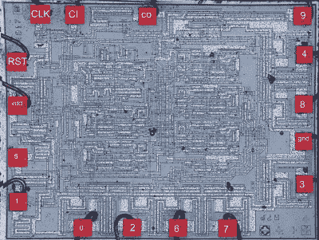

# 为什么有些芯片的引脚不方便

> 原文：<https://hackaday.com/2020/02/17/why-some-chips-have-inconvenient-pinouts/>

如果你曾经接触过一个引脚排列非常奇怪或非常不方便的芯片，并怀疑其原因与内部工作有关，你可能会有兴趣看看[electronupdate]对为什么 4017 十进制计数器 IC 有如此奇怪的非直观引脚排列的分析。它窥视了一个可追溯到 20 世纪 70 年代的 IC 设计，以了解可能影响物理布局的设计问题。

Inside the 4017\. Want to make sense of how lines and shapes on a silicon wafer make an IC work? [With the right teachers, it’s simple](https://hackaday.com/2019/05/20/integrated-circuits-can-be-easy-to-understand-with-the-right-teachers/).

在 4017 的例子中，一旦打开盖子，内部工作被暴露，事情就变得更加清楚了。芯片内部是一堆触发器和与非门，排列在一层中。一些输出(例如，输出 5 和 1，物理上分别在引脚 1 和 2 上)共享同一个触发器。

最初的设计以一种最符合逻辑的方式放置了这些元素，这导致了漂亮整洁的内部工作，但显然不合逻辑的引出线。对于设计和布线单层 PCB 的人来说，这种情况可能很熟悉，因为仅限于一层，所以尽可能使尽可能多的连接相互靠近非常重要。

当然，自 70 年代以来，芯片设计已经取得了长足的进步，但在外观整洁和内部设计和谐之间永远需要某种程度的权衡。下次你看到一个引脚排列明显不合逻辑的器件时，很有可能它在内部更有意义。

如果你们中的任何人有兴趣自己打开芯片看看里面是什么，[我们发现用普通的化学物质](https://hackaday.com/2019/05/19/decap-ics-without-the-peril/)是可能的，不仅仅是有害的化学物质。

 [https://www.youtube.com/embed/MIBEk0wT3tI?version=3&rel=1&showsearch=0&showinfo=1&iv_load_policy=1&fs=1&hl=en-US&autohide=2&wmode=transparent](https://www.youtube.com/embed/MIBEk0wT3tI?version=3&rel=1&showsearch=0&showinfo=1&iv_load_policy=1&fs=1&hl=en-US&autohide=2&wmode=transparent)

