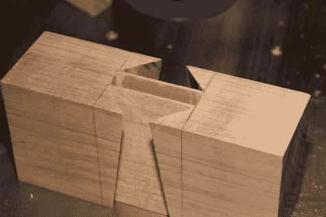
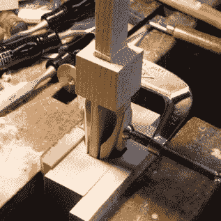

# 这个木槌有向后的燕尾…那是不可能的！

> 原文：<https://hackaday.com/2020/02/22/this-mallet-has-backwards-dovetails-thats-impossible/>

燕尾榫是木工中常见的楔形接缝。楔子有助于坚固的细木工，因为试图将它拉开的力量也会增加接合处的摩擦力。这个木槌的两边都有燕尾榫来防止头部飞出，但是在中心还有一个贯穿的榫头。这是一个不可能的关节，因为没有办法将槌头滑动到手柄上。这两块木头一定是那样长的！

和所有的事情一样，这里有一个窍门，在继续阅读之前让它在你的大脑里搔一会儿……如果你能猜出它是怎么做到的，当你证实你的理论时，那将会非常令人满意。来自[第三海岸工匠]的视频展示了不可能的木槌技巧和高超的手工细木工技艺。

这个技巧来自于两个木槌组装后隐藏的内部空隙。通榫和你想象的一模一样:直榫滑入木槌的直榫中。手柄两侧的楔形榫头和它们在槌头上匹配的凹槽与你想象的完全不同。燕尾的边缘已经被 45 度倒角，所以当你把它们滑动到位时，你不能把它们拉到槌的外面。相反的是实际的把戏。每个燕尾向内弯曲，直到槌袋末端的斜坡将它推回原位。

  Underside of mallet head shows “ramp” detail  Tenons clamped during assembly

不可能的木槌并不是一个新概念，对任何一个有成就的木工来说都是一个巨大的挑战。上面的图片是[【吉姆·吉尔福德的】不可能的槌](http://www.jguilford.net/jim/projects/PROJ_imallet.htm)。在这里，技巧完全暴露出来，显示了手柄的燕尾榫夹紧在一起，因为它被驱动到位。这里有两件事引人注目:接头无法测试，在组装前必须完美，并且由于组装的力量，榫很可能会断裂或者槌头会裂开。这个项目将考验你的勇气和耐心。

 [https://www.youtube.com/embed/dx7iN_y4X7k?version=3&rel=1&showsearch=0&showinfo=1&iv_load_policy=1&fs=1&hl=en-US&autohide=2&wmode=transparent](https://www.youtube.com/embed/dx7iN_y4X7k?version=3&rel=1&showsearch=0&showinfo=1&iv_load_policy=1&fs=1&hl=en-US&autohide=2&wmode=transparent)

