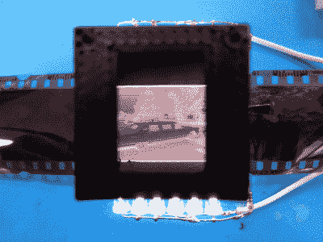

# 电影负片观众有许多优点

> 原文：<https://hackaday.com/2020/02/18/film-negative-viewer-has-many-positives/>

不久前，拍照还是一件神圣得多的事情。与数码方式相比，胶片和冲洗过程都很昂贵，而且因为你不能从相机上删除一张照片，然后再拿回你的胶片，所以人们往往对他们拍摄的照片更加挑剔。即便如此，对于每卷胶卷，通常至少有一个臭烘烘的。如果你把数字化过去作为自己的追求，你会很快意识到它们并不都是珍宝，有些可能会被遗忘。

【Random _ Canadian】最近发现自己深陷于负面信息中，但想要一种简单的方法来清除平庸的记忆。有了这个[胶片底片观察器和转换器](http://www.instructables.com/id/Film-Negative-Viewer-and-Converter/)，他可以在大屏幕上一张一张地浏览照片，并决定保留哪些照片。

Pi 使用负片图像效果将负片变成正片，然后输出到电视。如果[Random_Canadian]发现一个值得带进 21 世纪的东西，他就按下绿色按钮，用 Pi 相机拍一张照片，然后保存到那个很棒的 [cryptex USB 驱动器](https://www.instructables.com/id/Secret-Dual-USB-Data-Vault/)。当他厌倦了回忆往事，他会按下红色按钮退出程序。

我们特别喜欢[Random_Canadian]通过边缘照明一块 6 mm 的 Lexan 制作了自己的光板。刚从平顶 led 出来的时候，他通过在砂带磨光机上打磨一些普通的 led 来制作自己的产品。

有一些旧的 8 毫米胶片你想数字化吗？看看这个漂亮的自动胶片扫描仪。