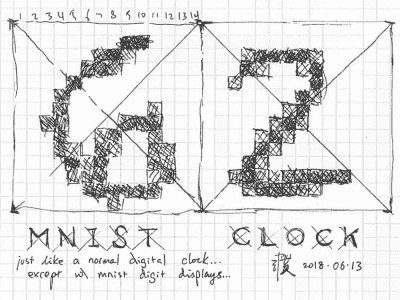

# MNIST 时钟使用著名的训练数据库

> 原文：<https://hackaday.com/2020/02/18/mnist-clock-uses-famous-training-database/>

当训练神经网络识别事物时，你需要的是一大堆训练数据。然后，您需要一堆后续的测试数据来验证网络是否如您所期望的那样工作。在手写识别领域，MNIST 数据库通常用于训练手写数字的网络。在[Evan Pu]提到利用这些数据制造一个时钟会很有趣之后，[[Dheera venkat Raman]开始着手工作](https://github.com/dheera/mnist-clock)。

The original sketch which inspired the build.

MNIST 数据库包含 60，000 幅训练图像和 10，000 幅测试图像。[Dheera]选择了一台 ESP32 来运行该项目，它包含 4MB 的闪存，足以存储每个数字 196 字节的测试数据库。这也为项目提供了网络连接，允许时钟使用网络时间协议来保持同步，从而消除了对外部 RTC 的需求。数字显示在四个独立的电子墨水显示器上，这非常符合手绘的审美。这也意味着时钟不会在晚上过度照亮房间。

这是一个有趣的项目，可能会吸引那些在手写识别领域工作的人会心一笑。我们也想在我们的桌子上放一个。如果你想尝试自己动手制作，请查看我们最近的比赛，获取更多灵感！