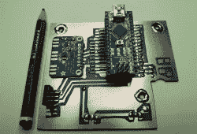

# 结实的自制收音机输出 200 瓦的 AM good

> 原文：<https://hackaday.com/2020/02/20/stout-homebrew-radio-pumps-out-200w-of-am-goodness/>

在这个时代，随着廉价的网上购物，软件定义的电台和来自中国的廉价宝丰，新贵火腿电台的选择太多了。当然，没有什么比在车库里自己动手制作自制装备更有魅力的了。[保罗]，又名[VK3HN]，知道这是什么感觉，[组装了一个史诗般的 200 瓦 D 级 AM 钻机](https://www.youtube.com/watch?v=oHkqW84h8ZM)在电波中发射他的信号。

在【保罗】的一个版本中使用的 Arduino 的例子。

这是从另一个无线电业余爱好者【劳里】，又名【VK3SJ】的作品中继承而来的。年轻的黑客会注意到项目的核心 Arduino Nano，它运行 VFO 并处理所有相关的发送/接收切换。我们只能想象现代微控制器对业余无线电老手来说是多么受欢迎，使得合成各种各样的野生频率变得轻而易举。

投入到构建中的努力是巨大的。PWM 低通滤波器有手动线圈，PCB 是用氯化铁蚀刻的，以老派的方式做事。在这个版本的开发过程中，也有一大堆牺牲了生命的无用组件。也许我们最喜欢的部分是一般的审美——我们无法克服手绘铜迹和现成 Arduinos 的结合。

Many components perished in the development of this powerful rig.

这是一个远远超过澳大利亚法律限制的建筑，所以它在实际使用中只能达到 120 瓦。这样做的好处是使无线电设备在远离其组件的安全区域内运行，有助于保持事物凉爽和稳定。我们确信[保罗]将在这个平台上获得一些很好的联系。如果你自己也受到低功率的困扰，[考虑一个放大的版本](https://hackaday.com/2019/11/07/well-engineered-rf-amplifier-powers-ham-radio-contacts/)。休息后的视频。

【感谢本的提示！]

 [https://www.youtube.com/embed/oHkqW84h8ZM?version=3&rel=1&showsearch=0&showinfo=1&iv_load_policy=1&fs=1&hl=en-US&autohide=2&wmode=transparent](https://www.youtube.com/embed/oHkqW84h8ZM?version=3&rel=1&showsearch=0&showinfo=1&iv_load_policy=1&fs=1&hl=en-US&autohide=2&wmode=transparent)

