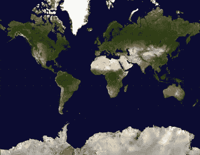

# 你怎么会丢失一艘货船那么大的东西呢？

> 原文：<https://hackaday.com/2020/02/26/just-how-can-you-lose-something-the-size-of-a-cargo-ship/>

我正在英国牛津郊外一个舒适的农舍里写信，在那里，我们正慢慢从一场特别强烈的大西洋风暴中走出来。一些地区洪水泛滥，倒下的树枝和损坏的屋顶遍布全国。我们在爱尔兰共和国的邻居首先处在这些风暴的路径上，受到特别强烈的侵袭。

风暴过后的新闻是一艘商船被风暴冲上了科克郡的海岸。MV Alta 号 [*是一艘近 2300 吨重 77 米(253 英尺多一点)的货轮*](https://en.wikipedia.org/wiki/MV_Alta)，因机械故障无法航行，于 2018 年在百慕达南部被废弃。它的船员被美国海岸警卫队救起，从那以后——除了一艘皇家海军极地考察船在大西洋中部短暂出现过——它在出现在爱尔兰海岸之前，一直作为一艘漂流的幽灵船悄无声息地通过。

从字面上看，它已经从雷达上消失了，但我们的问题是如何消失？在 21 世纪第二个十年结束时，导航设备和全球传感技术都取得了巨大的进步，这可能吗？作为一名陆地爱好者，有必要花点时间来看看船只是如何被追踪的，试图弄清楚这种看似不可见的东西到底有多大，难以隐藏。

## 这些地图中的一幅与另一幅不同

 

这些距离有些不像是别人熟悉的墨卡托世界地图投影。[ [公共领域](https://commons.wikimedia.org/wiki/File:Mercator-projection.jpg) ]

也许要理解这一点，最好从所涉及的距离尺度开始。我们习惯于根据你们小学墙上的地图来看世界。被称为墨卡托投影，一个球形球体被扭曲成一个圆柱体，然后可以被展开为一张矩形纸。在大西洋的这一边，欧洲和非洲大致位于中心，国际日期变更线环绕新西兰位于其右侧，太平洋和阿拉斯加位于其左侧。这样做让我们很容易在脑海中形成一幅世界上各个地方的图像，但却极大地扭曲了我们对距离的感知。

例如，格陵兰岛比墨卡托投影图中描绘的要小很多倍，从格陵兰岛到挪威跨越遥远的北大西洋的距离看起来与从纽约到摩洛哥的距离相同。实际上，前者在 1000 英里左右，而后者超过 3500 英里。相比之下，纽约和旧金山之间的公路距离约为 2900 英里。

## 大西洋，它比你想象的要大

 

从球形地球仪投影上看北大西洋。[ [Public domain](https://commons.wikimedia.org/wiki/File:OmegaNasaLiberiaNorwayDakotaglobe.png) ]

在球形投影上观看大西洋可以显示出海洋的真实大小，因为美国中西部在一个地平线上，中东在另一个地平线上，海洋占据了大部分可见表面。如果有一座公路桥横跨在它上面，我会花大约一周的时间开着我的小掀背车走完这段距离，但事实上，除了百慕大或亚速尔群岛等几个岛屿之外，什么也没有。看一下任何一个在线船只跟踪网站，这些网站都有来自自动识别系统应答器的地图报告，似乎显示那里挤满了船只，但即便如此，这也是网页上图标大小造成的错觉。事实上，在这些地图上，每艘船在浏览器地图上的尺寸是一个像素的几分之一，它们在 5 公里范围内的光学地平线是相同的，正如它们大约 20 海里的 X 波段雷达视图一样。

在这种情况下，很容易相信像阿尔塔号这样的船只的船长可以绘制一条路线，使其远离其他船只，并在如此广阔的空间中有效地从视野中消失。没有船长和 AIS 应答器失灵的情况下，它也可能在相同的空间中漂流而不被发现，这不是不可能的。

## 除非你去寻找，否则你不会找到它

[![One of the US Navy's venerable Lockheed P-3 maritime patrol aircraft. US Navy [Public domain]](img/3225ffed8308362c70a1329cdd367ba5.png)](https://hackaday.com/wp-content/uploads/2020/02/1024px-Orion.usnavy.750pix.jpg) 

美国海军备受尊敬的洛克希德 P-3 海上巡逻机之一。美国海军[ [公共领域](https://commons.wikimedia.org/wiki/File:Orion.usnavy.750pix.jpg)】

因此，除了与皇家海军舰艇短暂的视觉相遇之外，它还实现了跨越大西洋而不被发现的壮举。但是，我们确实生活在 21 世纪，难道我们的政府没有不断监测潜在敌人的浪潮吗？我们希望答案是肯定的，但即便如此，公平地说，寻找悬挂巴拿马国旗的漂流商船不太可能成为优先任务。

他们可能在空中有配备雷达的海上巡逻机，水下水听器，头顶有卫星监控，但所有这些都需要海军情报部门将他们引向感兴趣的船只。如果情报显示一艘潜在的敌对船只已经离开港口，那么一系列强大的机械和技术将会跟踪它的一举一动。但是，阿尔塔号无人驾驶，漂浮在水面上，很难被视为对全球安全的威胁。事实上，它本来可以避开其中的一些系统，因为如果没有动力探测船的引擎或尾流，他们根本不会发现它。

我们希望阿尔塔不会让爱尔兰当局感到头疼，也许会有一些额外的游客来此观光，并在该地区花费他们的欧元，但如果它的命运告诉我们什么的话，那就是:我们有时愿意相信我们是我们世界的主人，而事实上在地球表面的这么多地方，我们仍然像几个世纪前我们的祖先乘着小木船漂洋过海时一样受大自然的摆布。

MV *Alta* 头图:Colm Ryan / [CC BY-SA 4.0](https://commons.wikimedia.org/wiki/File:MV_Alta,_shipwrecked_off_the_Ballycotton_coast,_Cork,_Ireland.jpg)