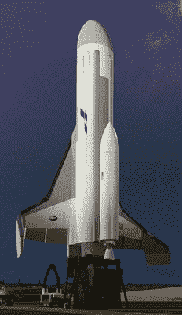
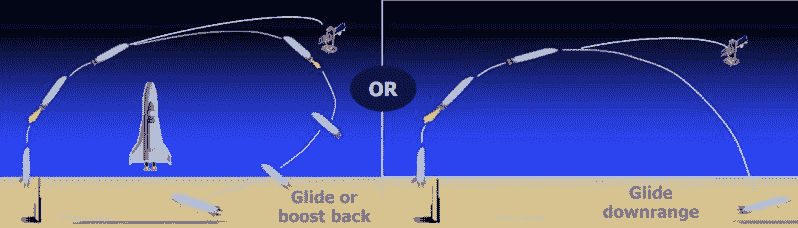
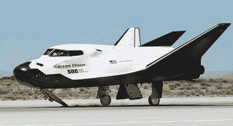

# 幻影快车:从未存在过的太空飞机

> 原文：<https://hackaday.com/2020/03/27/phantom-express-the-spaceplane-that-never-was/>

即使对于我们这些密切关注太空新闻的人来说，这些天也有很多东西需要跟踪。私营公司正在竞相开发新的载人飞船，组装巨型卫星星座，而美国国家航空航天局正致力于重返月球和 SLS 的首次飞行。在新的声明，现有任务的更新，和真正的火箭发射之间，事情几乎每天都在发生。公平地说，自 20 世纪 60 年代的太空竞赛以来，我们从未见过如此活跃的活动。

发生了这么多事情，难怪没有多少人听说过 XS 1 号幽灵快车。美国国防高级研究计划局(DARPA)的一个项目，XS-1 被设计成一个可重复使用的发射系统，可以在短时间内将小型有效载荷送入轨道。一旦任务完成，飞行器将返回发射地点，并在 24 小时内准备好再次飞行。

也被称为“DARPA 实验太空飞机”，该飞行器被设想为大约一架商务喷气式飞机的大小，能够携带高达 2300 公斤(5000 磅)的有效载荷。它将在火箭动力下垂直起飞，然后在任务结束时滑翔返回地球，进行常规跑道着陆。每次飞行 500 万美元，其运营成本甚至可以与价格最优惠的商业发射提供商相媲美；但是额外的好处是不必让第三方参与军事和侦察任务，这些任务几乎肯定是机密的。

或者至少，这是我的想法。飞行测试原定于今年开始，但今年早些时候，主承包商波音公司突然退出了该计划。尽管经过六年的开发，DARPA 提供了超过 1.4 亿美元的资金，但现在几乎可以肯定的是，XS-1 幻影快递将永远不会起飞。这是一个遗憾，因为即使在一个充满创新运载火箭的市场，这种独特的航天器也提供了一些引人注目的优势。

## 按比例缩小的航天飞机

像火箭一样发射，像飞机一样降落，人们可能会认为 XS-1 幻影快车有点像微型航天飞机。的确，这两种飞行器有相似之处，毫无疑问，从航天飞机的发展、制造和操作中吸取的经验教训都被考虑在内了。实际上，如果任何人在设计太空飞机时，至少不参考 NASA 在这个问题上积累的大量数据，他们会给自己造成难以置信的伤害。

 但是这两款车有一些根本的区别，很难直接比较。首先，即使保守的数学计算，航天飞机的有效载荷能力至少是 XS 1 号的 12 倍。这自然意味着让飞行器离开发射台所需的推力会更小，因此 XS 1 号不需要外部推进剂罐或捆绑式助推器。飞行器的单个 Aerojet Rocketdyne AR-22 发动机和任务所需的所有推进剂将包含在飞行器大致呈圆柱形的机身内。

这意味着 XS 1 号将在起飞时的相同条件下着陆；关于快速可重用性的一个极其重要的细节。在每次航天飞机任务中，外部推进剂罐将在高层大气中燃烧，而固体火箭助推器虽然在技术上可以重复使用，但需要由单独的回收小组从海洋中打捞出来，并经过漫长的翻新过程。

相比之下，XS 1 号只需要在两次任务之间进行一次彻底的检查和加油。这种类似飞机的可重复使用性是 SpaceX 和 Rocket Lab 等几家“新太空”公司的最终目标，因为它有望彻底改变我们利用地球轨道的方式。

尽管如此，太空还是很难。虽然人们可以从逻辑上得出结论，太空发射系统的成本和复杂性与其有效载荷能力有着相当线性的关系，但即使是最小的轨道火箭也是技术奇迹，在产生有用推力和自我毁灭之间徘徊。无论飞船有多大或多小，在进入轨道的整个过程中保持这种微妙的平衡都异常困难。这就是为什么 XS 1 号从未被设计到那种程度。

## 坠落，有型

虽然 XS 1 号可能有航天飞机轨道器的外观，但在运行中，它更接近猎鹰 9 号火箭的第一级。它会将有效载荷加速到高超音速，根据 DARPA 项目概述，理想情况下高达 10 马赫，并将其带到地球大气层的边缘。但是它没有足够的能量将有效载荷运送到最终高度，更不用说进入轨道了。

一旦 XS 1 号到达远地点，它将释放一个背部安装的有效载荷模块。这个模块，本质上是一个小火箭，将独立地继续任务。它已经在稀薄的高层大气中高速行驶，它将能够用一个相对小推力的发动机推动有效载荷“上山”并进入轨道。

Like the Falcon 9, the XS-1 would have been able to either return to the launch site or land downrange.

随着其主要任务的完成，XS 1 号将开始在亚轨道轨道上落回地球。以相对较低的速度重返大气层时，只需要最低限度的屏蔽就能经受住空气动力加热。在被空气阻力减缓到亚音速后，飞行器的三角翼和过大的控制表面将赋予它横向滑翔回发射场的能力。

## 希腊胜利女神像

甚至在他们成功将其中一架送入太空之前，工程师们就已经在试图设计一种混合动力汽车，它将结合火箭的动力和飞机更温顺的飞行特性。航天飞机证明了这个想法在现实世界中是可行的，但必须做出如此多的让步，以至于很难称之为成功。[尽管凭借自身实力取得了技术上的胜利](https://hackaday.com/2019/06/18/an-evening-with-space-shuttle-atlantis/)，但有翼轨道飞行器从未兑现其廉价快速进入太空的承诺。事实上，人们可以说它做了完全相反的事情。

Sierra Nevada Corporation’s Dream Chaser

今天，SpaceX 已经表明[你不需要翅膀来制造可重复使用的火箭](https://hackaday.com/2019/05/28/there-and-back-again-a-falcon-9-launch-story/)。虽然他们离日常飞行还有很长的路要走，但他们已经实现了相当于航天飞机计划的 reflight 节奏，而成本只是航天飞机计划的一小部分。即便如此，有翼航天器对工程师和未来学家都有不可否认的吸引力。

像维珍银河和内华达山脉这样的公司正在推进他们自己版本的概念，尽管现在说他们是否会比航天飞机更成功还为时过早。无论如何，尽管 XS-1 幻影快递可能会成为一长串从未离开过绘图板的“纸火箭”中的又一个，但可以肯定地说，实用太空飞机的梦想仍然存在。