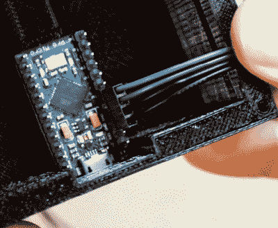

# 踏脚开关让你不用手就能跳过曲目

> 原文：<https://hackaday.com/2020/02/24/stomp-switches-let-you-skip-tracks-hands-free/>

你(可能)有四肢，那么当你在电脑上工作时，为什么只使用其中的一半呢？仅仅因为你的脚趾没有打字的灵活性(再次，可能)并不意味着你的脚应该整天坐在那里什么也不做。在最近的一个项目中， [[MacCraiger]向您展示了通过构建一对媒体控制踏脚开关来实现某些功能是多么容易。](https://github.com/craigfoo/stomp_switch)

Crimp pin connectors grant +50 professionalism.

如果上图中的设备看起来很像吉他效果，那是因为它们共享很多部件。[MacCraiger]使用了你可能在踏板上看到的相同类型的开关和铝制外壳，因为他认为它们比他 3D 打印的东西更适合一生被踩。

在桌子上，这一次是在一个印刷的盒子里，是他们联系到的 Arduino Leonardo。这个项目的布线非常简单，开关直接连接到 GPIO 引脚。从那里，Arduino 固件模拟一个 USB 人机接口设备，并触发适当的媒体控制键击来跳到下一首曲目或暂停回放，这取决于所使用的开关。

这种硬件并没有在这里开辟任何新的领域，但我们确实喜欢[MacCraiger]如何使用标准的 3.5 毫米音频电缆和相关的插孔来连接一切。这显然是一个音乐项目的主题，但更重要的是，让整个事情看起来非常专业。这绝对是一个为未来做好心理准备的建议。

对于更有成就的踢踏舞者，我们自己的[【Kristina Panos】最近带我们参观了她的巨型吊索脚凳](https://hackaday.com/2019/12/20/macro-foot-stool-helps-me-get-a-leg-up-on-work/)。在这两个定制外设的例子之间，你应该有你需要的一切来创建你自己的定制输入设备。如果你对那种东西感兴趣，我们认为你甚至可以做一个手动的。

 [https://www.youtube.com/embed/bYrHOaon0kQ?version=3&rel=1&showsearch=0&showinfo=1&iv_load_policy=1&fs=1&hl=en-US&autohide=2&wmode=transparent](https://www.youtube.com/embed/bYrHOaon0kQ?version=3&rel=1&showsearch=0&showinfo=1&iv_load_policy=1&fs=1&hl=en-US&autohide=2&wmode=transparent)

