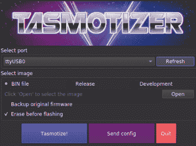

# 用 Tasmota 更新 Sonoff 设备变得更加容易

> 原文：<https://hackaday.com/2020/02/25/flashing-sonoff-devices-with-tasmota-gets-easier/>

 Tasmota 是 ESP 板的替代固件，它提供了大量方便的功能，【Mat】编写了[一个使用 Tasmotizer](https://notenoughtech.com/home-automation/esp/tasmotizer/) 更轻松地刷新的指南。除此之外，它使你的基于 ESP 的设备，如各种 Sonoff 产品，返回到工厂设置变得简单，所以黑客了！

Tasmotizer 是一个前端，它还可以轻松完成备份现有固件和设置 WiFi 凭据等配置选项等常见任务。当然，如果不提到 Tasmotizer[tas Mota](https://tasmota.github.io/docs/#/)，就不能真正讨论 Tasmotizer，Tasmota 是各种基于 ESP 的设备的替代固件，因此应该将它们放在一起考虑。

基于 Sonoff 设备的黑客是很受欢迎的家庭自动化项目，[Mat]也写了关于使用 Tasmota 以大约 5 美元的价格将老式的 theromostat 转换成类似 NEST 的设备的所有内容。下面嵌入了一个关于使用 Tasmotizer 的视频，所以给它一个手表，让它开始使用它来入侵一些 Sonoff 设备。

 [https://www.youtube.com/embed/8yxEgYvoHY0?version=3&rel=1&showsearch=0&showinfo=1&iv_load_policy=1&fs=1&hl=en-US&autohide=2&wmode=transparent](https://www.youtube.com/embed/8yxEgYvoHY0?version=3&rel=1&showsearch=0&showinfo=1&iv_load_policy=1&fs=1&hl=en-US&autohide=2&wmode=transparent)

