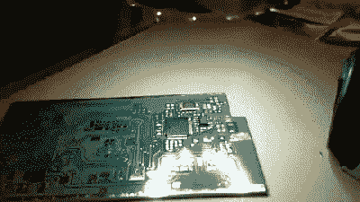
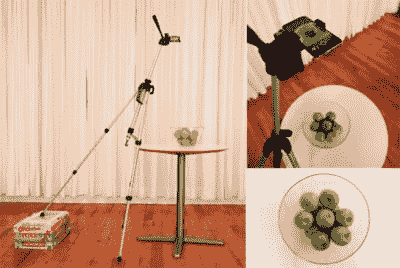
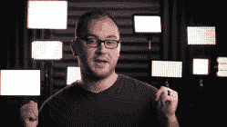

# 如何拍出一个很棒的项目视频

> 原文：<https://hackaday.com/2020/10/09/how-to-shoot-a-great-project-video/>

创建项目很有趣，但就想象中的互联网点而言，真正的价值在于你如何展示它们的影响力。拍几张快照没问题，但是如果你想制作一个高质量的项目视频，在这个过程中投入一些思考和努力是值得的。

## 讲述故事

在开始用视频记录你的项目之前，想想你要向观众传达什么。你是在尝试创建一个如何重现你所做的一步一步的指南，还是只是想展示一下令人敬畏的成品？这是两种截然不同的视频，需要完全不同的内容和交付方式。它还指导您如何拍摄视频。

如果你想展示你的建造过程，你需要边走边拍。这可能很费时间，但也是展示你工作中真实情况的好方法。我总是喜欢人们传达他们一路上遇到的陷阱和成功，让人们参与到故事中来。这也意味着你将拍摄大量的镜头，并花大量的时间来编辑它们。

Sometimes a timelapse is all you need, and has benefit of letting you work uninterrupted!

或者，您可能希望展示最终结果。如果你的项目作为一个成品更有趣，你可能觉得没有必要向人们展示你花了多少时间连接 Arduino 和调试代码。相反，你可以跳到最后，向他们展示精彩的结果，并在必要的地方给出背景信息。如果您编辑的时间有限，并且希望工作时不要一直放慢速度拍摄视频，这是非常好的。

有时候，可以更简单，只拍延时镜头。配上合适的配乐，这可以成为一个非常吸引人的视频，特别是如果你正在构建一些巧妙或复杂的东西。它还可以在您的过程中指导其他人，而不需要做所有的工作来创建一个完全解释性的操作方法。

无论你选择哪一个，你都应该考虑你想向人们展示什么，他们想看什么。你的项目的价值是在创作过程和做工上，还是在闪亮的成品上？认识到这一点，你就不会浪费时间制作一个充斥着没人想看的内容的视频。做一些奇特的加工来制作一个复杂的时钟？考虑拍摄构建。把一束发光二极管连接起来，制作出一件令人惊叹的艺术品？焊接和布线可能有点干-考虑花时间拍摄美丽的揭示。

根据您的项目，一个好的视频可以替代或补充文档。如果你正在做的事情很有趣，但可能并不特别新颖，那么就不太需要详尽的文档。你的视频可能只是你所取得的成就的一个小概述，以及你需要与世界分享的一切。或者，如果你一直在从事一个先进的新流程，处于你的领域的前沿，视频可能是对你的项目的更丰富的文档的一个很好的补充——但请仍然写下那些有助于提供更深入理解的本质细节。在这些情况下，一个击中要点并将观众引向更深入的资源的短视频可能是一个非常有用的东西。

## 你口袋里的大相机

A decent smartphone is a great way to start shooting video, especially when combined with a tripod. Source: [Animoto](https://animoto.com/blog/video-tips/diy-overhead-video-shot)

拍摄一部好的视频需要有合适的工具和使用合适的技巧。谢天谢地，我们生活在一个消费电子产品比以往任何时候都便宜的时代，有一大堆硬件和软件可以让你的视频看起来非常完美。

你会希望从一台能够拍摄高质量视频的像样的相机开始。中端至旗舰智能手机都能够以高清拍摄，如果不是现在的 4K，当你开始时可以作为一个优秀的平台。如果使用得当，他们每次都能推出高质量的内容。

再往上，是长期以来专业摄影师的领域，这些相机提供可互换镜头和更好的拍摄技巧。当在弱光环境中拍摄时，或拍摄微距对象时，或在需要精细控制捕捉过程的其他情况下，DSLR 会很有用。除此之外，天空是极限，专业视频设备为那些有预算匹配的人提供最佳性能。

## 她走得很稳

A tripod will make all the difference to your videos, allowing you to easily shoot clear, stable footage.

除了相机，你的第一件东西应该是三脚架。尽管世界上有各种图像稳定技术，但没有一种能与简单安装在稳定基础上的相机相媲美。即使你使用的是智能手机，购买一个便宜的适配器并安装到一个合适的三脚架上，也会极大地改善你的视频。你的观众将不再需要为你颤抖的手部动作和糟糕的画面而分心。相反，他们会对行动有一个清晰的视野，并能够专注于正在发生的事情。

对于拍摄项目视频，一个带有球头的摄影式三脚架就足够了。你想拍的大部分照片都是静态的，也许偶尔会有晃动。当然，如果你开始拍摄更多的动作镜头，你可能会找到一个投资更昂贵的液压系统的理由。流体头三脚架设计有液压流体机制，帮助您拍摄平滑的云台镜头，如果您希望在工作中获得更多运动，这是很好的选择。众所周知，经常移动摄像机的人远远不止这些，他们定制设计了轨道系统，有些是便携式的，有些是由电脑控制的，直接建在商店里。

## 阿齐兹，开灯！

LED video lights like the Viltrox V116T are a great portable lighting solution, particularly when paired with softening filters. Source: DSLR Video Shooter

你必须考虑照明。如果你真的想认真对待事情，一些适当的照明可以让一切都不一样。如果你在户外拍摄，要考虑到太阳相对于主体的位置，并确保你不会在不必要的阴影或白色过度曝光的情况下丢失细节。在室内，有一套好的视频灯是值得的。这些是输出宽色谱的专业灯，旨在帮助您拍摄高质量的图像和视频。通常与软盒搭配使用，它们会对最终图像的质量产生巨大的影响。

绝对可以[自己做摄影灯](https://hackaday.com/2018/09/25/diy-studio-lights-to-improve-your-videos/)。作为一个尝试过用车间灯和床头灯拍摄高质量视频但失败了的人，看到一套视频质量的 CCFLs 安装到为我的拍摄制作的软盒中的改进是令人惊讶的。这将有助于为您的场景提供明亮、均匀的照明，并尽可能以最佳的光线展示您的项目。

## 往前走，开枪！

有了好的灯光、坚固的三脚架和好的相机，你应该拥有拍摄高质量项目视频所需的一切。如果你想把船推出去，当然还有更多的硬件有待发现。你可能想给自己配一个稳定相机或万向节来拍摄高质量的动作镜头，或者一个电动滑块来拍摄戏剧性的画面。当然，这是 Hackaday，不是 Buyaday，构建自己的也是一种选择。如果你想定制你的工具来配合你喜欢的拍摄方式，这是很棒的。

有了想要拍摄哪种视频的明确想法，并配备了合适的硬件，您就可以开始拍摄了。你现在需要的只是一个项目，尽管我们相当肯定黑客时代的读者永远不会缺少工作。记住——没有人比你更了解你的项目，所以走出去，拍摄一些精彩的内容与世界分享！