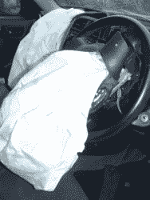
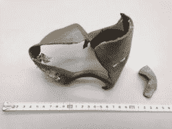
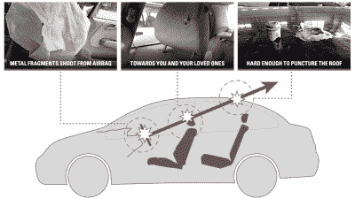

# 尽管推进剂化学成分不同，但更多的高田安全气囊造成了死亡

> 原文：<https://hackaday.com/2020/03/17/yet-more-takata-airbags-are-causing-fatalities-despite-different-propellant-chemistry/>

高田公司因其安装在全球汽车上的致命安全气囊而成为众所周知的产品安全教训。尽管在 2017 年申请破产，但随着历史上最大的产品召回继续扩大，他们的阴影仍挥之不去。随着时间的推移，随着调查人员发现新的令人担忧的原因和死亡人数继续上升，故事越来越深入。

2019 年底，高田宣布了另一次召回——[这引起了熟悉该案件](https://hackaday.com/2019/11/07/takata-airbag-recalls-widen-to-potentially-affect-other-types-of-airbag/)的行业官员的新担忧。到目前为止，高田生产的缺陷部件是基于硝酸铵推进剂的型号，[一种其他制造商认为使用起来太危险的化学物质。](https://hackaday.com/2019/06/10/takatas-deadly-airbags-an-engineering-omnishambles/)然而，有报道称，使用不同化学物质的其他车型对驾车者造成了致命伤害，这引发了高田安全气囊是否安全的问题。

## 复数问题

The airbag deployment in a BMW vehicle in which a man was injured, suspected to be caused by the Takata airbag deployment. Source: NT Police, Australia

经过多年的内部和外部调查，这个问题似乎已经解决了。高田公司选择使用一种随着时间推移变得不稳定的推进剂，从而导致过压事件，这可能会破坏金属气囊外壳，造成驾驶员和乘客的伤亡。据信这仅影响相稳定的硝酸铵(PSAN)安全气囊充气机。这种化学物质只有高田公司使用，因为其他制造商认为这种化学物质在实际应用中太危险了。

2019 年，随着高田 NADI 5-AT 充气机的第一次召回，一切都改变了。NADI 代表非叠氮驱动充气机，它使用四唑推进剂，如果使用得当，被广泛认为是安全的。据报道，1996 年至 2001 年间生产的高田 NADI 汽车安全气囊在澳大利亚夺去了两人的生命，除此之外，高田的 PSAN 充气机在全球[已经造成 24 人死亡，300 人受伤。](https://www.newsweek.com/takata-airbag-recall-honda-bmw-mitsubishi-other-car-brands-affected-faulty-airbags-1475713)

Large metal fragments can be fired at vehicle occupants during deployment of malfunctioning Takata airbags.

[根据高田公司提交给美国国家公路交通安全管理局的文件](https://static.nhtsa.gov/odi/rcl/2019/RCLRPT-19E080-7937.PDF)，该问题是由有缺陷的箔封引起的，箔封无法防止湿气进入安全气囊外壳。湿气的进入会对充气机的性能产生一些负面影响。这可能会导致安全气囊展开缓慢，降低其在撞车事故中约束乘客的有效性。或者，通过湿气进入和干燥或冷冻的重复循环，推进剂可能机械分解，增加其表面积。这导致反应速度加快，造成过压事件，击碎外壳，向乘客喷洒致命的弹片。

The results of an overpressure event during a Takata airbag deployment. The violent explosion destroys the airbag casing with deadly results. Source: NHTSA

我联系了约翰·凯勒，他曾在 1998-2001 年间担任高田公司的工程师，请他对最近的发展发表评论。约翰对当时安全气囊产品的性能进行了研究，收集了各种型号的数据。约翰说:“推进剂的表面积至关重要。如果推进剂表面积相对于通风面积过大，在燃烧过程中，充气机外壳可能会破裂[……]不管推进剂配方如何，这一点很重要[……]破裂的推进剂增加推进剂表面积可能会导致充气机破裂。”

在高田安全气囊造成的死亡和伤害案例中，[主要原因是安全气囊弹出的金属碎片。](https://www.latimes.com/business/autos/la-fi-hy-takata-air-bag-death-20190329-story.html)在实践中，这导致涉及安全气囊展开的小事故成为伤亡事件。在某些情况下，司机被告知避免驾驶车辆，汽车制造商进行移动检查或将车辆拖到经销商处。

## 找到根本原因

 <https://hackaday.com/wp-content/uploads/2020/02/takata-malfunctionGIF.mp4?_=1>

[https://hackaday.com/wp-content/uploads/2020/02/takata-malfunctionGIF.mp4](https://hackaday.com/wp-content/uploads/2020/02/takata-malfunctionGIF.mp4)

正如上面视频中的图片所示，有故障的充气机展开后会造成严重后果。理解这背后的原因是解决问题的关键。随着召回现在影响到多种不同的高田安全气囊化学物质，将责任完全归咎于硝酸铵已经不再现实。相反，它暗示了设计和制造中一个更广泛的问题。在 NADI 充气机的情况下，问题是不完善的防潮密封。关于 PSAN 打气筒，同样的湿度和水分归咎于。

Automakers have been working to educate customers of the dangers involved, in an attempt to maximise the effectiveness of the recall. Source: Honda

2015 年 11 月，NHTSA 要求高田公司在 2019 年 12 月 31 日之前证明使用 PSAN 干燥剂充气机是安全的。到目前为止，[联邦机构还没有对这个问题](https://www.autoblog.com/2020/01/14/takata-replacement-airbags-recalled/)做出明确的评论，这将导致更多的汽车被召回。根据凯勒的说法，“这种补救措施从根本上来说是不合理的。这是一种补救措施的幻觉，可能会说服一些人，但不是真正了解高田充气机缺陷的人。最终任何干燥剂都会饱和，一旦饱和，水分就会进入推进剂。"

这里的共同点是水分进入对推进剂稳定性的影响。随着多种安全气囊类型受到影响，很明显，更广泛的问题是充气机设计不佳，而不仅仅是选择了错误的推进剂化学物质。这应该给其他安全气囊制造商敲响警钟，他们不再认为自己在设计中避免使用硝酸铵是安全的。相反，它表明必须严格注意推进剂装药的长期稳定性。未能控制这个问题会导致悲剧性的结果。

考虑到普通汽车的长寿命，公众有理由期待安全气囊在使用几十年后仍能保持安全。任何有时间限制的保护方法，比如干燥剂，似乎都有可能导致更多的问题。随着越来越多装有安全气囊的汽车老化，更多的安全气囊可能会发生危险的故障。到目前为止，其他制造商已经在很大程度上避免了几十年时间尺度上的退化问题，但这些设备是否能够在 40 年、50 年或更长时间内保持安全，仍然是一个悬而未决的问题。在这样的时间尺度下，这只影响一小部分驾驶老爷车的人，但这个群体将不得不面对这个问题。

## 走向

所涉及的时间表打乱了解决问题的努力。由于最新的 NADI 召回涵盖了年龄更大的车辆，汽车制造商很难补救这个问题。[宝马估计开发和生产替换零件需要 14 到 22 个月的时间](https://www.productsafety.gov.au/recalls/recall-of-takata-nadi-5-at-airbags/takata-nadi-5-at-airbag-recall-faqs#manufacturers-and-spare-parts)。除了丰田，他们是唯一打算这么做的制造商。为一小队车龄达 25 年的汽车重新设计零件的商业案例很糟糕，因为涉及到巨大的工程和后勤费用。[其他公司正在探索回购计划，以补偿消费者驾驶不再安全的车辆。](https://www.productsafety.gov.au/recalls/recall-of-takata-nadi-5-at-airbags/takata-nadi-5-at-airbag-recall-faqs#manufacturers-and-spare-parts)

由于安全气囊在安装和处理过程中存在危险，因此它不是一个可以轻易作为消耗品处理的零件。有了这些限制，就需要进行研究，以确保安全气囊能够承受这种长时间的环境暴露，而不会对车辆乘员造成危险。迄今为止，大多数制造商已经成功地完成了这项任务；时间会证明他们是否能继续努力。

高田技术的多个分支被证明是致命的，这一事实表明该公司存在更深层次的问题，而不是一个致命的错误决定。制造缺陷被允许流向客户车辆，导致几条生命的损失和无数进一步的伤害，其中一些是永久改变生活。在这种背景下，灾难性的经济后果影响了许多为高田公司或相关公司工作的人的生计。很明显，汽车制造商和供应商需要做出严格的改变，以确保这样的灾难不会再次发生。