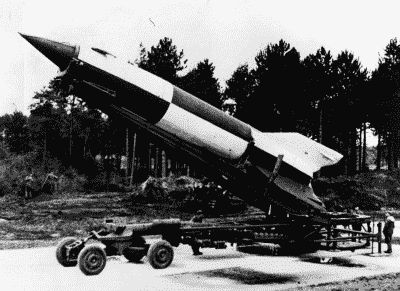
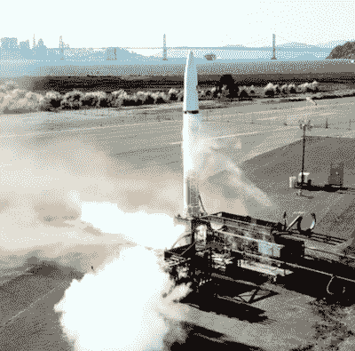

# Astra 准备好秘密的硅谷火箭；公司退出隐形模式，计划试射

> 原文：<https://hackaday.com/2020/02/28/astra-readies-secretive-silicon-valley-rocket-firm-drops-out-stealth-mode-plans-test-launch-today/>

第二次世界大战结束后，美国和苏联开始狂热地工作，以完善德国为 V-2 计划开发的火箭技术。这引发了太空竞赛，幸好每个参与者都以月球上的脚印而不是莫斯科和 DC 的陨石坑而告终。自那时以来，全球紧张局势已经大大缓解。今天，人们怀着兴奋而不是恐惧的心情等待火箭发射。

也就是说，如果认为军方对推进尖端技术不感兴趣，那就太天真了。即使在相对和平的时期，也需要防御性武器和侦察。这正是为什么美国国防高级研究计划局(DARPA)一直在征求公司开发一种小型廉价的运载火箭，可以在极短的时间内将轻质有效载荷送入地球轨道。毕竟，你永远不知道一颗精确定位的间谍卫星何时能决定一场简单的误会还是全面的核战争。

最初有 50 多家公司参加了 DARPA 的“启动挑战”，但只有少数几家公司通过了最终的评选。美国维珍轨道公司让他们的空射助推器参加了比赛，但最终退出了竞争，因为[专注于为商业运营做准备。Vector Launch 让他们的 12 米长的光滑火箭参加了比赛，但尽管助推器的亚轨道试飞成功，该公司最终在 2019 年底破产。最终，这个领域被削减到只有一个竞争者:一家相对不知名的硅谷公司 Astra。](https://hackaday.com/2018/08/14/virgin-orbit-readies-first-launch/)

如果该公司完成 DARPA 概述的所有目标，包括从不同的发射台快速连续发射两枚火箭，Astra 将赢得总计 1200 万美元；这笔钱无疑将有助于该公司使他们的助推器准备进入商业服务。据传，这是有史以来最便宜的轨道火箭之一，体积小到足以装入集装箱，它应该会成为竞争激烈的“小卫星”发射市场的一个有趣的补充。

## 有火箭，会旅行

当看 DARPA 发射挑战要求时，不难读出字里行间的意思；他们正在寻找一种可以在极短时间内发射的小型火箭，即使发射场、有效载荷和目标轨道都没有提前透露。如果这听起来很像移动洲际弹道导弹发射器，那是因为它基本上是。虽然发射挑战的低有效载荷要求(Astra 的火箭只能将 150 公斤的物体送入轨道)意味着 DARPA 正在寻找的发射器永远无法携带太多的弹头，但概念实际上是一样的:快速发射，从敌人不容易预测的位置发射。

After landing, the rocket is transported via truck to the launch site.

Astra 提出了一个独特的解决方案。他们的火箭使用了可以随车运输的移动发射“工作台”,而不是传统的固定发射结构。整个操作可以放在一个集装箱里，这意味着火箭及其地面支持设备可以很容易地用货机、火车运输到发射场，甚至用卡车拖着穿过街道，而不会引起怀疑。当集装箱到达一个合适的平坦位置时，移动发射台被架起，火箭被拉出集装箱。

 顺带一提，这[与德国 V-2 火箭如何发射](https://hackaday.com/2019/02/05/operation-backfire-witness-to-the-rocket-age/)非常相似。由于知道盟军会迅速轰炸任何永久性发射结构，火箭会通过铁路线转移到前线，然后在发射前不久用卡车拖到发射区。一个移动平台被竖立在一块像田地或停车场一样的平地上，火箭被倾斜到上面。对于一支训练有素的队伍来说，整个过程只需要 90 分钟，这使得德国人每天可以发射多达 100 枚火箭。

DARPA 并不期待这种快速的转变，但他们希望在短短几天内就能实现。还有一个 DARPA 想要发射的预定地点的列表，所以从技术上来说，火箭不需要这么机动。但从商业角度来看，Astra 的联合创始人亚当·伦敦(Adam London)表示，便携式发射器可以运输到离客户更近的地方，这与公司的目标非常吻合。

## 在雷达下飞行

很少有人听说过阿斯特拉，部分原因是该公司成立的时间并不长。至少目前的形式不是这样。2005 年，亚当·伦敦成立了 Ventions LLC 公司，专门开发小型液体推进剂火箭发动机，用于 DARPA 和 NASA 的几个项目。当伦敦在 2016 年遇到硅谷企业家克里斯·坎普(Chris Kemp)时，两人决定创办 Astra，以此作为一种体验发动机的方式，并围绕它建造了一种新的运载火箭。

Performing an engine test in Alameda

五个这样的发动机，每个大约有割草机大小，产生大约 6000 磅的推力，为火箭的第一级提供动力。与火箭实验室的电子一样，[电泵被用来将液态氧和煤油推入燃烧室](https://hackaday.com/2018/01/29/smaller-and-smarter-the-electron-rocket-takes-flight/)，而不是传统上液体火箭使用的笨重复杂的涡轮泵。关于第二级的信息不多，只知道它使用一个较小的引擎，该公司以希腊神话中的天空之神以太命名。

设计一个更小的火箭有很多好处，但其中一个可能不会立即显现出来的好处是它更容易测试。Astra 能够在附近的阿拉米达海军航空站进行全面的发动机点火，除了当地新闻机构报道他们产生的噪音之外，没有什么大张旗鼓的宣传。他们还在 2018 年从阿拉斯加的太平洋航天港综合体进行了两次亚轨道测试发射，几乎完全保密。关于这两次飞行有多成功还有一些争论，但是所有人都认为，即使没有达到目标高度，这两种飞行器至少都升空了。

## 最后的障碍

Astra 已经展示了火箭的关键系统，但他们仍然没有将有效载荷送入轨道。事实上，在这一点上，他们甚至还没有飞过第二级；2018 年的亚轨道飞行都使用了被称为质量模拟器的虚拟上面级。如果火箭足够大，你可以为此使用特斯拉跑车，但在这种情况下，它可能只是一块钢铁或混凝土。

这个微小的火箭，DARPA 收到的 50 多个建议中的最后一个，能完成发射挑战吗？我们不用等很久就能知道了。Astra 火箭的首次轨道测试飞行目前定于美国东部时间 3 月 1 日 3:30，由于直播视频的魔力，你将能够在自己的智能手机上舒适地观看。Astra 仍然需要在几周内发射第二枚火箭来获得全额奖金，但对于这家年轻的公司来说，第一次发射就能进入轨道将是一项令人难以置信的成就。

 [https://www.youtube.com/embed/2Wzagx8kC7s?version=3&rel=1&showsearch=0&showinfo=1&iv_load_policy=1&fs=1&hl=en-US&autohide=2&wmode=transparent](https://www.youtube.com/embed/2Wzagx8kC7s?version=3&rel=1&showsearch=0&showinfo=1&iv_load_policy=1&fs=1&hl=en-US&autohide=2&wmode=transparent)

