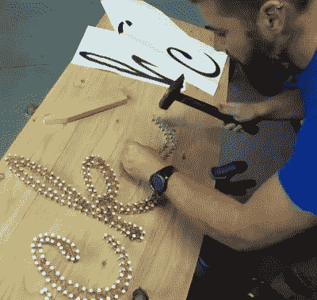

# 标志制作中的绕线技巧

> 原文：<https://hackaday.com/2020/03/04/wire-wrapping-skills-put-to-use-for-sign-making/>

如今，我们已经看不到多少绕线电路了，你可能会认为这几乎是一门失传的艺术。但这并不意味着这项技术不能在其他地方应用。[米虎-Works]最近来信分享了他们最近为一个客户的餐厅制作的一个标志[，对我们来说，它看起来非常像一台自制电脑的背板](http://www.mihu-works.com/how-to-build-a-restaurant-sign/)。

 在你有机会向下滚动并在评论中抱怨它之前，我们承认这是一个相当深入的工艺品系列。但这也是一个很棒的作品，我们很乐意挂在黑客空间里，所以我们不在乎。可能不会有任何愤怒的小精灵在那些可爱地缠绕着的铜线中跑来跑去，但它肯定*感觉*就像你在看一些复杂机器的内部。

为了制作它，[米虎作品]首先在纸上打印出字母，然后放在木头上作为指南。屋顶的钉子被钉进木头里来创造文本的轮廓。在钉钉子的时候，用一块分叉的木头做的一个简单的工具被放在每个钉子的头部下面，以确保深度一致。它还确保下面有足够的空间来包裹铜线。然后是包装的时候了…这么多包装。(谁会用机器人来做这件事？)

几年前，我们问 Hackaday 的读者，他们是否认为绕线电路的时代已经结束。它引发了许多讨论和有趣的想法，但看着这样的项目，也许我们问错了问题。

 [https://www.youtube.com/embed/PdrGyXqVxxM?version=3&rel=1&showsearch=0&showinfo=1&iv_load_policy=1&fs=1&hl=en-US&autohide=2&wmode=transparent](https://www.youtube.com/embed/PdrGyXqVxxM?version=3&rel=1&showsearch=0&showinfo=1&iv_load_policy=1&fs=1&hl=en-US&autohide=2&wmode=transparent)

