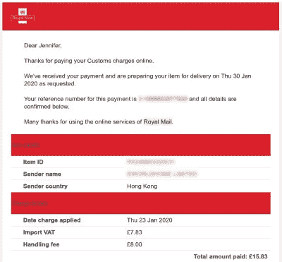
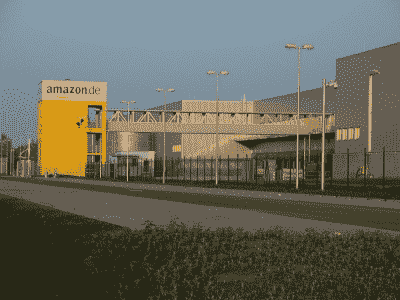

# 欧盟关税变化，给黑客带来了一大堆麻烦？

> 原文：<https://hackaday.com/2020/03/10/eu-duty-changes-a-whole-vat-of-trouble-for-hackers/>

可以说，在过去的几十年里，我们的硬件黑客社区的创造力爆发背后有许多因素，但毫无疑问的是，从中国进口小订单变得非常容易。在全球速卖通看到某样东西，只需几英镑，它就可能是你的了，在世界另一端的某个仓库里，它被装进一个灰色的装运袋，三周后，它就出现在你的门前。这种慷慨在很大程度上得到了有利的邮资和税收环境的帮助，在这种环境下，低邮资和低于一定价值的包裹没有关税合在一起，使产品出现在你面前的成本只是购买该产品的一小部分。

## 对欧洲硬件黑客来说，这是一次令人不快的冲击

An email from Royal Mail in January 2020 showing a £8 ($10.44) handling charge for paying VAT on a package. This charge stays the same even for small VAT amounts.

然而，对于欧盟的人们来说，这一切可能即将结束。这一切的催化剂来自于委员会授权条例(EU) 2019/1143，[,该条例取消了价值低于 22](https://ec.europa.eu/taxation_customs/news/new-form-customs-declaration-low-value-consignments_en)欧元的包裹的购置税或增值税豁免，并代之以 150 欧元以下包裹的简化申报。突然间，你的 Arduino 克隆产品将需要支付增值税，由于目前的规范是这些费用由快递员在交付前收取，你可能还会从邮局收取高额手续费。2 美元的电子模块现在不仅增加了 20%的税，而且额外增加了 10 美元左右，因为你被告知你欠他们 40 美分。轻松进入进口电子产品世界的日子可能已经结束，至少对欧洲人来说，似乎是时候倒退几十年了。

当然，我们不只是在谈论电子黑客进口零部件。这种情况的种子已经播下好几年了，人们越来越担心亚马逊等大型在线公司的活动，以及它们利用复杂的欧盟税收环境中的漏洞给欧洲大陆的国库造成数十亿欧元的损失。这导致了大量的提议，不幸的副作用是把像我们社区这样的小鱼和大鱼聚集在一起。

那么，对于欧洲人来说，今年年底之后，国际贸易的车轮将如何继续转动呢？如果我们对这个问题有明确的答案，我们可能会用我们的收入去购买超级游艇和私人岛屿，作为金融预言家，而不是报道科技世界，但公平地说，没有人希望这种类型的交易突然停止。但问题是，尽管这项法律适用于所有 27 个欧盟成员国，但各个国家的增值税制度并不统一。因此，任何试图创建一个集中的增值税方案，在订购时预付税款的做法，都会因其复杂性而面临失败的风险。

## 会不会出现航运混乱？

A European Amazon warehouse, in Leipzig. Medien-gbr / [CC BY-SA 3.0](https://commons.wikimedia.org/wiki/File:Amazon.de_Versandhaus_Leipzig.jpg)

较大的卖家可能会试图通过将其分销基础设施设在欧盟内部，并在税收框架内而不是之外开展工作来规避这一点。一些公司，如亚马逊和 Banggood 已经这样做了，但代价是 EU-采购的商品价格高得多。因此，这种解决方案适用于较小企业的可能性并不高，因为有多少在深圳某个部门工作的全球速卖通卖家有资源突然在欧盟建立一个仓库？

或许会出现一种新的业务类型，即从中国大量进口订单的欧盟托运人，他们与最终客户签订运输协议，支付欧盟内部适用的任何关税。无论发生什么，可能的结果都是，客户为便捷运输的特权支付更多费用，而不是冒着额外服务费的风险，在直接运输的产品交付之前支付增值税。

这场迫在眉睫的崩溃的关键在于一个我们还没有得到的细节，即在新方案下如何征税。重点是使销售者和税务机关的过程更容易，似乎很少考虑最终用户。如果他们能够达成一个解决方案，只需要支付增值税本身，那么我们 2 美元的 Arduino 克隆产品上额外的 40 美分将没有什么影响，但如果他们允许快递员继续收取过高的代收费用，那么我们认为理所当然的许多订单都将玩完。只有在对这些手续费进行有意义的监管的情况下，这一措施才能真正取得成功，否则不仅所有类型的消费者都将错过较小的订单，欧盟也将错过赚取所有增值税的预期结果。

这不是欧盟写的，而是英国写的，英国目前正处于离开欧盟的尴尬境地，但仍处于过渡阶段，我们仍在英国退出欧盟之前的欧盟规则下工作。根据英国政府今年与欧盟达成的任何协议的状态，我们被告知[在无协议英国退出欧盟](https://www.bbc.com/news/business-47551266)之后的一段时间内将实施免关税计划，因此在这种情况下，有可能有一次事情会对我们有利。如果是这样的话，我们期待我们在 EU-的朋友访问我们的黑客空间，储备廉价的技术，就像我们曾经访问法国储备廉价的葡萄酒一样，但考虑到其他地区可能出现的动荡，这种情况的总体好处可能是微不足道的。鉴于[在美国也有关于从中国运输的低成本的抱怨](https://www.theatlantic.com/technology/archive/2018/10/trump-changes-terminal-dues-and-epacket-rates/573337/)，也许是时候我们都认识到派对在某种程度上可能已经结束了。

海关标志表头图片: [MPD01605 /公共域](https://commons.wikimedia.org/wiki/File:ZollDouane.svg)。