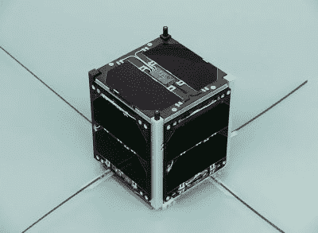
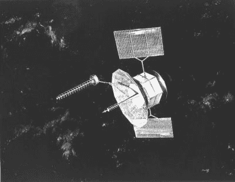

# 我们头顶上有数以千计的联网卫星，还有什么可能出错呢！

> 原文：<https://hackaday.com/2020/03/19/thousands-of-internet-connected-satellites-above-us-what-could-possibly-go-wrong/>

我们的天空布满了卫星，比以往更满，这是因为 SpaceX 的 Starlink 和一群其他即将发射的运营商计划用数以千计的小型低地球轨道飞行器来填充卫星，以便用卫星互联网覆盖地球。天文学家对这种对他们晴朗天空的攻击感到震惊，太空观察家对最新的进展着迷，在某些方面，他们引起了对他们可能带来的安全风险的一点担忧。随着“黑客”一词令人遗憾地被过度使用，人们担心天空中如此大量的飞行器可能会成为不良行为者不可抗拒的目标，他们会继续操纵它们相互碰撞，从而导致混乱。

投资海底电缆吧，伙计们，凯斯勒综合症正在逼近，我们完蛋了！

## 半真半假是最危险的

值得花点时间来看看这些故事，因为当谈到技术报道时，认为必须做些什么的人手中的半真半假是最危险的。黑客攻击卫星是一项可以追溯到几十年前的活动，但 Starlink 和其他类似技术的出现并没有比 1957 年 Sputnik 发射以来的任何其他飞行器带来更多的危险。找出为什么它值得拆开耸人听闻的报告，并回顾历史，揭示一些真正的卫星黑客行为。

The FUNcube-1 CubeSat. Pa3weg / [CC BY 3.0](https://commons.wikimedia.org/wiki/File:FUNcube-1.jpg)

第一段中链接的*科学美国人*的文章是其他类似文章的代表，它始于对立方体卫星的担忧。这些相对便宜的卫星通常是由容易获得的部件制成的，这些部件可以被分析出弱点，这使得它们成为坏人不可抗拒的目标。

在阅读这半真半假的内容时，值得怀疑作者是否真的知道立方体卫星是什么，因为立方体卫星不是一个具有复杂推进和其他机载系统的大型装置，而是一个微型设备，除了最基本的有效载荷之外，它没有太多的空间。总的来说，在它们相对较低的轨道衰变之前，它们在太空中翻滚有限的时间，为它们的建造者提供了宝贵的天基机会，但给恶意活动留下了相对较小的空间。他们缺乏被指示改变轨道并撞向其他飞行器的设备，因此尽管一个受到损害对其所有者来说将是一场灾难，但很难看出普通的立方体卫星对入侵者来说将是一个重要的奖励。

他们又说了另一个半真半假的理由，引用卫星黑客攻击的历史作为未来厄运的预兆，前提是如果它发生在过去，那么它肯定会再次发生。在某些方面，他们当然是正确的，因为有许多卫星被未经授权的第三方访问的例子。但是，引用十年、二十年或三十年前的事件作为证据，类似于引用 80 年代 UNIX 版本中的漏洞作为现代操作系统失败的证据。两者之间的安全性比较根本没有意义。为了说明这一点，有必要回顾一下卫星黑客攻击的历史。

## 卫星黑客的好日子

One of the FLTSATCOM craft beloved of the Brazilians. US Air Force ([Public domain](https://commons.wikimedia.org/wiki/File:FLTSATCOM.jpg))

几十年前，要参与太空技术，你必须是一个政府。普通人可能只能收听一些卫星通信，但建立任何类型的地面站所需的投资绝不是微不足道的。因此，建造卫星时并没有考虑到安全性，因为人们认为不可能有人有办法接近它们。这导致许多飞行器携带开放的转发器，使它们成为天空中有效的永远在线的模拟转发器。

随着技术的进步，为其中一些转发器建造或获取地面站组件成为可能，到 20 世纪 80 年代，有一些可疑公司利用隐藏在商业转播的宽带电视信号中的非法窄带载波销售跨大西洋数据链路的故事。这种开放式应答器劫持在巴西有着广泛的市场，在那里，美国海军的[舰队卫星通信系统](https://en.wikipedia.org/wiki/Fleet_Satellite_Communications_System)可以追溯到 20 世纪 70 年代末，被广泛使用，以至于成为[几乎类似于该国广阔内陆的 CB 收音机](https://www.wired.com/2009/04/fleetcom/)。即使卫星通信进入数字领域，人们也认为进入的高门槛足以形成威慑，因此，例如，20 世纪 90 年代推出的铱星卫星电话系统缺乏加密，2015 年[很容易被 SDR 窃听。](https://media.ccc.de/v/camp2015-6883-iridium_hacking)

不过，到 2020 年，即使是最新手的卫星工程师也会意识到安全问题，我们预计像 SpaceX 这样的公司不会雇佣新手。就像你可以用简单的工具偷一辆 20 世纪 80 年代的科斯沃斯福特塞拉，但他们最新的快速蒙迪欧模型有一个强大的内置发动机锁定装置，所以它可能不是在公园散步妥协任何当前的航天器作物。他们引用 1999 年的一个卫星劫持事件作为 2020 年担忧的理由，这和担心蒙迪欧一样有道理，因为一个孩子可能会刮到 Sierra 这根本不可信。这并不是说对卫星安全没有合理的担忧，只是煽动性的劣质新闻很难接近它们。

空间碎片云头图:NASA image / [公共领域](https://commons.wikimedia.org/wiki/File:Debris-GEO1280.jpg)