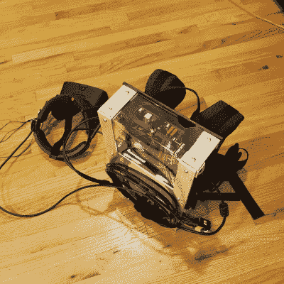

# 背包虚拟现实系统的发展

> 原文：<https://hackaday.com/2020/03/03/evolution-of-a-backpack-vr-system/>

坚持不懈是黑客实现目标所需要的。这正是[Erik]制作一个[无束缚虚拟现实背包系统](https://hackaday.io/project/167957-upgrade-ready-virtual-reality-backpack)所花费的时间。

早在 2019 年春天，[Erik]就开始致力于一个无线虚拟现实系统。当然，Oculus Quest 即将推出，但它不会与基于 PC 的系统的游戏库兼容。[Erik]决定他想要两个世界最好的，所以他决定做一个背包，携带一台足够强大的电脑来驱动裂缝。

最初的系统是使用一个切割背包，一台带有外部 Nvidia 1060 GPU 的惠普迷你 PC 和一个基本的 DC-DC 转换器。结果呢？几乎什么都不管用。惠普的启动过程在使用外部 GPU 时表现不佳。

[Erik]经历了这个项目的几次迭代。他切换到一个标准的个人电脑主板，并尝试了几种不同的 DC-DC 转换器。他选定了 HDPLEX 的一款额定功率为 200 瓦的设备。该转换器直接插入标准的 24 针 ATX 主板电源连接器，并不比连接器本身大多少。

 添加了填充物和木头框架的老式背包让位于 Zotac VR go 背包。只使用 Zotac 的皮带和框架，使用胶合板和 3D 打印部件安装[Erik 的]定制部件。外部框架是铝，丙烯酸面板。

电力来自 7000 毫安的生活电池，每个包提供一个小时的运行时间。虽然背包可以装两个包，但将它们并联起来应该可以使运行时间翻倍。

我们不得不说这是一个非常有据可查的版本。[Erik]解释了他是如何选择每个组件的，以及他所做选择的优点(和缺点)。他挑选的公羊就是一个例子。他选择了比他需要的规格更高的 DDR4，这样他就可以在更长的运行时间内使器件欠压。

然而，并非虚拟现实中的一切都是有趣的游戏——你可以抛弃显示器，选择虚拟桌面。