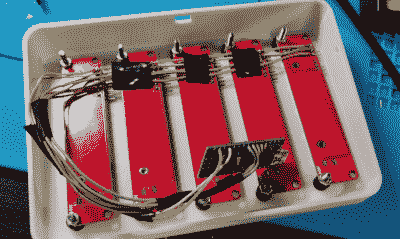

# 使用物理滑块提高(Windows)音量

> 原文：<https://hackaday.com/2020/03/05/pump-up-the-windows-volume-with-physical-sliders/>

就我们记忆所及，Windows 已经提供了一个混音器，它将每个应用程序的音量级别分解到它自己的滑块控制通道中。但是导航到这些控件是很重要的，尤其是如果你急着让团队发言中的某个人闭嘴。你必须停下手头的工作，点击扬声器，进入调音台，然后找到合适的滑块。Windows 不会考虑调音台访问之间的调整大小，所以  你几乎总是要做一些水平滚动。

那么，当你可以像 DJ 一样快速推动物理滑块时，你究竟为什么要让自己经历这一切呢？滑块毕竟只是一条直线上的电位器。

这些连接到 Arduino Nano，它将串行数据发送到 PC 上的 Python 脚本，该脚本相应地为配置文件中的任何五个程序更改音量值。多亏了一点 Visual Basic，Python 脚本可以在后台运行。

[Aithorn]已经得到了复制它所需要的一切，所以请继续阅读并获取 STL 文件和代码。如果你发现这些滑块太小了，就让[做一些更大的](https://hackaday.com/2019/12/09/diy-music-controllers-for-raging-with-machines/)。