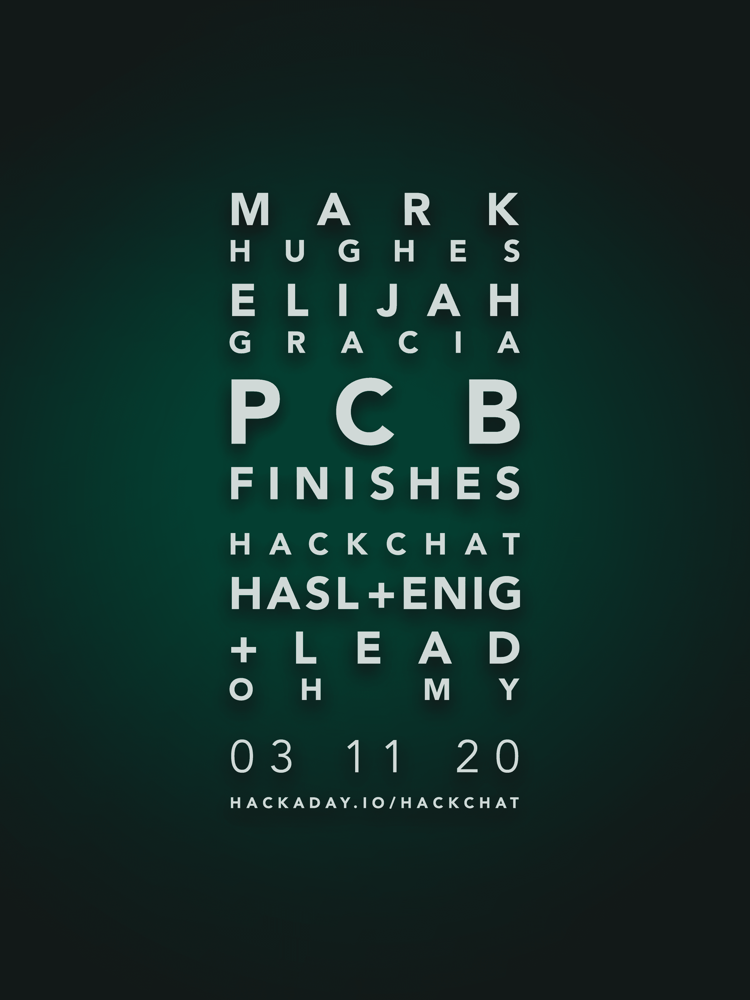

# PCB 完成黑客聊天

> 原文：<https://hackaday.com/2020/03/09/pcb-finishes-hack-chat/>

加入我们太平洋时间 3 月 11 日星期三中午的 [PCB 结束与马克·休斯和以利亚·细川玉子的黑客聊天](https://hackaday.io/event/169956-pcb-finishes-hack-chat)！

印刷电路板的发明给电子学带来的革命程度怎么估计也不过分。曾经由工匠将电路与分立元件、端子板和线束编织在一起的工作现在可以由专用机器完成，这使得电路构建成为一个几乎无需人工的过程。这一切之所以成为可能，是因为他们发现了如何让铜箔粘在一块平板上，以及如何去除一部分铜箔而留下其余的铜箔。

然而，一旦这些痕迹形成，还有更多的工作要做。裸铜是出了名的易反应材料，很快就会形成氧化物，这将使迹线难以焊接。有数百种不同的方法来防止这一点，PCB 表面抛光几乎已经成为一种艺术形式本身。根据电路的要求，走线可以用锡、铅、金、镍或上述材料的任意组合涂覆，工艺从电镀到浸入化学浴不等。痕迹不是唯一的结束；阻焊和丝网印刷对成品板的可用性和耐用性都很重要。

在这次聊天中，我们将和皇家电路解决方案公司的伊莱贾·细川玉子和马克·休斯聊聊。他们都非常熟悉各种 PCB 涂层和处理，他们将帮助我们理解字母汤:HASL，OSP，ENIG，IAg，LPI，等等。我们将学习不同的饰面做什么，在什么情况下选择哪一种，甚至可能学习如何使我们的自制板看起来更专业，性能更好。

 我们的黑客聊天是 [Hackaday.io 黑客聊天群发消息](https://hackaday.io/messages/room/2369)中的社区直播活动。本周，我们将在太平洋时间 3 月 11 日星期三中午 12:00 坐下来讨论。如果时区让你烦恼，我们有[一个方便的时区转换器](https://www.timeanddate.com/countdown/generic?iso=20200311T12&p0=224&msg=PCB+Finishes+Hack+Chat&font=cursive)。

点击右边的那个发言气泡，你会被直接带到 Hackaday.io 上的黑客聊天群，不用等到周三；随时加入，你可以看到社区在谈论什么。

