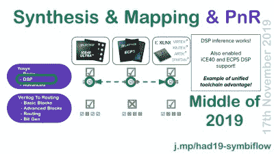

# Mithro 运行开源 FPGA 工具链

> 原文：<https://hackaday.com/2020/03/06/mithro-runs-down-open-source-fpga-toolchains/>

Tim [Mithro] Ansell [有很多关于开放式 FPGA 工具](https://www.youtube.com/watch?v=EHePto95qoE)的当前状态的内容要告诉你:如果你正在计算的话，25 分钟内 115 张幻灯片。[他的 SymbiFlow 项目](https://symbiflow.github.io/)旨在成为 FPGA 工具链的 GCC:跨平台、多平台、完全免费、无所不包。这意味着它是其他人正在做的所有工作的伞式框架，从综合和验证工具的工作，到布局和布线，到特定于供应商的芯片库。他的讲话让你赶上了 2019 年底的最新发展水平，下面是嵌入的内容。剧透警告:SymbiFlow 已经瞄准了 Xilinx 7 系列 FPGAs，并且正在逼近。SymbiFlow 是今天在 Xilinx 7 的 FPGA 架构上实现联网 Linux 系统的*，完全独立于任何供应商工具。*

但是让我们回顾一下背景。当你为 FPGA 编码时，你输入的单词被转换成一个由 1 和 0 组成的比特流，这可能会触发芯片内部的几百万个开关。从高级语言到比特流很像编译普通的编程语言，除了最终的计算逻辑不直接映射到机器语言，而是映射到 FPGA 上的低级物理硬件。因此，FPGAs 的“编译”包括两个步骤:综合和布局布线。Synthesis 采用您编写的高级语言，并将其转换为一组网络和时序要求，这些要求代表相同的逻辑，并且可以跨芯片系列工作。 [Yosys](http://www.clifford.at/yosys/) 是这里首选的开源合成工具。

 [https://www.youtube.com/embed/EHePto95qoE?version=3&rel=1&showsearch=0&showinfo=1&iv_load_policy=1&fs=1&hl=en-US&autohide=2&start=102&wmode=transparent](https://www.youtube.com/embed/EHePto95qoE?version=3&rel=1&showsearch=0&showinfo=1&iv_load_policy=1&fs=1&hl=en-US&autohide=2&start=102&wmode=transparent)

然后，布局布线将程序逻辑映射到单个 FPGA 的架构和功能集，在这里，逆向工程工作已经完成并正在进行，以适应更多的 FPGA 系列。 [nextpnr](https://github.com/YosysHQ/nextpnr) 获取程序逻辑并将其映射到 FPGA 门，如果没有对各种芯片内部的详细描述，它无法做到这一点。为此，SymbiFlow 将每个 FPGA 芯片家族拆分成自己的比特流文档和工具项目。到目前为止，我们已经为 Lattice iCE40 芯片开发了项目[冰风暴](http://www.clifford.at/icestorm/)，为 Supercon 徽章上的 Lattice ECP5s 开发了项目 [Trellis](https://symbiflow.github.io/prjtrellis-db/) ，为 Xilinx 7s 开发了项目 [X 射线](https://symbiflow.github.io/prjxray-db/)。

Mithro 首先提到目标是用一个工具链覆盖所有 FPGAs。这是一个不可思议的目标，非常非常遥远。但是进展快得离谱。例如，在 2018 年初，只有 Lattice iCE40 零件真正得到了很好的理解和支持。选择这种 FPGA 是因为[它容易获得](https://hackaday.com/2018/08/06/learn-fpga-fast-with-hackadays-fpga-boot-camp/)，便宜，并且易于逆向工程，但是 Lattice 的市场份额几乎为零。Xilinx 和 Altera 是 FPGA 界的 Intel 和 AMD，没有他们芯片的覆盖，这个项目只能说是刚刚起步。然而，在一年之内，Dave Shah 基本上完全记录了更强大的 Lattice ECP5，我们能够为您带来 Hackaday Supercon 徽章。格子就是这么多。

 正如开篇提到的，这里的真实故事是 2019 年在 Xilinx 部件上取得的巨大进步。随着 X 射线项目的认真进行，nextpnr 的一些部分变得比以前想象的更加晶格特定，一个新的布局布线工具 [Verilog to Routing](https://verilogtorouting.org/) 在多伦多大学开发，被拉入 SymbiFlow。

与此同时，Yosys 中的一些合成步骤没有最佳利用 Xilinx 部件的一些更高级的功能，如专用数字信号处理模块(DSP)，并在 2019 年在这方面取得了很大进展。(当然，DSP 在 Xilinx 7 芯片上的一些优化溢出到了 Lattice ECP5s 上，所以大家都是赢家。)

这让我们想到了笑点。SymbiFlow 能完全取代 Xilinx 专有的(而且笨重的)Vivado 工具链吗？不能，因为 FPGA 的高速外设还不能很好地与开放式布局布线兼容。虽然米罗在演讲中表示，Symbiflow 财团正在全力以赴，争取在 2019 年底达到这一点，但我们在 12 月 29 日与他交谈时，他们仍在努力。但是如果你问我们，我们预测我们将在 2020 年看到一个完全开放的 Xilinx 7 工具链。甚至可能是今年夏天？这是一个我们非常关心的项目，所以我们会让你随时了解情况。

但是，尽管 Mithro 本质上是一个 Linux/软件人，专注于获得一个完全开放的工具链来构建 Linux 系统，但现在不应该阻止你在 Xilinx 7 或 Lattice parts 上尝试任何其他东西。这两种流程对于微控制器或物联网应用都是完全可行的。只要你不需要高速内存和以太网外设，你就可以走了。如果你真的需要这些东西，你可以用 Yosys 进行综合，用 Vivado 工具进行布局布线，直到 SymbiFlow 又多了几个框。IMHO，现在是开始使用 FPGAs 的最佳时机。